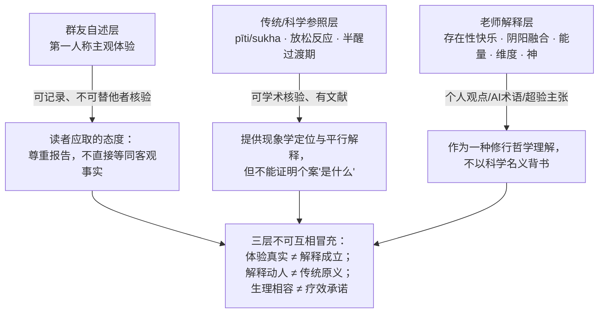

# 核验报告：一段自发冥想愉悦体验的传统定位、生理学参照与语言分层

> ## ℹ️ 核验性质（先读本节）
>
> 本文**没有数字、日期、疗效或名人归属类硬事实**，因此本报告不是"勘误型核验"，而是**定位型核验**，回答三个问题：
>
> 1. 群友描述的体验（醒后自发出现的柔软、温暖、弥漫性爱感）在**已被充分记录的传统与科学知识**中处于什么位置？
> 2. 文中给出的两种解释（DeepSeek 的"内在阴阳融合的极乐"、大方老师的"存在性的快乐"）分别属于什么**语言层级**？
> 3. 哪些主张在经验上可核验、哪些超出核验范围、以及读者的安全边界在哪里？
>
> **总结论**：未发现源文硬错误，故整包 **status: stable**；但博文主体是**主观体验报告 + 个人灵修观点**，外部权威只能提供"现象学相容"与"生理学平行解释"，**不能证明其解释框架（阴阳融合、能量、维度、按神的方式生活）成立**。不构成医疗建议。

## 一、核验方法与信源距离

- **被核验对象**：微信公众号"身体自我修复研究者"（大方老师）2026-10-04 群问答短文，约 1223 字，无引用链接、无数据、无机构关联；信源距离 = **个人灵修自媒体一手问答**（F-026）。
- **参照基准**：① 佛教巴利语经典中心所与禅那次第的学术二手整理（SN 46 七觉支、《清净道论》体系）；② 哈佛医学院 Herbert Benson 放松反应研究线及其综述；③ 睡眠科学对 hypnopompic state 的标准定义；④ 冥想相关不良反应的临床研究（Lindahl et al. 2017）。
- **裁决规则**：
  - 体验描述与传统/科学记录的现象学特征相容 → ✅ 相容（**不等于等同**）；
  - 解释性主张可以用现有证据检验 → 给出证据状态；
  - 超验主张（神、维度、能量、量级增长的承诺）→ 超出经验核验范围，标"观点层"，不以科学背书也不简单否定；
  - 术语来源 → 追溯其实际出处（经典术语 vs AI 生成 vs 老师自创）。

## 二、逐项核验结论（6 项）

| # | 博文声明（F 编号） | 参照口径 | 结论 |
|---|------------------|---------|------|
| 1 | 醒后出现"无限柔软/温柔/爱"的愉悦、四肢柔软温暖、幸福感，可长时间"泡"在其中（F-003/F-004/F-006） | 巴利语佛教体系中 **pīti（喜）** 为振奋、充盈、可带身体感的喜，**sukha（乐）** 为较细微持久的愉悦，伴 **passaddhi（轻安）**；五世纪《清净道论》还记载 pīti 的五种强度（从鸡皮疙瘩到遍满）。柔软、温暖、弥漫至全身的描述近"喜/轻安"谱系（F-027） | ✅ **现象学相容**；⚠️ 但传统判准要求深度安住、五盖舍离与稳定性，读者体验自发、短暂、醒时出现、可随时起身思考，不符禅那（jhāna）安住判准 |
| 2 | "这还算不上极乐……该状态会反复出现、可不依赖身体与睡眠常时存在、量级会越来越大"（F-012/F-020） | 与传统次第观相容：初/二禅 pīti 强、三禅 pīti 消退唯 sukha、四禅不苦不乐；"分级克制"本身是传统而谨慎的态度（F-027） | ✅ 分级态度与传统相容；⚠️ "量级越来越大""可不依赖身体常时存在"是修行进阶**预测/承诺**，无经验证据，不可证实亦不可证伪 |
| 3 | 状态可能与两年静坐、冥想、放松有关（F-008）；僵硬变软、"脆弱被释放"（F-009） | Benson 的**放松反应**：副交感主导，心率/呼吸/氧耗下降、α 波增强；Benson-Henry 2013 年 PLOS ONE 研究报告放松练习影响炎症、能量代谢、胰岛素相关通路基因表达，长期练习者变化更明显（F-028） | ✅ 存在**世俗生理学平行解释**，"长期练习→深度放松→温暖柔软与情绪改善"方向与证据相容；⚠️ 个案无对照，不能归因，更不能外推为疗效承诺 |
| 4 | 体验固定在早上/午睡醒来时出现，起床活动后消退（F-002/F-007） | **hypnopompic state（半醒过渡期）**：睡眠到完全清醒间的半意识状态，可残留梦样体验、情绪增强、α/θ 脑电混合；醒转期体验在普通人群常见，多数无病理意义（F-029） | ⚠️ **时点相关性**：出现与消退都贴着睡眠—清醒边界；这既不把体验"还原为幻觉"，也提醒不要忽略其状态依赖性 |
| 5 | DeepSeek 说"这是内在阴阳融合的极乐"；老师答"DeepSeek 说的是对的"（F-005/F-019） | "内在阴阳融合"**不是**道家内丹学或中医学标准术语（标准话语为阴阳交媾、坎离交媾、性命双修等），是大模型生成的现代综合说法（F-030） | ⚠️ **语言来源分层**：AI 生成解释被老师采纳 ≠ 传统术语；引用时必须标注，禁止伪装成道家/佛学经典概念 |
| 6 | "所有感觉融为一体=存在性的快乐""只是存在就快乐，做事反而减少""超越它就具备进入另一维度的能力""我在按神的方式生活"（F-017/F-018/F-023/F-025） | 与多家思想有家族相似（佛教出离乐、《庄子·至乐》"至乐无乐"、儒家"孔颜乐处"），但措辞是现代个人化灵性综合（F-033） | ℹ️ **观点层**：自洽的人生哲学与修行主张，非可检验事实；可作跨传统对话入口，不可作为某家教义或科学结论引用 |

**汇总：6 项中 ✅ 相容 3 项（第 1、2 项的"现象学相容/分级态度"、第 3 项的生理学平行解释）、⚠️ 边界提示 2 项（第 4 项时点相关、第 5 项术语来源）、ℹ️ 观点层 1 项（第 6 项，含多条超验主张）。无 ❌ 源文硬错误。**

## 三、三层语言模型：这篇文章里其实有三种话

图注：本文最容易出错的读法是把三层压缩成一层——"我感到了 X（体验）→ 老师说这是极乐/能量融合（解释）→ 所以 X 在客观上就是极乐/能量（事实）"。规范读法始终保留三层间距（F-026/F-030/F-032）。

## 四、安全与适用性边界

| 维度 | 结论 |
|------|------|
| 本案风险信号 | 群友体验为**正向、可自控、社会功能正常**（能起床、能思考、主动用于梳理问题，F-010），无恐惧、失控、功能受损信号 |
| 一般风险 | 冥想相关不适（焦虑加剧、解离、情绪失控、睡眠紊乱）在西方禅修者中有系统报告（Lindahl et al. 2017，PLOS ONE，基于对西方佛教禅修者的深度访谈）；**出现持续恐惧/失控感/现实感丧失/功能受损时，应降低练习强度并就医或寻求合格心理专业人员**（F-031） |
| 医疗边界 | 本文与本知识包**不构成医疗建议、诊断或治疗承诺**；"身体变软、僵硬释放、对自己有好处"（F-009）是主观改善感，不能替代对疼痛、慢性病、睡眠障碍等问题的医学评估 |
| 解释多样性 | 同一体验在不同传统中有不同话语（佛教喜/乐、道家内丹、现代身心医学放松反应），话语选择不改变体验本身；不必追求"唯一正确命名" |
| 特殊人群 | 有精神疾病史、严重创伤史者进行高强度静坐/长时间冥想宜在合格指导下进行；本文的"无需努力、自动发生"不构成可复制的练习方法 |

## 五、权威信源 URL 汇总

| 信源ID | URL | 覆盖事实 |
|--------|-----|---------|
| src-hms | https://hms.harvard.edu/news/mind-body-genomics | F-028（放松反应、Benson-Henry 基因表达研究的哈佛官方报道） |
| src-pmc4475556 | https://pmc.ncbi.nlm.nih.gov/articles/PMC4475556/ | F-028（冥想生理学与放松反应综述，Biomed Res Int 2015） |
| 佛教经典参照（SN 46 等） | 巴利语相应部《觉支相应》（Saṃyutta Nikāya 46）及《清净道论》（Visuddhimagga）学术通行译本 | F-027（pīti/sukha/passaddhi、七觉支、禅那次第） |
| src-pmc5424601 | https://doi.org/10.1371/journal.pone.0176239 | F-031（冥想相关挑战的临床现象学，Lindahl et al., PLOS ONE 2017） |
| src-britannica-hypnopompic | https://www.britannica.com/topic/hypnopompic-state | F-029（半醒过渡期定义） |
| 喜马拉雅转述专辑 | https://www.ximalaya.com/album/76860531 | F-026（信源生态：第三方语音搬运，非作者官方） |
| 被核博文 | https://mp.weixin.qq.com/s/x8WOQKShXQYSeGiKLv52Vw | F-001 ~ F-025 |

> 复核提示：2026-12-31 前若放松反应研究线、冥想不良反应流行病学或该公众号体系出现新材料，应重跑本核验表。佛教部分因各宗派（南传/北传、重定派/重经派）对禅那深浅判准有争议，本包采用"现象学相容、不判等同"的保守口径。
