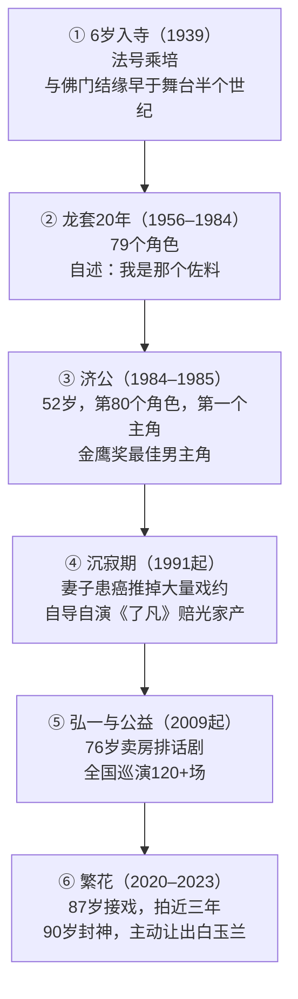

# 00 · 职业轨迹与六次转折

> **为什么从轨迹读方法论**：单个成功案例无法证明方法有效；但**一个人 70 年里的每一次转折都能暴露他的决策模式**。本篇不复述生平（生平见 `../references/facts.md`），只做一件事——**从六次转折中提取共同结构**。

## 1. 完整轨迹：六个阶段



## 2. 六次转折的共同结构

**这是本篇的核心发现（推断层）**：

> 游本昌的每一次转折，都不是「机会突然找到他」，而是**他在机会到来之前很久就已经在做某件事**。

逐个对照：

| # | 转折 | 表面原因 | 真实准备（前置事实） | 准备时长 |
|---|---|---|---|---|
| 1 | 1961 年被小和尚身份救回 | 算命先生说活不过 13 岁 | 父母送他入寺是**主动选择**（据 C 级信源 F-YB-004） | 7 年 |
| 2 | 1984 年春晚《淋浴》 | 哑剧四分钟无台词 | **40 岁时主动决定要做一件「死而无憾」的事**，夫妻自行筹资、无人愿同干仍做成（C 级 F-YB-012） | 约 10 年 |
| 3 | 1984 年被张戈选中演济公 | 导演看了《淋浴》 | 为找济公步态每天在西湖边磨炼，鞋底磨松（F-YB-016）；戏服自己剪破做旧、蒲扇亲手做（C 级 F-YB-018） | 数月 |
| 4 | 2020 年被王家卫选中演爷叔 | 抖音小视频被选角团队注意（C 级 F-YB-036） | 80 多岁开始拍短视频，两百多条；坚持近 70 年每天练功（C 级 F-YB-098） | 约 10 年 |
| 5 | 2010 年《弘一》杭州首演 | 「虎跑寺」是济公圆寂与弘一出家的寺庙 | 76 岁买版权、卖房、租房、组团队（A/C 级 F-YB-072） | 数月 |
| 6 | 2020 年《繁花》封神 | 87 岁接下邀约 | **没有自己镜头时仍坐在苹果箱上给胡歌搭戏**（A 级 F-YB-031）——这是「准备」的最直接证据 | 全程 |

### 转机判据（本包提出，推断层）

复盘六次转折，可以提炼出「机会是否真的被你接住」的三条判据：

```
判据一：你为这件事准备了多久？
        济公：数月专门练步态   → 有效准备
        春晚：40 岁起做哑剧   → 长周期准备
        繁花：80 岁起拍短视频 → 长周期准备

判据二：机会来临时，你在做什么？
        被选济公时：在练步态（不是等着）
        被选爷叔时：在拍短视频（不是等着）
        拍摄中：没有镜头也在现场（不是完成自己的部分就走）

判据三：这个准备是否只有你能做？
        济公步态：他的身体条件 + 审美积累
        掰碎肉：他的角色理解深度
        搭戏：他的表演功力 + 对后辈的责任
```

> **三条判据的共同点（推断）**：**判据二最关键**。机会来临时你在做什么，比你为它准备多久更能预测结果。因为准备是过去的，**「机会来时的行为」是当下的选择**。

## 3. 最被低估的一段：19 秒的农奴

在话剧《大雷雨》里，他演一个农奴——**没有一句台词，出场只有 19 秒**。而他为这 19 秒**写了一整篇人物小传**（C 级 F-YB-011）。

> **为什么这一段比「济公封神」更值得学**（推断）：
>
> 19 秒的戏，**没有任何观众会记住他**。在「追求可见回报」的逻辑下，这个投入是纯粹的浪费。
>
> 但这 19 秒构成了 79 个角色中的一个。**如果没有这 19 秒，就不会有 40 岁时敢做哑剧的那口气。**
>
> 这解释了「长期积累，偶然得之」（A 级 F-YB-053）这句话的真实含义：**「偶然」之所以能得，是因为「长期」的部分包含了大量不可见的投入。**

**与陶行知的对照**：陶行知的六大解放之一是「解放双手」——他要求学生动手而非只动脑（F-TX-056，见 [../../taoxingzhi-life-education/](../../taoxingzhi-life-education/index.md)）。游本昌的 19 秒农奴，正是「解放双手」在表演领域的具体形态：**在没有掌声的地方动手**。

## 4. 沉寂期（1991 起）为什么重要

1991 年后他逐步淡出，业内渐不再找他。表面原因是「耍大牌」，真实原因是**当年妻子被查出癌症，为照顾妻子推掉大量戏约**（C 级 F-YB-022）。

> **这一段是六次转折中信息量最大的**（推断）：
>
> **A 级事实**：同期他自导自演《了凡的故事》，赔光了家产（C 级 F-YB-026）。
>
> **两个事实叠加的结构**：
> ```
> 为了照顾妻子 → 推掉所有商业邀约（收入归零）
>              ↓
>       自掏腰包拍《了凡》→ 赔光家产
>              ↓
>         彻底淡出（1991起）
> ```
>
> **这说明什么**：他在「最应该接戏赚钱」的时候，选择了**一件商业上明确不划算、且可能赔光全部积蓄的事**。而《了凡》的题材正是「一个人在苦闷沉沦的时候得到高人指点、重振精神、改变命运」——**他选了和自身处境最同构的题材**。

> **本包的推断（F-YB-026 场景的机制解读）**：
>
> 「演一个自己正在经历的处境」是他处理困境的方式——**不是去回避它，是去把它变成作品**。这与他在 2009 年选择排演《弘一大师》（一部关于在乱世中坚持、在绚烂后收束一生的戏）是同一结构。

## 5. 一次失败的成本核算

《了凡》的商业安排（C 级 F-YB-070/071，2006 年）：

| 项 | 内容 |
|---|---|
| 投入 | 卖掉一处住所，筹资近千万元，自任制片人/导演/主演 |
| 条件 | 只要电视台保证故事连贯性、不插播广告 |
| 定价 | 首播权 **一集一元** |
| 结果 | 赔光家产 |

> **这次决策的真实结构（推断）**：
>
> **商业上不划算**：近千万投入，一集一元首播权，几乎必然亏损。
>
> **但换回的是**：「为了观众而拍。只要有一个人从中得到启发，我就满足了」的正当性——**一个可复用的、可信的「我是为观众拍戏」的人设**。
>
> 这个人设后来支撑了什么：2010 年卖房拍《弘一》时，面对「晚景凄凉」的谣言，他可以平静地公开回应「卖房子怎么了？这是对的……来自济公，还于社会，济世为公」（A 级 F-YB-073）。**因为他的行为序列是可验证的、连续的、指向同一方向的。**
>
> **这才是三次杠杆决策的共同机制**，详见 [02 济世为公](02-jishi-wei-gong.md)。

## 6. 引用与溯源

生卒与离世见 F-YB-001/002/003（A 级）；童年入寺见 F-YB-004（C 级）；上戏与龙套见 F-YB-006/007/008/010（C/A）；19 秒农奴见 F-YB-011（C 级）；40 岁做哑剧见 F-YB-012（C 级）；春晚《淋浴》见 F-YB-013（A/C）；济公第 80 个角色见 F-YB-015（A 级）；步态磨炼见 F-YB-016（A/C）；戏服蒲扇自制见 F-YB-018（C 级）；金鹰奖见 F-YB-021（A/C）；沉寂期与妻子患癌见 F-YB-022（C 级）；《繁花》87 岁接戏见 F-YB-030（A/C）；没有镜头也搭戏见 F-YB-031（A 级）；86 岁被抖音选中见 F-YB-036（C 级）；《了凡》赔光家产见 F-YB-026（C 级）；「长期积累，偶然得之」见 F-YB-053（A 级）；每天练功见 F-YB-098（C 级）。

**本篇推断部分**（「六次转折的共同结构」「转机判据三条件」「19 秒的意义解读」「沉寂期结构分析」「一次失败的成本核算」及全部因果解释）为本包 D 级推断，非史实。

**下一篇**：[01 慢成与复利](01-patience-and-compounding.md) —— 79 个角色如何产生复利，以及「不能爱艺术中的自己」为什么是一条护栏。
