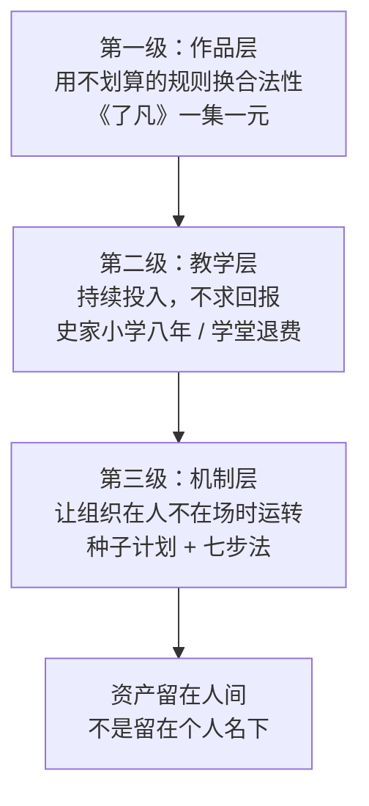

# 02 · 济世为公：资源转化路径

## 1. 一句话概括这条路径

> **他把「成名带来的资源」系统性地转成了「可持续的社会基础设施」**——不是一次性捐赠，而是学校、基金会、教师培养体系。

这条路线的完整证据链（C 级为主，但关键节点有 A 级印证）：

| 阶段 | 时间 | 动作 | 层级 |
|---|---|---|---|
| 一次性投入 | 2006 | 卖房筹资近千万拍《了凡》，一集一元出让首播权 | 作品层 |
| 一次性投入 | 2009–2010 | 卖北京唯一住房排演《弘一大师——最后之胜利》，巡演 120+ 场 | 作品层 |
| 持续投入 | 2007/2008 起 | 北京史家小学免费戏剧课，**坚持八年** | 教学层 |
| 持续投入 | 2015/2017 | 济公学堂；开营当天宣布**退还全部学费**转为公益 | 教学层 |
| 组织化 | 2018 | 出资成立浙江济公公益基金会 | 组织层 |
| 机制化 | 2019 起 | 「种子计划」——**培养乡村教师**，戏剧教育七步法 | 机制层 |

> **从作品层到机制层的跃迁是关键**（推断）：前四步是「他做」，第五步是「他建组织」，第六步是「**让组织能在他不在场时继续做**」。
>
> 这一跃迁的判据很清晰：**创始人退出后，机制还能不能运转？** 种子计划的设计恰恰回答了这个问题（详见 [03 种子计划机制](03-seed-program.md)）。

## 2. 三次杠杆决策复盘

这三次决策的共同结构是：**商业上不划算，换回的是更值钱的东西**。

### 杠杆一：《了凡》一集一元（2006）

| 项 | 内容 | 出处层级 |
|---|---|---|
| 投入 | 卖掉一处住所，筹资近千万元，自任制片人/导演/主演 | C |
| 定价 | 首播权 **一集一元** | C |
| 条件 | 只需电视台保证故事连贯性、不插播广告 | C |
| 结果 | 赔光家产 | C |

**换回的是什么**（推断）：

不是钱。是一个**可复用的合法性来源**——「我是为观众拍戏的」。

这个合法性在 2009 年卖房拍《弘一》时产生了实际价值：面对「晚景凄凉」的谣言，他可以平静公开回应（A 级 F-YB-073）：

> 「卖房子怎么了？这是对的，说明我有房子可卖。这房子怎么来的？是『济公』送我的，我演了济公才有钱买房子，所以来自济公，还于社会，**济世为公**。」

> **注意这段回应的结构**（推断）：它同时完成三件事——承认行为、给出合法性来源、把行为接入一个更大的叙事（济公 → 济世为公）。
>
> **这只有在行为序列连续可验证时才能成立**。如果只有卖房这一次，没有《了凡》垫底，这段话就只是话术。

### 杠杆二：卖房拍《弘一大师》（2009）

| 项 | 内容 | 出处层级 |
|---|---|---|
| 投入 | 买版权、卖北京唯一住房、租房住、自组 24 人团队、租剧场、出劳务费 | A/C |
| 理由 | 「剧作者看不到商业价值就不干了，我想的不是商业价值，弘一大师是我们的先辈，要弘扬，这是我的责任，也是我的荣耀」 | C |
| 首演 | 2010 年杭州虎跑寺（济公圆寂、弘一出家的寺庙） | C |
| 结果 | 三场赔百余万元 | C |
| 巡演 | 超 120 场，走进监狱、福利院、偏远乡村学校；坚持压低票价、更多去基层 | A/C |
| 身体代价 | 82 岁排练摔成左肱骨骨折，距巡演两周；全麻手术，25 天后绑绷带登台 | A/C |

> **这个决策的杠杆点非常特殊**（推断）：他不是选了一个「有市场」的项目，而是选了一个**「剧作者不做的事」**。
>
> 原文「剧作者看不到商业价值就不干了」意味着：**这个项目在商业逻辑里根本不该存在**。他接手的是一个市场机制无法覆盖的项目。
>
> **这类机会的结构（推断）**：
> ```
> 商业逻辑不覆盖的项目
>   → 竞争者最少（没人跟你抢）
>   → 但需求真实存在（弘一值得弘扬）
>   → 承接者获得的是「无人竞争的行动空间」+「明确的道义正当性」
> ```
>
> 与《了凡》相比，《弘一》的杠杆更高——因为它同时换回了**行动空间**和**正当性**。

### 杠杆三：济公学堂开营当天退全部学费

| 项 | 内容 | 出处层级 |
|---|---|---|
| 创办 | 2015 年在杭州开办济公学堂（另有报道作 2017 年首期） | A/C |
| 学费 | 首期原定 9800 元，**开营当天宣布全部退还** | C |
| 表述 | 「学校不要你，爷爷要你」（对免费艺术团成员的表述） | A/C |

> **这次决策的杠杆是「叙事反转」**（推断）：
>
> 常规的公益操作是「一开始就免费宣传」。他的做法是：**先按商业收费模式定价并公示，然后当场宣布全退**。
>
> **这为什么效果更强**（推断）：
> ```
> 常规免费：受众看到「免费」→ 怀疑质量 → 报名 → 怀疑是否真的免费
> 当场退费：受众看到「9800 元」→ 报名意愿被激活 → 现场宣布全退 → 情感冲击 + 品质背书
> ```
>
> **付了钱再被退还，比一开始免费更有说服力**——因为前者证明「他本可以收费，但他选择不收」。这与《弘一》的逻辑同源：**放弃一个能收的选项，比从未拥有这个选项更有说服力。**

## 3. 「以文艺化导人心」的双向读法

客厅挂着茗山长老手书的「**以文艺化导人心**」，他每天看一遍；这句话也是济公公益基金会的宗旨（A/C 级 F-YB-051）。

他对这七个字的解释（A 级 F-YB-052）：

> 「『以』是副词，横着念是『以艺导心、以文化人』。倒过来念是『以心导艺、以人化文』。这个『导』是繁体字，上面是道，下面是寸，**这就是以道德引领寸心**。」

> **双向读法的意义（推断）**：
>
> 横读（以艺导心）是**他做的事**：用艺术影响人心。
>
> 倒读（以心导艺）是**他相信的事**：先有人心的改变，艺术才有正确的内容。
>
> **大多数公益实践只做横读**——用现有的资源去做一件被认为「好」的事。**倒读要求先问：如果人心没变，我做这件事的意义是什么？**
>
> 这也解释了他为什么坚持「戏剧教育不是培养演员」（详见 [03](03-seed-program.md) 的七步法）——**如果目的是培养演员，倒读不成立；如果目的是解放孩子的心，横读才成立。**

**在 2023 年电视剧品质盛典上，他把同样 7 个字送给年轻演员**（C 级 F-YB-062），并称「一刻不能忘，时刻准备着」。

## 4. 基金会命名：最被忽略的一个设计

2018 年他出资成立浙江济公公益基金会。关于命名，他有一段完整的表述（C 级 F-YB-086）：

> 「我成立的基金会不叫『游本昌』公益基金会。**游本昌只是一瞬间的事**，我希望基金会可以一直把『济世为公』的事情长久地做下去。」

> **这个设计的意图（推断）**：
>
> **命名 = 归属声明。** 他把自己的名字从组织名中排除，意味着：
>
> | 含义 | 效果 |
> |---|---|
> | 组织不属于某个人 | 组织可以在创始人不在场时继续存在 |
> | 组织的目标独立于个人生命 | 使命的持续性不依赖个人的存在 |
>
> **这与陶行知形成有意思的对照**：陶行知的名字进入了他的教育理论（「陶行知教育思想」「行知教育」），**人名与思想绑定**；游本昌则主动把自己的名字**排除**在组织名之外。
>
> **两种做法都成立，但目标不同**（推断）：
> - 陶行知式（人名绑定思想）：适用于**思想传承**——希望这个名字持续代表这套主张
> - 游本昌式（组织去个人化）：适用于**机制传承**——希望机制持续运转而不依赖人
>
> **判断标准**：如果你要传的是**主张**，绑定名字；如果你要传的是**机制**，去掉名字。

## 5. 资源转化三级模型（本包提出，推断层）

综合三次杠杆决策与组织化路径，本包提炼一个可迁移的模型：



| 级别 | 投入方式 | 回报形态 | 风险 | 迁移难度 |
|---|---|---|---|---|
| **一：作品层** | 一次性、极端（卖房） | 合法性、叙事一致性 | 高（可能倾家荡产且无回报） | 低（人人可做一次） |
| **二：教学层** | 长期、低强度（每周一次） | 能力、人脉、社会资本 | 低 | 中（需要持续 8 年级 commitment） |
| **三：机制层** | 一次性设计、长期生效 | 组织能力、可持续性 | 中（设计失败则机制空转） | 高（需要机制设计能力） |

> **大多数人的问题出在跳过第二级直接做第三级**（推断）：想做机制，但没有教学层的沉淀作为设计依据。
>
> **他的顺序是**：作品（合法）→ 教学（能力与观察）→ 机制（复制）。**每一级都是下一级的输入。** 特别值得注意：正因为教了八年小学（F-YB-081），他才知道「乡村缺的是长期关系」——这个认知直接催生了「种子计划不派人驻村」的设计（详见 [03](03-seed-program.md)）。

## 6. 引用与溯源

《了凡》一集一元见 F-YB-070/071（C 级）；卖房拍《弘一》见 F-YB-072（A/C）；「来自济公，还于社会，济世为公」见 F-YB-073（A 级）；首演虎跑寺见 F-YB-074（C 级）；巡演 120+ 场见 F-YB-075（A/C）；骨折手术登台见 F-YB-076（A/C）；《弘一》创作理由见 F-YB-072 语境（C 级）；「艺术最重要的是分享」见 F-YB-077（C 级）；史家小学八年见 F-YB-081（A/C）；济公学堂退费见 F-YB-083（A/C）；「学校不要你，爷爷要你」见 F-YB-084（A/C）；基金会成立与命名见 F-YB-085/086（A/C）；「以文艺化导人心」及双向读法见 F-YB-051/052（A 级）；七字赠年轻演员见 F-YB-062（C 级）；种子计划见 F-YB-087（A 级）；规模数据见 F-YB-091（C 级）；「我不是公益人士」与感恩论见 F-YB-097（A 级）；「以文艺化导人心」作为行动初心见 F-YB-096（A 级）；《济公游记》首播少管所见 F-YB-079（A/C）；西藏哈达承诺见 F-YB-080（C 级）。

**本篇推断部分**（「从作品层到机制层的跃迁」「三次杠杆决策的机制拆解」「放弃能收的选项比从未拥有更有说服力」「双向读法的行动含义」「命名与人名绑定的两种传承」「资源转化三级模型」及全部因果解释）为本包 D 级推断。

**上一篇**：[01 慢成与复利](01-patience-and-compounding.md) | **下一篇**：[03 种子计划机制](03-seed-program.md)
