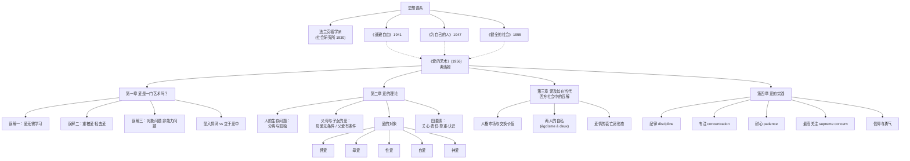

# 架构洞察（Architecture Insights）

> 基于事实清单（facts.md）与公开权威信源分析得出，每条洞察遵循四元组结构：陈述 / 证据 / 反常识点 / 行动启示。

## 洞察1：本书的革命性不在于"谈爱"，而在于把爱从"对象问题"改写为"能力问题"

| 四元组 | 内容 |
|--------|------|
| **陈述** | 弗洛姆的核心命题是：爱不是一种碰巧降临的强烈情感，也不是找到"对的人"之后自然发生的结果，而是一种与音乐、医学同类的艺术——需要理论知识与反复实践才能掌握的能力。因此，爱的问题的重心应从"如何被爱、如何找到合适对象"转移到"如何培养自己爱的能力"。 |
| **证据** | F-019（1956年出版）、F-023（第一章"爱是一门艺术吗？"）、F-029（爱之四要素：关心、责任、尊重、认识）、F-033（实践四条件：纪律、专注、耐心、最高关注）、F-035（华莱士访谈中"人不是坠入情网，而是立于爱中"的表述） |
| **反常识点** | 流行文化把爱情的成败归因于对象选择（"找到对的人"），弗洛姆却指出：多数人把爱的问题看成"被爱"而非"去爱"的问题，把"可爱"经营成流行度与性吸引力的混合体。按此逻辑，换对象不能解决爱的失败——失败的是能力，不是选择。 |
| **行动启示** | 知识包设计以"能力训练"为主线：概念篇讲清理论（爱是什么、为何衰亡），示例篇提供可反复练习的日常功课，而非提供择偶标准或关系技巧清单。 |

## 洞察2：爱的理论是弗洛姆社会心理学体系的"伦理闭环"，不是孤立的情感随笔

| 四元组 | 内容 |
|--------|------|
| **陈述** | 《爱的艺术》是弗洛姆思想链条上的收束之作：《逃避自由》（1941）诊断现代人因自由带来的孤独而逃向权威，《为自己的人》（1947）建立"生产性取向"的人本主义伦理学，《健全的社会》（1955）批判异化的消费社会；《爱的艺术》（1956）则回答：一个健全的人、健全的社会，其人与人之间的结合方式应当是什么——爱正是对人类生存困境（分离与孤独）的成熟回答。 |
| **证据** | F-013~F-017（前作出版年与前言自述）、F-005（法兰克福学派社会研究所经历）、F-010（新弗洛伊德文化学派）、F-038（爱是对人类生存问题的回答） |
| **反常识点** | 读者常把《爱的艺术》当作"两性关系读物"，但它本质上是一部社会哲学著作：谈母爱、性爱只是入口，真正的落点是"社会性格"批判——资本主义的人格市场如何系统性地削弱人爱的能力。脱离《逃避自由》《健全的社会》读本书，会把社会诊断误读成个人励志。 |
| **行动启示** | 知识包设置 [00-fromm-and-context](concepts/00-fromm-and-context.md) 交代思想谱系，并在 [02-reading-path](examples/02-reading-path.md) 中把本书嵌入弗洛姆著作序列与西方哲学传统，防止断章取义。 |

## 洞察3："自爱"命题是全书最易被误读、也最具现代意义的枢纽

| 四元组 | 内容 |
|--------|------|
| **陈述** | 弗洛姆主张自爱与爱他人在根本上是同一能力的两面：自私不是自爱过头，而是自爱不足；一个不能恰当地肯定、照料、尊重自己的人，也无法真正爱他人。爱本质上是一种面向全人类的态度，而非只针对某个特定对象的情感。 |
| **证据** | F-036（自私是自爱不足）、F-030（自爱是五种爱的对象之一）、F-029（四要素同样适用于对自身的关系）、F-032（"两人的自私"批判：两人彼此封闭、对世界漠不关心不是爱） |
| **反常识点** | 日常道德直觉把"爱自己"与"自私"混为一谈，又把"忘我奉献"当作爱的理想形态。弗洛姆同时反对两端：利己者没有能力爱他人，也没有能力爱自己；而"两人的自私"式的排他关系，看似浓烈，实则是把两个人的利己主义放大，与博爱（对所有人的责任与尊重）相矛盾。 |
| **行动启示** | 概念篇 [02-theory-of-love](concepts/02-theory-of-love.md) 专节处理自爱与博爱的关系；练习篇 [01-practice-exercises](examples/01-practice-exercises.md) 设计"自我关切"功课，避免把"爱的实践"窄化为伴侣相处技巧。 |

## 洞察4：第四章拒绝提供"处方"，恰恰是本书方法论的关键声明

| 四元组 | 内容 |
|--------|------|
| **陈述** | 第四章"爱的实践"开篇即声明：期待拿到"如何自己去做"操作处方的读者将会失望。弗洛姆只给出掌握任何艺术都通用的条件（纪律、专注、耐心、最高关注），以及爱作为一种特殊实践所要求的信仰与勇气，拒绝把爱的实践降格为技巧清单。 |
| **证据** | F-033（实践四条件）、F-034（拒给处方的声明）、F-021（全书仅133页，篇幅短小而无一章谈"技巧"） |
| **反常识点** | 自助类读物通常以"可操作步骤"为卖点，弗洛姆反其道而行：爱无法靠技巧速成，因为爱的能力是整个人格的产物——不发展自己的全部人格，任何爱的尝试都注定失败。练习的对象不是"对方"，而是自己的注意力、纪律与生命态度。 |
| **行动启示** | 示例篇的练习设计明确标注为"基于本书四要素的原创编排"，不冒充原书内容，也不承诺速效；练习指向通用人格训练（独处、专注、倾听、克制评判），而非恋爱话术。 |

---

## 知识地图



## 学习路径推荐

```
零基础读者：00（弗洛姆其人与时代）→ 01（爱是一门艺术）→ 04（爱的实践）→ examples/01（日常练习）
通读完原书后：02（爱的理论）→ 03（爱情的衰亡）→ examples/02（阅读路径）→ 延伸读《逃避自由》《健全的社会》
研究型读者：全部概念 → references/01（版本）→ references/02（延伸阅读）→ 对照弗洛姆前作与法兰克福学派文献
```

## 跨书参照

弗洛姆"爱是一种需要学习的艺术"这一核心命题，在分组内其他知识包中跨越数十年形成回声：

- **实践呼应实证**：弗洛姆强调的"关注、纪律"与戈特曼婚姻研究中的"友谊系统、日常出价回应"异曲同工，可对照 [友谊基础三原则](../gottman-seven-principles/concepts/02-principles-friendship.md)。
- **爱的表达**：弗洛姆对"被爱幻觉"的批判，与查普曼"爱语错位"现象形成通俗版对照，见 [爱箱隐喻](../five-love-languages/concepts/01-love-tank.md)；后者为通俗实践模型，其证据地位见 [评价与适用边界](../five-love-languages/concepts/04-evaluation-and-boundaries.md)。
- **科学对照**：关系科学对"爱能否维持、如何维持"的实证回答，可从 [相互依赖与关系维持](../intimate-relationships/concepts/04-interdependence-maintenance.md) 进入。
