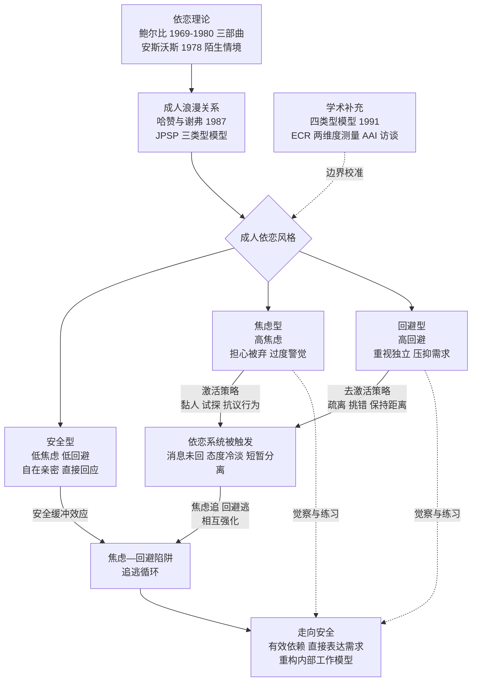

# 架构洞察（Insights）

> 基于 [事实清单](facts.md) 提炼。每条洞察遵循四元组结构：陈述 / 证据 / 反常识点 / 行动启示。洞察是解释层，不构成新事实；事实依据均回指 F 编号。

## 洞察 1：依恋框架的解释力来自"行为系统"，而非"性格标签"

| 四元组 | 内容 |
|--------|------|
| **陈述** | "焦虑型/回避型"最有价值的用法不是给人贴性格标签，而是把恋爱中的过度反应理解为**依恋系统被触发后的策略行为**：焦虑型使用激活策略（抗议行为）重连依恋对象，回避型使用去激活策略自保。行为是策略，就意味着它有触发条件、可以被觉察和替换。 |
| **证据** | F-011、F-016（依恋行为系统与安全基地）；F-034（抗议行为/激活策略）、F-035（去激活策略）；F-018（安斯沃斯分类依据是行为组织方式而非反应强度）。 |
| **反常识点** | "策略"是描述模型而非主观意图——当事人通常意识不到策略在运行；本书把策略讲得高度有意识化、可快速自控，这是科普简化。策略的改变在临床上通常需要反复练习与关系经验支持，不是读完一本书即完成。 |
| **行动启示** | 该视角可迁移到一切带依恋色彩的关系：友谊中的过度求确认、职场中对上级认可的过度敏感、团队成员对"被排除在信息外"的激烈反应，都可以问一句"这是哪个系统被触发了"，而不是直接归因于"这人太作/太冷"。 |

## 洞察 2：焦虑—回避配对是"系统互补"陷阱，冲突的根源在互动结构而非单方人品

| 四元组 | 内容 |
|--------|------|
| **陈述** | 焦虑型与回避型相互吸引又反复冲突，是因为双方的策略恰好**互为扳机**：焦虑方的追求激活回避方的去激活（更想逃），回避方的疏远激活焦虑方的抗议（追得更紧），形成自我强化的追—逃循环。问题的最小单元是"配对的互动模式"，而不是某一方的性格缺陷。 |
| **证据** | F-036（焦虑—回避型陷阱，本书第 8–9 章）；F-034、F-035（两类策略方向相反）；F-037（安全型的安全缓冲效应从反面证明：换一个回应方式稳定的伴侣，循环可以不发生）。 |
| **反常识点** | "相互吸引"是倾向性描述而非宿命统计；本书对焦虑—回避配对发生率的叙述偏经验化。学术上配对组合的分布受测量方式、关系阶段、文化样本影响，不能据此推出"焦虑型必然爱上回避型"。 |
| **行动启示** | 任何"一方越推、一方越退"的二元互动（销售追客户、家长追青春期孩子、管理者追下属反馈）都适用同一分析：识别谁在激活、谁在去激活，在循环的任一点改变反应（焦虑方暂停追击、回避方主动给一次确定信号），都能打断正反馈。 |

## 洞察 3："有效依赖"反转独立与依赖的对立——安全基地让人更敢独立

| 四元组 | 内容 |
|--------|------|
| **陈述** | 本书最有反常识价值的主张是依恋悖论：**善于依靠他人的人反而更独立**。因为依恋对象提供的安全基地降低了底层不安全感，个体才敢探索、敢冒险、敢独处。把"依赖"视为软弱、要求自己在关系中完全自给自足，本身就是去激活策略的文化外衣。 |
| **证据** | F-033（有效依赖与依恋悖论，本书第 2 章）；F-016（安全基地概念自鲍尔比—安斯沃斯传统即存在）；F-019（安全型婴儿因照护者可信赖而更敢探索，是同一机制的婴儿版）。 |
| **反常识点** | "有效依赖有益"有充分的关系科学支持，但本书对"如何获得有效依赖"的指导主要是沟通技术与择偶建议，对结构性约束（如确实处于无回应关系中、依恋对象不可得）讨论不足；依赖的对象必须是回应性的，否则"依赖"会变成 F-036 陷阱的燃料。 |
| **行动启示** | 组织管理中"心理安全感"研究与团队安全感设计是同构的：成员相信求助不会被惩罚时，反而更敢承担风险；个人成长中，先建立"可依靠的少数关系"再推进高风险人生选择，比一味要求自己坚强更符合依恋机制。 |

## 洞察 4：三类型是入门地图，不是学术终点——本书定位为科普应用读物

| 四元组 | 内容 |
|--------|------|
| **陈述** | 《依恋》的科学底座（鲍尔比—安斯沃斯—哈赞/谢弗）是成熟的学院心理学；但本书为大众写作所做的简化必须被标注：三分类是哈赞与谢弗 1987 年的初代教学模型，当代主流测量已转向"焦虑×回避"两维度连续模型（ECR/ECR-R），另有 AAI 访谈传统与四类型模型（含恐惧型）并行。用类型自我觉察很有效，用类型给他人下判决则超出了证据支持的范围。 |
| **证据** | F-024、F-026（三类型来自 1987 年三题迫选量表）；F-027、F-028（1991 年四类型模型补充恐惧型）；F-029、F-030（ECR/ECR-R 两维度测量）；F-031、F-032（AAI 访谈传统与混乱型）；F-006（本书为畅销科普，300 万册/40 余种语言的传播量级也提示其通俗定位）。 |
| **反常识点** | 本知识包同样是二手转述：概念文档以中文转述为主，未逐字核对英文原书章节；学术结论以公开可核验的论文/教材信息为准（见 facts.md 信源），涉及临床诊断或个人重大关系决策时，应求助具备资质的心理咨询专业人员。 |
| **行动启示** | 阅读一切"心理学大众化"作品都可复用同一套校验动作：找到概念的原始论文与年份（谁提出、什么期刊、最初证据是什么）、区分"原研究结论"与"作者的应用建议"、查看后续文献是否修订了原模型。本知识包的 [学术脉络与延伸阅读](references/02-further-reading.md) 即按此路径编排。 |

## 知识地图



## 阅读路径推荐

```
实用取向：01 三类型 → examples/01 自察 → 03 陷阱 → 04 走向安全
理论取向：00 理论源流 → references/02 延伸阅读 → 01 三类型 → 02 运作机制
质疑取向：04 走向安全（学术边界一节）→ references/02 → facts.md 放弃核验清单
```

## 跨书参照

依恋视角为分组内多本读物提供了底层解释框架：

- **追逃与四骑士**：焦虑—回避配对中的追逃互动，与戈特曼观察到的"要求—退缩"及末日四骑士相互印证，见 [末日四骑士](../gottman-seven-principles/concepts/01-four-horsemen.md)。
- **教材定位**：成人依恋在关系科学全景中的位置，可回到 [沟通与冲突](../intimate-relationships/concepts/03-communication-conflict.md) 及《亲密关系》知识包 [入口](../intimate-relationships/index.md)。
- **对性别归因的替代**：火星金星话语把关系困扰归于性别差异，依恋理论提供了"个体差异"的替代解释，对照阅读 [学界批评与性别相似性证据](../mars-venus/concepts/03-scholarly-criticism.md)。
