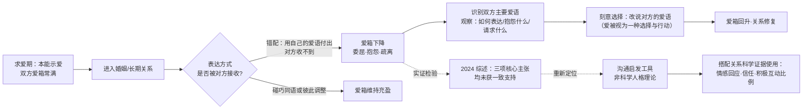

# 架构洞察（Architecture Insights）

> 基于 [事实清单](facts.md) 提炼。每条洞察按「陈述 / 证据 / 反常识点 / 行动启示」四元组组织；洞察是解释性判断，不等同于事实。

## 洞察 1：该框架最可靠的产品是「沟通词汇」，而非「人格分类」

| 四元组 | 内容 |
|--------|------|
| **陈述** | 《爱的五种语言》流传三十年的真正原因，是它给伴侣提供了一套可指认、可对话的词汇（「我的爱语是……」「你刚才那样做我没收到」），而不是因为它准确地把人分成了五种类型。作为词汇表它低门槛、低对抗；作为人格测验，它的测量学基础薄弱。 |
| **证据** | F-040、F-041（2024 年综述：10 项研究无一支持三主张，独立量表下五种爱语评分都很高）；F-019（框架主张人各有主要爱语）；F-045（作者自定位为「一个基本方面」而非完整答案）。 |
| **反常识点** | 不得把爱语测试结果当作稳定的人格标签或择偶匹配依据；「匹配效应」无实证支持（F-040），用它预测关系满意度或做婚配筛选属于超出证据的使用。 |
| **行动启示** | 任何「给予方式 ≠ 接收方式」的协作场景都可借用「翻译」隐喻：亲子教养、团队激励、客户服务中，先问「对方如何接收」，再决定如何表达，比坚持「我已经尽力了」更有效。 |

## 洞察 2：证据来源是牧灵辅导经验，流行度不能替代验证

| 四元组 | 内容 |
|--------|------|
| **陈述** | 本书的知识来源是作者三十余年牧灵辅导中的临床轶事与模式归纳，成书于受控研究之前；它后来的巨大销量与文化影响属于「传播成功」，不能作为「理论正确」的证据。两者必须分开评估。 |
| **证据** | F-001、F-006、F-007（牧师/辅导者身份与事工背景）；F-040、F-044（框架基于轶事，验证性研究结果不一致）；F-029、F-030、F-031（销量与榜单口径）；F-009（ECPA 白金奖属出版行业奖项而非学术认证）。 |
| **反常识点** | 「未被科学验证」不等于「无用」：作为引发对话的工具它有实践价值；但任何「已被科学证明」的营销表述都与证据状态不符，本知识包不予背书。 |
| **行动启示** | 评估一切自助读物时可先问三个问题：主张来自系统观察还是个人经验？有没有独立的同行评审研究？样本代表谁？Impett 团队指出查普曼的观察样本以白人、宗教背景、异性恋传统伴侣为主（F-042 相关段落），这提示读者警惕把单一文化样本的经验普遍化。 |

## 洞察 3：「爱箱」是情感账户隐喻的通俗版，价值在日常微储蓄而非记账

| 四元组 | 内容 |
|--------|------|
| **陈述** | 「爱箱常满」把关系状态模型化为一个可存入、可支取的情感容器，与关系科学中戈特曼的「感情账户/出价回应」思路同向：日常微小的正向回应持续积累，决定关系的抗冲突能力。它的行动含义是「平时储蓄」，而不是「危机时一次性补偿」。 |
| **证据** | F-021（爱箱隐喻，作者注明引自精神科医师 Ross Campbell 的演讲）；F-015、F-016（第二章「保持爱箱常满」）；F-044（戈特曼研究显示情感回应、信任与积极互动是更可靠的关系预测因素）。 |
| **反常识点** | 账户隐喻容易暗示「关系等价交换」，而关系科学强调的是回应姿态（turn toward）而非收支核算；把爱箱当记分牌使用（「我为你做了这么多」）反而背离该隐喻的本意。 |
| **行动启示** | 可把「今天我为对方的爱箱存了什么」设计成低成本日常习惯：一句具体的感谢、一段放下手机的专心倾听、一件对方提过的小事。重点在频次与回应质量，不在金额大小。 |

## 洞察 4：爱语错配解释的是「努力不被接收」的错位，不解释关系的全部问题

| 四元组 | 内容 |
|--------|------|
| **陈述** | 框架最贴切的解释对象是一种具体困境：一方真诚付出，另一方却「收不到」。它把这类困境归因于表达方式的错位，并给出「观察—识别—改用对方语言」的操作路径。但关系困境还可能来自价值观冲突、权力不对等、创伤与心理健康问题、现实压力等，均不在框架射程内。 |
| **证据** | F-022（三条观察线索：如何表达爱、最常抱怨什么、最常请求什么）；F-019（用对方爱语表达才有效）；F-045（作者明确称只覆盖「被爱」维度，道歉与宽恕是另一要素）；F-040、F-042（匹配效应无支持、五类之外还有其他重要表达）。 |
| **反常识点** | 涉及暴力、成瘾、抑郁、背叛等议题时，「学说爱语」不能替代专业咨询与干预；本书本身定位为牧灵辅导读物，遇到高风险关系问题应寻求持证专业人员帮助。 |
| **行动启示** | 「抱怨」与「请求」可作为需求诊断的信号源：把伴侣反复抱怨的话翻译成未被满足的需求，比逐条辩解更有建设性。该诊断思路也适用于管理沟通中识别下属未明说的认可需求。 |

## 知识地图（Mermaid）



## 阅读建议

```
想改善沟通：01 爱箱 → 02 五种爱语 → examples/01 自察对话 → examples/02 实践节奏
想评估可信度：04 评价与边界 → facts.md 第六节 → references/02-further-reading
面向孩子/团队：03 发现方法（衍生应用一节）→ references/02 衍生书目
```

## 跨书参照

爱语模型在分组知识谱系中位于通俗实践层，与其他知识包的关系如下：

- **实证近邻**：戈特曼的"感情账户"与 5:1 积极互动比是爱语表达更具实证基础的近邻概念，见 [比率与修复](../gottman-seven-principles/concepts/04-ratio-repair.md)。
- **哲学先声**："爱需要学习而非坠入"的观念，弗洛姆在 1956 年已有系统阐述，见 [爱作为艺术](../art-of-loving/concepts/01-love-as-art.md)。
- **个体差异视角**：当"爱的表达方式"差异被归结为依恋风格而非固定爱语时，可参照 [三种依恋类型](../attached/concepts/01-three-attachment-styles.md) 获得更稳健的解释框架。
