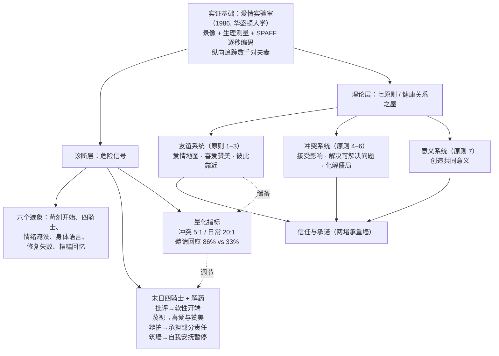

# 核心洞察（Insights）

> 本页的“洞察”是编订者基于 [facts.md](facts.md) 中已核验事实做的归纳与解读，属于二次加工观点；事实本身见 facts.md 与 [references](references/index.md)。

## 洞察一：婚姻预测是“可观察行为科学”，但预测数字有严格口径

| 维度 | 内容 |
|------|------|
| **陈述** | 戈特曼体系最轰动的主张——听五分钟对话就能预测离婚——其学术实质是把婚姻研究从“自我报告问卷”转向“可观察行为编码”（录像、生理测量、逐秒情感编码 SPAFF、多年纵向追踪）。这一方法转向影响了整个亲密关系研究领域。 |
| **证据** | 戈特曼自 1970 年代与莱文森合作，1986 年建成公寓式“爱情实验室”；书中自称三项研究平均预测准确率 91%[^s-utah-excerpt]，官方博客称 90%+[^s-magic-ratio]（[facts.md](facts.md) 研究方法组）。但 Heyman & Smith Slep（2001）在《Journal of Marriage and Family》指出：不经交叉验证的预测方程在独立样本上准确率与预测价值骤降，二手再分析中阳性预测值可低至 21%[^s-heyman]。 |
| **反常识点** | 大众传播把“91%”当作被反复验证的硬结论；学界质疑的却不是“沟通模式与婚姻质量相关”这一方向，而是“把相关性当预测公式、且未做样本外验证”的统计方法。描述性发现（四骑士、互动比率）比预测性声称稳健得多。 |
| **行动启示** | 学习者应把本书当作“可改变的行为模式手册”而非“婚姻命运诊断书”：用四骑士、修复尝试、邀请回应率自查行为，不用预测数字给自己或伴侣贴“迟早离婚”的标签；引用戈特曼数据时主动标注“戈特曼团队自我报告口径”。 |

## 洞察二：婚姻质量的地基是友谊系统，不是冲突技巧

| 维度 | 内容 |
|------|------|
| **陈述** | 七原则的前三条——爱情地图、喜爱与赞美、彼此靠近——全部属于“夫妻友谊”建设；处理冲突的原则排在第四位以后。戈特曼明确不把传统婚姻咨询的“积极倾听/我句式”训练当作决定性因素，并指出许多幸福夫妻吵架时并不遵守那些规则。 |
| **证据** | 新婚六年追踪：维持婚姻者对配偶“沟通邀请”的回应率为 86%，离婚者平均 33%[^s-emotional-bank]；戈特曼引用的 Robinson & Price 研究称不幸福夫妻会漏数配偶约 50% 的积极行为[^s-gratitude]；书中把婚姻基础概括为夫妻间的深厚友谊。 |
| **反常识点** | 流行婚恋建议几乎都聚焦“怎么吵架”——沟通话术、倾听技巧；戈特曼数据却指向相反方向：决定关系走向的大量变量发生在“不吵架的时候”（日常邀请是否被回应、积极行为是否被看见）。冲突处理是屋顶，日常友谊是地基。 |
| **行动启示** | 资源分配优先级：先投资日常“靠近”（回应邀请、更新彼此世界的信息、表达欣赏），再打磨冲突话术；评估一段关系时，观察其日常互动密度比观察单次争吵质量更有信息量。自查清单见 [examples/01-marriage-checkup.md](examples/01-marriage-checkup.md)。 |

## 洞察三：蔑视是唯一带“地位攻击”的骑士，解药在积极储备而非争吵技术

| 维度 | 内容 |
|------|------|
| **陈述** | 四骑士中，批评针对具体行为、辩护是自我保护、筑墙是生理过载下的撤退，唯独蔑视（contempt）表达的是“我比你优越、我厌恶你”——它攻击对方的人格地位。戈特曼研究称其为离婚的“最强单一预测因子”。 |
| **证据** | 戈特曼研究所官方博客与多种临床工具资料一致指出：翻白眼、嘲讽、讥笑、辱骂等蔑视行为最具腐蚀性，对应的解药不是“换一种吵架方式”，而是“建立喜爱与赞美的文化”；冲突中稳定婚姻保持约 5:1 的正负互动比（日常场景更高，接近 20:1）。 |
| **反常识点** | 直觉上“愤怒”是婚姻大敌；戈特曼数据表明愤怒本身并不预测离婚——所有夫妻都会愤怒，真正危险的是愤怒中夹带的厌恶与优越感。对治蔑视靠的是平时积累的欣赏与感恩（积极情绪储备），而不是争吵现场的话术控制。 |
| **行动启示** | 把“感恩/欣赏扫描”变成日常纪律：主动留意并表达对配偶具体行为的感谢（不幸福的人会漏看一半积极行为）；争吵中一旦察觉自己想翻白眼或嘲讽，先暂停——那是蔑视信号，不是“口才占上风”。修复机制详见 [concepts/04-ratio-repair.md](concepts/04-ratio-repair.md)。 |

## 洞察四：69% 的问题不可“解决”——婚姻工程学从消灭分歧转向与分歧共处

| 维度 | 内容 |
|------|------|
| **陈述** | 戈特曼把婚姻冲突一分为二：可解决的问题与永久性问题（约占 69%）。对前者用五步法（温和开端、修复尝试、自我安抚、妥协、包容缺点）；对后者（僵局 gridlock）不追求说服对方，而是识别分歧背后各自守护的个人梦想，让僵局“松动”到可以对话共处。 |
| **证据** | 戈特曼研究所“777 规则”文明确称约 69% 的关系问题是永久性问题[^s-777]；原书原则五给出可解决问题的五步骤，原则六处理僵局（犹他大学馆藏原书章节可核）；原则七“创造共同意义”则用共享仪式、角色与目标超越分歧。 |
| **反常识点** | 多数关系指南承诺“解决冲突/达成一致”；戈特曼的框架反而要求先判断问题类型——对永久性问题追求“解决”本身就是僵局的燃料。区分“这场架要不要赢”与“这个差异要不要背一辈子”，比任何谈判技巧都重要。 |
| **行动启示** | 冲突时先做分类题：这是具体情境问题（用五步法）还是人格/梦想层面的永久差异（用僵局对话）？对永久差异，目标从“改变对方”改为“理解对方守护的梦想 + 找到能互相取笑、互相迁就的共处方式”。原则四“接受配偶影响”是这种态度的入口：愿意被配偶改变的一方，婚姻破裂概率显著更低（书中 130 对新婚研究口径为 81%）。 |

## 知识地图

## 学习路径推荐

1. **先读概念**：[00 戈特曼与爱情实验室](concepts/00-gottman-love-lab.md)（理解方法与口径）→ [01 末日四骑士](concepts/01-four-horsemen.md)（最常用诊断工具）→ [04 比率与修复](concepts/04-ratio-repair.md)（机制）→ [02 友谊系统](concepts/02-principles-friendship.md) → [03 冲突与意义](concepts/03-principles-conflict-meaning.md)。
2. **再做实践**：[婚姻关系自查清单](examples/01-marriage-checkup.md) → [七原则实践计划](examples/02-principles-practice-plan.md)。
3. **溯源与延伸**：[版本信息](references/01-editions.md)（购买/借阅依据）→ [延伸阅读与学界讨论](references/02-further-reading.md)（含对预测力的同行批评，务必读）。

[^s-magic-ratio]: The Gottman Institute, The Magic Relationship Ratio, According to Science. https://www.gottman.com/blog/the-magic-relationship-ratio-according-science/
[^s-heyman]: Heyman, R. E., & Smith Slep, A. M. (2001). The Hazards of Predicting Divorce Without Crossvalidation. Journal of Marriage and Family, 63(2), 473–479. https://pmc.ncbi.nlm.nih.gov/articles/PMC1622921/
[^s-emotional-bank]: The Gottman Institute, Invest in Your Relationship: The Emotional Bank Account. https://www.gottman.com/blog/invest-relationship-emotional-bank-account/
[^s-gratitude]: The Gottman Institute, What is Gratitude? And is it the Antidote to Contempt. https://www.gottman.com/blog/what-is-gratitude/
[^s-777]: The Gottman Institute, The 777 Rule for Marriage. https://www.gottman.com/blog/777-rule-marriage/
[^s-utah-excerpt]: University of Utah 课程馆藏 PDF（原书第 1 章等摘录）. http://ereserve.library.utah.edu/Annual/COMM/3040/Parkin/principle5.pdf

## 跨书参照

戈特曼的互动观察在分组内与多个知识包形成概念对话：

- **追逃循环的依恋解释**：戈特曼描述的"要求—退缩"互动模式，在依恋理论中有更根本的解释——焦虑型与回避型的策略配对，见 [焦虑—回避配对陷阱](../attached/concepts/03-anxious-avoidant-trap.md)。
- **日常表达与感情账户**：感情账户与"出价回应"的通俗实践版可对照查普曼的爱语模型，见 [五种爱语总述](../five-love-languages/concepts/02-five-languages.md)（该模型实证基础有限，阅读时参见其评价篇）。
- **哲学先声**："爱可以通过练习经营"的信念与弗洛姆"爱是艺术"的实践观相通，见 [爱的实践](../art-of-loving/concepts/04-practice-of-loving.md)。
