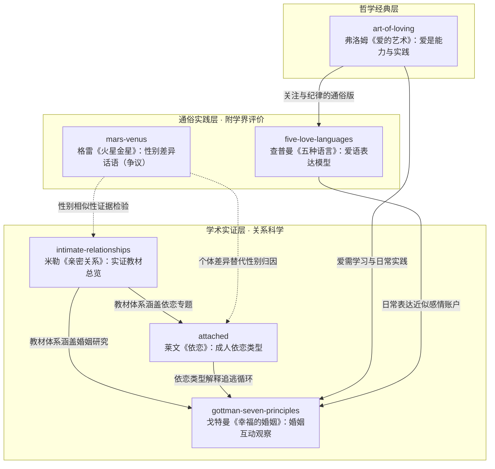

# 💕 亲密关系与两性情感

本分组收录两性关系与亲密关系领域经典著作的系统化中文知识包。六本著作在亲密关系的知识谱系中分属三个层次：**学术实证层**（米勒《亲密关系》、戈特曼《幸福的婚姻》、莱文《依恋》——以实证研究与临床科学为基础）、**哲学经典层**（弗洛姆《爱的艺术》——人本主义哲学对爱的本质追问）与**通俗实践层**（查普曼《爱的五种语言》、格雷《男人来自火星，女人来自金星》——长销大众读物，附学界评价与批判视角）。

> **阅读提示**：本分组知识包以**原创中文转述与解读**为主体，著作原文受版权保护，直接引用仅限标注出处的关键概念短句；书目事实均经公开权威信源核验，信源清单见各束 `references/`。通俗类读物的学术争议已在相应知识包中如实呈现。

## 分组导航

| 知识包 | 定位 | 核心概念 |
|--------|------|----------|
| [intimate-relationships/](intimate-relationships/index.md) | 学术实证 · 亲密关系科学教材 | 社会心理学实证研究、吸引力、相互依赖理论、关系发展与解体 |
| [art-of-loving/](art-of-loving/index.md) | 哲学经典 · 爱的本质论 | 爱是艺术与能力、爱的理论诸形态、爱的实践四要素 |
| [gottman-seven-principles/](gottman-seven-principles/index.md) | 学术实证 · 婚姻关系科学 | 爱情实验室、末日四骑士、七原则、5:1 互动比、感情修复 |
| [five-love-languages/](five-love-languages/index.md) | 通俗实践 · 爱的表达模型 | 爱箱隐喻、五种爱语、爱语错位与适配（含学界评价） |
| [attached/](attached/index.md) | 学术实证 · 成人依恋理论 | 依恋三类型、依恋系统、焦虑-回避陷阱、安全基地 |
| [mars-venus/](mars-venus/index.md) | 通俗实践 · 性别差异话语 | 火星/金星隐喻、沟通差异论（含学界批评与性别相似性证据） |

## 跨书知识地图

六本著作分处三个证据层级，彼此之间存在明确的概念承继与对话关系：



实线表示概念承继与实证呼应，虚线表示通俗主张与实证证据之间的检验关系。

## 跨书概念对话

| 关系主题 | 学术实证层的回答 | 哲学 / 通俗层的回答 |
|----------|------------------|---------------------|
| 安全感从何而来 | 依恋类型与安全基地（[attached 理论源流](attached/concepts/00-attachment-theory-origins.md)）；信任在日常互动中积累（[gottman 友谊基础](gottman-seven-principles/concepts/02-principles-friendship.md)） | 爱箱被对方爱语填满（[爱箱隐喻](five-love-languages/concepts/01-love-tank.md)，通俗模型） |
| 冲突为何伤人 | 末日四骑士式互动模式与修复尝试的成败（[四骑士](gottman-seven-principles/concepts/01-four-horsemen.md)） | 火星金星话语归因为性别本质差异（[学界批评](mars-venus/concepts/03-scholarly-criticism.md)，存在重大争议） |
| 爱能否学习 | 关系技能可观察、可训练（戈特曼七原则） | 爱是艺术，需纪律、专注、耐心与最高关注（[爱的实践](art-of-loving/concepts/04-practice-of-loving.md)） |
| 差异如何理解 | 性别差异多小到可忽略，个体差异更有解释力（[性别相似性证据](mars-venus/concepts/03-scholarly-criticism.md)；[三种依恋类型](attached/concepts/01-three-attachment-styles.md)） | 爱语分类提供表达差异的通俗切分（实证基础有限，见 [评价与边界](five-love-languages/concepts/04-evaluation-and-boundaries.md)） |

## 阅读路径

- **问题驱动（按需进入）**：在关系中反复感到不安、过度在意对方回应 → 先读 [attached](attached/index.md)；频繁争吵或冷战 → 先读 [gottman-seven-principles](gottman-seven-principles/index.md)；觉得"我表达了爱但对方收不到" → [five-love-languages](five-love-languages/index.md) 并配合其评价篇；想追问"爱到底是什么、为何现代社会爱如此艰难" → [art-of-loving](art-of-loving/index.md)。
- **体系路径（系统学习）**：以 [intimate-relationships](intimate-relationships/index.md) 教材总览建立关系科学地图，再按兴趣进入 attached（依恋专题）与 gottman（婚姻互动专题）两个实证纵深，最后以 art-of-loving 收束哲学层面的理解。
- **批判路径（通俗读物读法）**：mars-venus 与 five-love-languages 是长销通俗读物，阅读时务必配套各束的"学界评价 / 批评"概念篇，把"经验共鸣"与"科学证据"分开评估；证据分级方法见 [批判性阅读指南](mars-venus/concepts/04-critical-reading.md)。

```{toctree}
:glob:
:hidden:
:maxdepth: 7

intimate-relationships/index
art-of-loving/index
gottman-seven-principles/index
five-love-languages/index
attached/index
mars-venus/index
```
