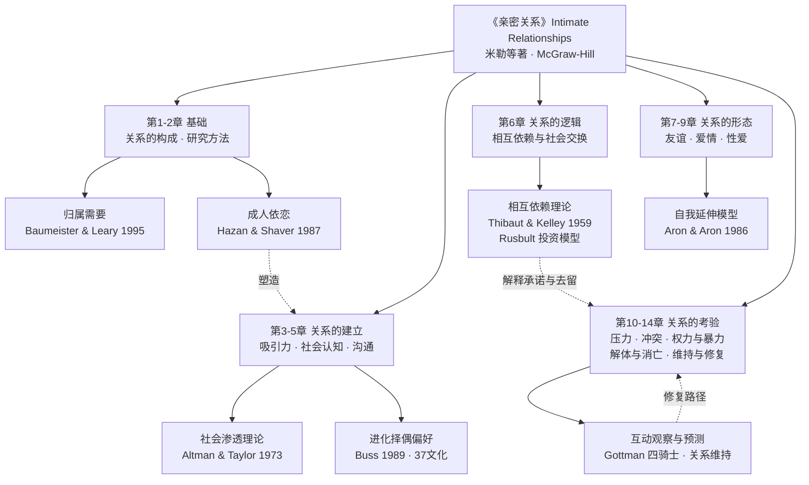

# 核心洞察（Insights）

> 本页洞察为基于 [事实清单](facts.md) 的原创解读，每条由「陈述／证据／反常识点／行动启示」四元组构成。证据列引用 F-编号事实，理论细节见 [概念层](concepts/index.md)。

## 洞察一：亲密关系是一门可实证的科学，而不是只能靠直觉与缘分的领域

| 维度 | 内容 |
|------|------|
| **陈述** | 米勒《亲密关系》的根本立场是：吸引、相爱、冲突、分手这些看似最私人化的体验，存在可被观察、测量和预测的规律；关系科学以相关研究、实验、纵向追踪和伴侣互动观察为方法，持续产出可重复的结论 |
| **证据** | 出版社官方定位本书为关系科学的综合综述，横跨社会心理学、沟通研究、家庭研究、神经科学、人口学等学科（F-034、F-035）；全书第2章专门讲研究方法（F-028）；戈特曼团队经四十余年、逾3000对伴侣的观察，仅凭互动模式即可高准确率预测离婚（F-043） |
| **反常识点** | 流行文化倾向于把亲密关系神秘化为"缘分"与"感觉"，认为科学一插手就破坏浪漫；本书恰恰相反——理解机制不会消解浪漫，反而让关系中的困境不再被归因为"我不够好"或"遇人不淑" |
| **行动启示** | 遇到关系困惑时，先问"证据是什么"：这是偶发事件还是稳定模式？我的判断来自观察还是来自恐惧与臆测？把"凭感觉下结论"换成"先看行为证据再判断" |

## 洞察二：关系的去留不取决于它绝对好坏，而取决于比较水平与替代选择

| 维度 | 内容 |
|------|------|
| **陈述** | 相互依赖理论把关系结果拆解为：实际所得减去期望基准（比较水平 CL）决定满意度，实际所得减去可替代选择（替代比较水平 CLalt）决定依赖度与去留；承诺还受到已投入资源多少的调节 |
| **证据** | 本书第6章"相互依赖"以社会交换框架组织，核心概念为结果、CL、CLalt，理论源头为 Thibaut 与 Kelley 1959/1978 年的工作（F-036、F-030） |
| **反常识点** | 常识认为"不幸福就会离开"；研究逻辑则是：一个人可以对关系高度不满却仍然留下（替代选择更差、投入太多），也可以对关系基本满意却选择离开（出现了更好的替代项）。"还爱不爱"并不能单独预测分合 |
| **行动启示** | 评估一段关系时同时看三个数：实际得到什么、自己的期望基准是否现实、离开后的真实选项是什么；提升承诺的正道是改善结果与校准期望，而非靠贬低对方的替代选择来"锁住"关系 |

## 洞察三：成年人的浪漫模式有可追溯的依恋根源，且类型分布相当稳定

| 维度 | 内容 |
|------|------|
| **陈述** | 哈赞与谢弗1987年把婴儿依恋理论迁移到成人浪漫关系，发现成人中安全型、回避型、焦虑/矛盾型三种依恋风格的相对比例与婴儿研究大致相同，且不同类型的人在恋爱中的情绪、记忆与冲突行为呈现可预测的差异 |
| **证据** | 奠基论文发表于《人格与社会心理学杂志》52卷3期，两项问卷调查得出上述分布与差异（F-037、F-038）；本书在"社会认知""爱情"等章节吸收了成人依恋框架（F-029、F-031） |
| **反常识点** | 人们习惯把伴侣的冷淡解释为"不爱我"、把自己的过度焦虑解释为"太在乎"；依恋视角指出，这些反应首先是各自早年形成的亲密关系工作模式在起作用，针对的是当下这个人的成分比想象中少 |
| **行动启示** | 冲突时刻先识别自己的依恋触发点：被疏远时你是追、是逃还是僵住？把"你为什么这样对我"改写为"我的哪种依恋恐惧被激活了"，能显著降低把童年剧本强加给伴侣的概率 |

## 洞察四：关系的存亡更多取决于如何处理负面时刻，而非正面时刻的浓度

| 维度 | 内容 |
|------|------|
| **陈述** | 戈特曼的伴侣观察研究识别出批评、蔑视、防御、筑墙四种递进的负面互动模式（"末日四骑士"），其中蔑视（居高临下的嘲讽与鄙夷）是离婚的最强单一预测因素；稳定关系并非没有冲突，而是负面互动被足量的正向互动所稀释 |
| **证据** | 四骑士与蔑视的预测力来自戈特曼四十余年、3000余对伴侣、12项研究的观察项目（F-043）；本书第11章"冲突"、第14章"维持和修复"以关系维持与修复机制收束全书（F-032） |
| **反常识点** | 流行建议强调"多制造浪漫惊喜"，而关系科学的权重排序相反：减少蔑视与敌意这类"坏"，比增加约会与礼物这类"好"更能保命——负面行为的侵蚀力远大于正面行为的建设力 |
| **行动启示** | 把检修重点从"我们最近够不够甜"转向"我们吵架时有没有出现鄙视对方的时刻"；具体可操作的替代是：抱怨具体行为而非攻击人格、在冲突升级时主动暂停、在日常积累可被对方接收到的微小善意 |

---

## 本书知识地图

> 地图说明：实线为教材章节顺序（建立 → 经营 → 考验），虚线为理论对章节的解释关系。概念详解见 [00-著作定位](concepts/00-book-and-science.md) 至 [04-相互依赖与维持](concepts/04-interdependence-maintenance.md)，学术出处见 [延伸阅读](references/02-further-reading.md)。

## 跨书参照

本知识包是关系科学的教材级总览，分组内其他知识包在若干专题上形成纵深与对照：

- **成人依恋专题**：教材中的依恋类型讨论可深入阅读《依恋》知识包的 [依恋理论源流](../attached/concepts/00-attachment-theory-origins.md) 与 [三种依恋类型](../attached/concepts/01-three-attachment-styles.md)，后者提供了从鲍尔比到成人浪漫依恋的完整学术脉络。
- **冲突互动专题**：教材引用的戈特曼研究可对照《幸福的婚姻》知识包的 [末日四骑士](../gottman-seven-principles/concepts/01-four-horsemen.md)，其中对该研究的方法、口径与学界争议有完整交代。
- **通俗话语的证据检验**：大众读物中的性别差异主张与教材实证图景的落差，可参见《男人来自火星，女人来自金星》知识包的 [学界批评](../mars-venus/concepts/03-scholarly-criticism.md)。
