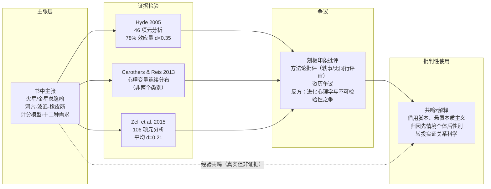

# 架构洞察（Architecture Insights）

> 基于[事实清单](facts.md)得出，每条洞察遵循四元组结构（陈述/证据/反常识点/行动启示）。所有因果性表述均锚定已核验事实；推测性内容显式标注。

## 洞察 1：火星金星是“经验共鸣型隐喻”，不是“实证型理论”——主张层与证据层必须分离

| 四元组 | 内容 |
|--------|------|
| **陈述** | 这本书的知识形态是自助叙事与关系隐喻（星球、洞穴、波浪、橡皮筋、计分），其功能是提供解释框架与沟通脚本，而非报告可检验的心理学发现。读者的共鸣体验是真实的，但“我有共鸣”不能反推“两性确有本质差异”。 |
| **证据** | F-018~F-030 显示书中模型均以“该书主张/该书称”形式出现，素材来自十年研讨班与咨询轶事（F-006、F-038）；F-031~F-036 显示元分析层面的证据指向性别相似性而非分立类别。 |
| **反常识点** | 共鸣本身有主观价值，不应被证据讨论否定；本判断针对的是“把隐喻当机制”的阅读方式，而非否定读者的真实体验。 |
| **行动启示** | 读任何流行心理学读物时先分层：哪些是作者的主张与故事（主张层），哪些有同行评审证据支撑（证据层）；两层都可以“有用”，但可信度不同。 |

## 洞察 2：实证图景是“重叠分布”，归因顺序应先情境与个体、后性别

| 四元组 | 内容 |
|--------|------|
| **陈述** | 主流心理学证据支持的模型是：男女在多数心理变量上分布高度重叠，差异表现为连续维度上的均值偏移，而非两个类别；因此把一次具体的伴侣反应归因为“因为他是男人/她是女人”，在统计上经常是错置——个体差异与情境压力通常解释力更大。 |
| **证据** | F-031、F-032（Hyde 2005：46 项元分析、78% 效应量 d<0.35）；F-035（Carothers & Reis 2013：心理变量为连续维度而非类属）；F-036（Zell et al. 2015：106 项元分析、平均 d=0.21）；F-034（差异大小依赖情境，匿名条件下攻击的性别差异消失）。 |
| **反常识点** | 相似性假说不等于“任何差异都不存在”：运动表现、身体攻击、部分性态度等领域确有中等以上差异（F-032）；该假说本身在学界也有方法论争论（F-037），“差异被夸大”与“差异被忽视”两种风险并存。 |
| **行动启示** | 关系冲突归因可采用“三层检验”：先问情境（疲惫、压力、信息不足），再问个体（依恋风格、成长史、当下状态），最后才问群体均值层面的性别倾向；且群体均值不能诊断个体。 |

## 洞察 3：该书“有效感”的机制可以独立于其理论真假

| 四元组 | 内容 |
|--------|------|
| **陈述** | 该书帮助到部分伴侣的可能机制是：提供简单可记的共情脚本（先倾听、不急着给方案）、把冲突去人格化（归因于“星球语言不同”而非对方恶意）、鼓励小而持续的关注。这些干预成分有效，不依赖“两性本质不同”为真。 |
| **证据** | F-024、F-027（书中建议核心是倾听与请求练习）；F-039 记录读者反馈“不把事情个人化帮我熬过很多关系时刻”；F-032 显示沟通变量本身性别差异很小——即脚本对男女双方可能同样适用。 |
| **反常识点** | 同一机制有反面：去人格化可能滑向去责任化（“他天生如此”成为不改变的借口）；刻板框架可能固化角色期待、让不符合框架的人（同性伴侣、非典型性别表达者）失声（F-039 批评；见概念 04）。 |
| **行动启示** | 评估自助读物应区分“叙事治疗价值”与“事实主张价值”：一本书可以处方有效而病因学错误；提取其中可迁移的行为脚本（倾听、直接请求、日常小关注），不必接受其性别本质主义包装。 |

## 洞察 4：畅销度与科学效度是两条正交的评价轴

| 四元组 | 内容 |
|--------|------|
| **陈述** | 121 周以上的畅销纪录与千万级销量证明的是文化影响力与营销成功，不构成任何科学有效性证据；相反，学术写作常以该书为“差异模型被大众高估”的典型反例。 |
| **证据** | F-011~F-017（销量与衍生生态）；F-033（Hyde 2005 开篇即以该书为批评靶子）；F-038（Buzzard 2002 将其作为品牌化案例，并记录作者学位来自未获认证的函授机构，F-004）。 |
| **反常识点** | 作者资历争议是可信度线索而非论证本身——CPU 学位未获认证不能单独证明书中观点错误，观点对错仍须由实证证据裁决；同理，学者身份也不保证批评完全公允（F-037 显示相似性立场同样受到同行质疑）。 |
| **行动启示** | 评价任何“现象级”读物时建立双账本：文化账本（它如何塑造了一代人的语言与想象）与证据账本（它的主张是否经得起检验）；双账本各自记账，互不抵扣。 |

## 知识地图



## 阅读路径推荐

```
第一次接触：概念 01（主张转述）→ 概念 03（证据对照）→ 概念 04（阅读姿态）
正在读书：  示例 02（警示清单）放手边 → 概念 02 对照 → 示例 01 做归因练习
想深入证据：references/02 中 Hyde 2005 原文 → Carothers & Reis 2013 → Zell 2015
```

## 跨书参照

本书的主张应在分组知识谱系中以批判视角定位：

- **个体差异替代性别归因**：书中描述的"他退缩、她追问"模式，用依恋类型（焦虑—回避差异）解释比用性别解释更贴合证据，见 [焦虑—回避配对陷阱](../attached/concepts/03-anxious-avoidant-trap.md)。
- **沟通冲突的实证图景**：关于两性沟通差异的实际效应量，教材综述与本书刻板印象差距明显，见 [沟通与冲突](../intimate-relationships/concepts/03-communication-conflict.md)。
- **可操作的实证替代**：若读者寻求改善互动的具体方法，戈特曼七原则提供了经过婚姻研究检验的替代方案，见 [友谊基础三原则](../gottman-seven-principles/concepts/02-principles-friendship.md)。
