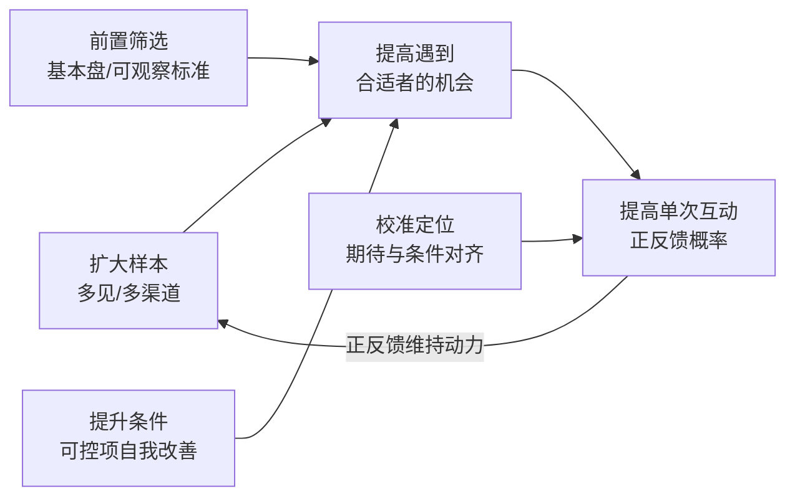

# 择偶中的概率判断与四类努力杠杆

在前一篇[因果与概率框架](00-causal-vs-probability.md)之上，作者把概率视角落到择偶的两个环节：一是识别**哪些结识方式在他看来风险更高**，二是指出**哪些努力能系统性提高 favorable 机会**。本篇如实呈现其判断，并对其中带刻板印象的部分做去标签化改写。

## 一、作者眼中"概率不友好"的四类情形

作者没有给出数据，以下是他基于咨询经验的**定性风险判断**：

| 情形 | 作者的判断 | F 出处 |
|---|---|---|
| 纯线上动情 | 仅网上聊几次、未见面就爱上对方甚至谈婚论嫁，被骗的概率很大 | [F-013](../references/facts.md#f-013) |
| 闪婚且未做了解 | 仅凭父母之命、媒妁之言，没做好背景了解就匆忙结婚，婚姻出问题/离婚的概率大 | [F-014](../references/facts.md#f-014) |
| 渠道与自身生活方式错位 | 自认"乖乖女/乖乖仔"，却把酒吧、按摩等娱乐场所或旅游古城偶遇当作主要找对象渠道，期待容易落空 | [F-015](../references/facts.md#f-015) |
| 自认是例外的高风险选择 | 明知某类人在自己经验里风险高，仍坚信自己会是例外 | [F-016](../references/facts.md#f-016) |

### 对 F-016 的必要修正：不拿职业标签当识人公式

原文断言"工程类的男生没有几个不去酒局、不去商K"，并据此警告坚持找工程男的女性 [F-016](../references/facts.md#f-016)。这是一条**无统计依据的群体刻板印象**，本 bundle 不将其作为事实呈现。可以保留的合理内核是：

- **看具体行为而非职业标签**：真正值得评估的是"这个人是否频繁出入高消费应酬场合、是否对此坦诚、这类行为是否越过你的底线"——这些在任何行业都可能出现或不出现。
- **警惕"我会是例外"的心态本身**：作者更可靠的提醒不是某个职业，而是当亲友、常识都提示风险时，仅凭强烈好感就认定自己特殊，这种决策方式确实容易让人忽略信号。
- 个体差异远大于职业均值；用行业给人贴标签，既可能错过可靠的人，也会制造虚假的安全感。

同样，F-015 对场所的判断带有经验化色彩，更中性的表述是：**在与自己价值观、生活方式差异很大的场景里找长期伴侣，筛到同频者的比例天然偏低**，这是渠道与目标错配问题，而不是某个场所里的人"不好"。

## 二、四类"提高概率"的努力杠杆

作者把自己过往内容与付费咨询的目标概括为同一件事：提高脱单与遇到优质对象的概率 [F-017](../references/facts.md#f-017)。具体拆为四个杠杆。

### 杠杆 1：扩大样本——多见、多渠道

- **做法**：各种脱单途径都用上，与更多异性相亲、见面、约会 [F-018](../references/facts.md#f-018)。
- **作者给出的心理收益**：样本量上来后，单次失败就更难被解读成"我不行"，从而保护继续尝试的动力。
- **边界**：见面数量不是越多越好——时间精力有限，且"海量相亲"可能带来倦怠与判断草率。它提高的是接触机会，不自动提高每次接触的质量。

### 杠杆 2：前置筛选——先定"基本盘"

- **做法**：在投入感情前，用一套基础标准识别合格对象，作者列的是身体素质、人品、性格、三观、生活习惯 [F-019](../references/facts.md#f-019)。
- **作者给出的社会收益**：从起点筛掉明显不合格者，就不容易在被伤害后把怨气扩大到整个异性群体、滑向男女对立。
- **落地提示**：把抽象的"人品好/三观合"转成**可观察行为**（如何对待服务人员、对承诺是否兑现、冲突时如何沟通、消费与作息是否相容），否则标准无法使用。

### 杠杆 3：提升自身条件——增大可匹配面

- **做法**：改善颜值、身高（不可改）、体重、学历、工作、收入等 [F-020](../references/facts.md#f-020)。
- **作者逻辑**：条件提升后，进入你可选择范围的对象层次也会变化，减少反复遇到低质量相亲对象带来的挫败。
- **边界**：身高、年龄、出身等不可控项不应成为自我否定的来源；把"优秀"窄化为外在条件排名，也与作者结尾强调的"利他属性"存在张力（见[下一篇](02-uncertainty-boundaries-and-cooperation.md)）。

### 杠杆 4：校准定位——期待与条件对齐

- **做法**：结合自身条件客观评估"适合找什么样、能找到什么样、方向在哪"，作者称之为不高攀也不低就 [F-021](../references/facts.md#f-021)。
- **作者逻辑**：定位越贴合实际，每次相亲/恋爱拿到正反馈的概率越高；而正反馈和阶段性结果，是维持相亲动力的燃料 [F-022](../references/facts.md#f-022)。
- **必要改述**："高攀/低就"是作者的等级化措辞（见 [F-025](../references/facts.md#f-025)），把人按条件分等、把婚姻当交换。更可辩护的说法是**双方在彼此看重的维度上是否都感到匹配与被珍惜**；关系满意度的研究更看重互动质量，而非外在条件的市场排名。

## 三、四类杠杆的关系

四个杠杆不是并列清单，而构成一个循环：**扩大样本**提供机会，**前置筛选**控制下限，**提升条件**扩大可匹配面，**校准定位**提高每次互动的正反馈率；正反馈又支撑人继续扩大样本 [F-018~F-022](../references/facts.md#f-018)。

## 使用边界

- 以上全部是**作者单源经验观点**，不是经过对照研究验证的策略；"概率提高"的幅度从未被测量。
- 风险判断（F-013~F-016）针对的是**决策方式与渠道错配**，不应被用作职业、地域或场所歧视的依据。
- 这套杠杆隐含"条件交换"色彩；是否接受这种婚恋叙事，读者可结合[下一篇](02-uncertainty-boundaries-and-cooperation.md)的"利他属性/合作"命题与组内实证类 bundle 自行权衡。
