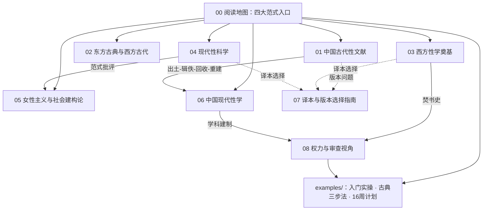

# 核心洞察（Architecture Insights）

> 生成时间：2026-08-30 ｜ 基于 facts.md 的 104 条事实提炼 ｜ 每条洞察含四元组：陈述/证据/反常识/行动。

## I-1：范式入口优于书目堆砌

| 四元组 | 内容 |
|--------|------|
| **陈述** | 性学经典阅读教程应以"方法论范式"（古典文献学/临床实验医学/社会科学/建构论批判）而非年代顺序作为组织主轴。 |
| **证据** | F-ANCIENT-001（马王堆简帛为文献学范式）、F-WEST-015（金赛为统计范式）、F-WEST-020（马斯特斯为实验范式）、F-WEST-028（福柯为话语分析范式）分别对应四种互不相同的阅读方法。 |
| **反常识** | 直觉上"按时间从古读到今"最自然，但奠基期著作（如《性精神病态》）的具体结论大多已被推翻，按年代读会让读者把过时结论当成入门知识。 |
| **行动** | concepts/00-reading-map.md 提供四范式自测与读者画像入口；examples/01-entry-path.md 给出按画像选第一本书的实操。 |

## I-2：中国脉络的独特链条——出土、辑佚、海外回收与学科重建

| 四元组 | 内容 |
|--------|------|
| **陈述** | 中国古代性文献的现代可读性来自一条"出土（马王堆）→辑佚（医心方/双梅景闇丛书）→海外汉学回收（高罗佩）→本土学科重建（刘达临等）"的环流链条。 |
| **证据** | F-ANCIENT-001（1973 马王堆出土）、F-ANCIENT（医心方 984 年辑存佚文、叶德辉清末辑刊）、F-ANCIENT（高罗佩 1961 年房内考）、F-CHINA-MODERN（刘达临著作与中华性文化博物馆）。 |
| **反常识** | 常识认为古籍靠本土师承传世，但中国房中文献恰恰是"墙内失传、墙外保存"——最大辑佚来源是一部日本医书（《医心方》卷二十八）。 |
| **行动** | concepts/01-ancient-china.md 按该链条组织阅读路径；古典文献读者应优先选现代整理本而非清末辑刊翻印本（见 concepts/07-translations.md）。 |

## I-3：译本与版本选择是中文读者的最大门槛

| 四元组 | 内容 |
|--------|------|
| **陈述** | 中文读者进入性学经典的实际障碍主要在版本层：热书滥译、冷书无译、辑佚文本可信度受限。 |
| **证据** | F-WEST-008（《性学三论》译本众多质量参差）、F-WEST-003（《性精神病态》无权威全译）、F-WEST-031（鲁宾正式中译未证实）、facts.md 中约 40 处【待核验】标注集中于现代版权著作版本细节。 |
| **反常识** | 书市上装帧最精致的"性学经典"往往是编译删节本；反而是潘光旦 1946 年的译注本至今仍是霭理士的最佳中文入口。 |
| **行动** | concepts/07-translations.md 给出选译本四原则与馆藏核验三步；bundle 内所有未核实版本信息均以【待核验】显式标注，不作断言。 |

## I-4：性学始终与权力/审查共构——阅读史即禁书史

| 四元组 | 内容 |
|--------|------|
| **陈述** | 性学经典的传播史与权力机制深度共构：焚书、查禁、删节与学科建制化是同一条线的不同片段。 |
| **证据** | F-WEST-011（1933 柏林性学研究所被焚）、F-CHINA-MODERN（张竞生《性史》查禁）、《金瓶梅》禁毁与版本生存（F-ANCIENT 相关条目）、中国性学会 1994 年成立与教育部 2008 纲要（F-CHINA-MODERN 相关条目）。 |
| **反常识** | 通常把"禁书"与"学科书"看成两类书，但同一批文本常常先被禁毁、后被学科化收编——1933 年被焚的图书馆正是 1919 年成立的正规研究所。 |
| **行动** | concepts/08-censorship-power.md 提供专篇视角；建议读者在阅读任何一部经典时同步查它的出版史/查禁史。 |

## 知识地图

