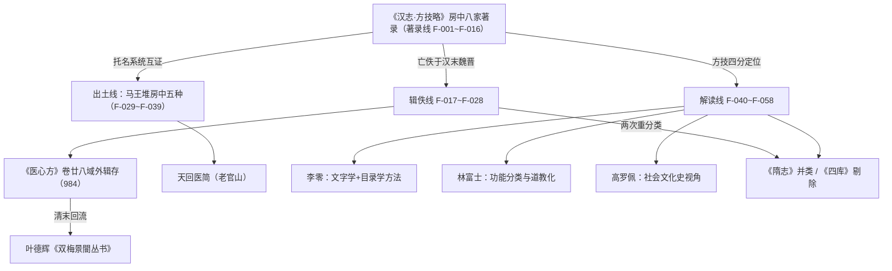

# 核心洞察（Architecture Insights）

> 生成时间：2026-08-31 ｜ 基于 [facts.md](facts.md) 的 58 条事实提炼 ｜ 每条洞察含四元组：陈述/证据/反常识/行动。

## I-1：托名结构是亡佚书目可复原的"化石层"

| 四元组 | 内容 |
|--------|------|
| **陈述** | 房中八家虽全部亡佚，但其书名中的托名人物（容成、务成、尧舜、汤盘庚、天老、天一、黄帝）构成可解读的知识化石——马王堆《十问》"黄帝问于容成""尧问于舜""帝盘庚问于耇老"的人物组合与八家书名托名系统直接对应，证明该托名传统在西汉初年（前 168 年下葬）已定型。 |
| **证据** | F-001~F-008（八家书名）、F-032（《十问》十组问答人物）、F-037（托名系统对应关系）、F-055（容成托名跨房中/阴阳家/天文历法）。 |
| **反常识** | 亡佚书目并非空白——书名本身就是内容证据。目录学著录与出土文献可以互证托名传统，"书亡而名存"中"名"携带着学派谱系信息。 |
| **行动** | 研读亡佚房中书时，先解析书名托名人物，再对照出土文献问对组合与《汉志》他类同名著录（如阴阳家《容成子》），重建学派归属。 |

## I-2：著录数字矛盾是流传史证据，不是数据缺陷

| 四元组 | 内容 |
|--------|------|
| **陈述** | 房中小计"百八十六卷"与逐家之和 191 卷差 5 卷，方技略总计 868 卷与四类小计之和 881 卷差 13 卷——颜师古已归因于"转写脱误，年代久远，无以详知"。这些矛盾是文本在两千年传抄中变动的直接痕迹。 |
| **证据** | F-009（小计原文）、F-010（差 5 卷与《汉书新注》按语）、F-016（四类核算与颜师古通例解释）。 |
| **反常识** | 数字错误不是史料缺陷而是史料内容——它记录了《汉志》文本自身的流传史。引用时以逐家卷数为著录依据、以小计为版本校勘对象，二者各有用途。 |
| **行动** | 凡引卷数，以逐家数字为准并附小计差异说明；不得为"凑整"擅自修正原文数字。 |

## I-3：亡佚文本通过"旁支双通道"回流：出土简帛与域外辑存

| 四元组 | 内容 |
|--------|------|
| **陈述** | 房中八家亡佚于汉末至魏晋（最迟隋初），但其知识传统通过两条旁支通道存留：一是出土简帛（马王堆房中五种，前 168 年实物），二是域外辑存链——六朝新系统房中书（素女经/玉房秘诀系）传入日本、被 984 年《医心方》卷廿八集成、清末叶德辉自《医心方》辑出刻入《双梅景闇丛书》回流中土。 |
| **证据** | F-019（《隋志》已不见八家）、F-022（《医心方》直引五种）、F-025/F-026（叶德辉辑刻与流传考证）、F-030/F-037（马王堆五种与时代关系）、F-058（填补空白）。 |
| **反常识** | "失传"不等于消失——文本以出土实物与域外辑存两种旁支形态存活，且回流路径跨越千年与国界（中土→日本→中土）。辑佚学在此是跨文化回收工程。 |
| **行动** | 查考亡佚房中书按三通道检索：传世文献引文（《医心方》《外台秘要》）、出土简帛（马王堆/天回）、域外辑存与辑佚本（双梅景闇丛书）；明确每条佚文的回流路径。 |

## I-4：房中在方技四分中的定位是"生生之具"，后世两次重分类改变了它的位置

| 四元组 | 内容 |
|--------|------|
| **陈述** | 《汉志》将房中列为方技四类之一（医经/经方/房中/神仙），小序以"乐而有节，则和平寿考"定调节制养生，房中是"生生之具，王官之一守"的合法知识。此后两次重分类改变了它的位置：《隋志》取消房中独立类目并入医方、同时在道经中另立房中类（十三部三十八卷）；《四库全书总目》进一步从医家类剔除房中。 |
| **证据** | F-012（小序原文）、F-014（方技总序"生生之具"）、F-020（《隋志》并类与道经四分）、F-047（林富士析"乐而有节"）、F-054（四分法分类学意义）、F-056（道教化节点）。 |
| **反常识** | 房中在汉代不是禁书也不是纯医书，而是与医经、经方并列的官方知识门类；它的"边缘化"是目录学史上的两次具体操作（隋、清）造成的，而非自古如此。 |
| **行动** | 以方技四分坐标系讲解房中，拒绝以现代学科（性学/医学）或后世道藏框架倒推汉代定位；概念文档中单列"目录学地位变迁"一节。 |

## 知识地图

