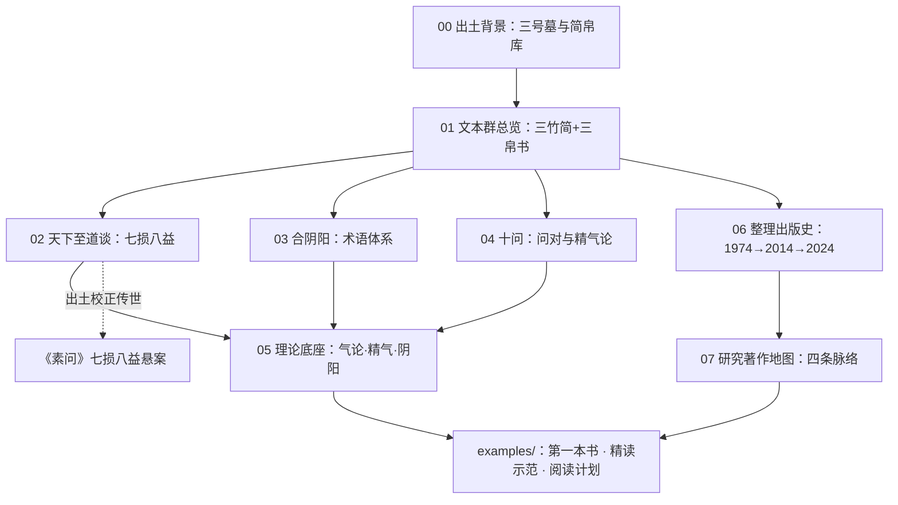

# 核心洞察（Architecture Insights）

> 生成时间：2026-08-31 ｜ 基于 facts.md 的 127 条事实提炼（含补充调研新增 29 条） ｜ 每条洞察含四元组：陈述/证据/反常识/行动。事实编号（F-XX-NNN）指向 [facts.md](facts.md)。

## I-1：房中书不是"禁书"，而是西汉官方知识分类中的正统方技

| 四元组 | 内容 |
|--------|------|
| **陈述** | 房中在西汉是独立而正统的方技门类：《汉书·艺文志》方技略将房中与医经、经方、神仙并列，著录八家186卷；马王堆房中书以"气"论养生，与医学、养生学共享同一理论框架，而非边缘秘术或淫祀之学。 |
| **证据** | F-TR-001、F-TR-002（《汉志》方技四家并列与八家著录）；F-TR-003（班固小序"情性之极，至道之际"的正面定位）；F-CON-001、F-CON-002（气论为共同理论基础）；F-TR-016（房中分类地位的历史演变）。 |
| **反常识** | 现代人常把房中术想象为隐秘的"黄色文献"或道教秘传，但在西汉官方目录中它与《黄帝内经》所属的医经同列方技，是公开著录、卷帙浩繁的实用知识；其"污名化"与道教化是东汉以后才发生的地位滑落。 |
| **行动** | 阅读马王堆房中书时应以"早期医学-养生文献"而非"性猎奇材料"为框架；研究其概念（七损八益、玉闭、食阴）时优先对照《内经》系医学概念史，而非后代道教内丹术语。 |

## I-2：马王堆房中书填补的是"目录存在、文本全灭"的文献断层

| 四元组 | 内容 |
|--------|------|
| **陈述** | 在马王堆出土之前，中国早期房中文献处于"有目录、无文本"状态：《汉志》八家、《抱朴子》诸经、《隋志》诸书全部亡佚，仅存《医心方》所引晚期佚文；马王堆简帛是唯一早于这一亡佚断层的实物文本群，其价值在于提供了术语系统的"原点坐标"。 |
| **证据** | F-TR-002（八家皆亡）；F-TR-006、F-TR-007（《抱朴子》《隋志》著录而书亡）；F-TR-008（《医心方》为最大辑佚来源但年代偏晚）；F-TXT-004、F-TXT-005（马王堆为现存最早实物且不见于《汉志》）；F-RES-012（李零指出马王堆与后代房中术术语体系一致）。 |
| **反常识** | 通常认为出土文献的价值在"补充"传世文献，但房中领域恰恰相反——传世链条完全断裂，出土文本不是补充而是唯一的早期样本；《医心方》佚文（10世纪日本类书）反而成了"晚期旁证"。 |
| **行动** | 构建房中文献谱系时以马王堆为年代锚点：向前上溯《汉志》著录体系，向后下接《医心方》佚文与叶德辉辑本；凡讨论"素女""彭祖"等人物系统，须先区分马王堆之前的证据与之后的证据。 |

## I-3：整理出版史的"40年滞后"揭示了出土文献研究的基础设施瓶颈

| 四元组 | 内容 |
|--------|------|
| **陈述** | 马王堆简帛1973年出土，但图版首次集中完整公布要到2014年《长沙马王堆汉墓简帛集成》，历时40年；瓶颈不在学术兴趣（期间已有著作264部、论文近4000篇），而在揭裱拼接的物理难度与整理体制：1974年帛书整理小组计划6卷本仅完成3卷，大量图版长期"研究者很难寓目"。 |
| **证据** | F-BG-011（碎片化出土、照片拼接的原始整理方式）；F-PUB-004、F-PUB-017（6卷计划仅成3卷）；F-PUB-008、F-PUB-009（2008年启动、耗时6年方成《集成》）；F-PUB-012（李学勤"里程碑"评价）；F-BG-017（40年间264部著作、近4000篇论文）。 |
| **反常识** | 直觉认为"出土越早、研究越充分"，但马王堆案例显示：出土时间与可研究时间之间存在数十年的"资料黑箱期"，期间大量研究只能基于不完整的释文（如 Harper 1977年起步时仅有《文物》1975年刊布的部分释文），早期结论难免需要随《集成》出版而修订。 |
| **行动** | 引用马王堆房中书时优先使用2014年《集成》及2024年修订本的释文注释，而非1979—1985年旧整理本；引用旧释文时应核对《集成》是否已改释改缀（如《养生方》新缀10余块残片）。 |

## I-4："七损八益"的破解是出土文献校正传世注疏的典范案例

| 四元组 | 内容 |
|--------|------|
| **陈述** | 《素问·阴阳应象大论》"七损八益"一语困扰历代注家千余年，诸说皆误；马王堆《天下至道谈》出土后，以逐条列举的方式（八益：治气、致沫、知时、畜气、和沫、窃气、侍赢、定倾；七损：闭、泄、竭、勿、烦、绝、费）给出了本义，证明该术语原属房中养生技术体系而非抽象阴阳哲学。 |
| **证据** | F-TR-009（历代注家解释不一）；F-CON-003、F-CON-004（《天下至道谈》的完整列举与原文）；F-TR-015（马王堆医书整体证明《内经》理论有更早实践基础）。 |
| **反常识** | 传世经典中被当作高深哲理的术语，其原义可能非常具体、技术化；权威注疏传统（包括王冰以下各家）在失去原始语境后可以集体误读上千年，而一次考古发现即可终结争议——出土文献对传世文献具有"降维校正"能力。 |
| **行动** | 遇到《内经》等传世医经中来源不明、注家分歧的术语，应建立"先查出土文献（马王堆/张家山/北大汉简）对读材料"的检索习惯；写作涉及时明确区分"传世注疏义"与"出土本义"。 |

## I-5：房中书的文本形态（问对体+依托古人）要求读者先做"文献身份识别"

| 四元组 | 内容 |
|--------|------|
| **陈述** | 马王堆房中书普遍采用"黄帝问于天师/大成/曹熬/容成""尧问于舜""黄神问于左神"等传说人物问对结构，书名亦为整理者据内容试加（原书无名）；这意味着文本的"作者""书名""年代"三层信息均为后设，阅读前必须先完成文献身份识别。 |
| **证据** | F-TXT-006（原书无名，今名为整理小组试加）；F-TXT-010（《十问》十组问对人物）；F-CON-015（"黄神问于左神"结构）；F-TXT-017、F-TXT-018（成书年代跨度大：春秋至秦汉之际，抄本年代与著作年代分离）。 |
| **反常识** | 读者容易把"黄帝问于容成"当作真实的历史对话记录、把《十问》当作原书名，但问对体只是古代技术文献的惯用包装，类似《内经》黄帝-岐伯问答；书名则是1970年代整理者的命名。混淆这两层会把文体惯例误读为史实。 |
| **行动** | 阅读任何马王堆房中书篇章时先核对三项元信息：今名由谁定名（帛书整理小组/《集成》）、问对双方是谁（判断文本依托的知识谱系）、释文依据哪个整理本（1985帛书肆 / 2014集成 / 2024修订本）；引用时标注"整理者定名"而非默认原名。 |

## I-6：篇名是"后设学术约定"，且拟题真实性参差不齐

| 四元组 | 内容 |
|--------|------|
| **陈述** | 马王堆医书大多原无书名，今名是整理小组据内容拟定的假称；但拟题的真实性并不均匀：《天下至道谈》篇题见于出土竹简第17简，可能保留原题；《却谷食气》篇题为后加且《集成》改题《去穀食氣》；气功馆网站所载"《黄帝问于左神》"一名不见正式定名【待核验】。篇名本身即是研究对象。 |
| **证据** | F-TXT-006、F-TXT-021（原书无名、整理小组拟名）；F-TXT-023（真柳诚：15种医书书名均不详，各依内容或冒头语句赋假称）；F-TXT-022（《却谷食气》→《去穀食氣》改题）；F-TXT-025（《天下至道谈》题于第17简）；F-TXT-024（《黄帝问于左神》异名【待核验】）；F-PUB-021（大形彻译注册沿用整理者定名）。 |
| **反常识** | 读者通常把《十问》《合阴阳》当作古书原名，实际上这些书名是1970—1980年代整理者的命名行为；更微妙的是，同一批文献中有的篇名来自出土原题、有的纯属后设，二者证据等级不同，不能等量齐观。 |
| **行动** | 引用马王堆医书篇名时标注"整理者定名"或"出土原题"；遇到异名（如《黄帝问于左神》《合阴阳方》）先核对是否见于正式整理本；跨语言引用时注意日文译名（十問/合陰陽方/天下至道談）与中文定名的对应。 |

## I-7：同一文本群被四条学术脉络分别接管，形成"分工性研究生态"

| 四元组 | 内容 |
|--------|------|
| **陈述** | 马王堆房中简帛研究已形成四条互补脉络：①中医文献学（周贻谋《马王堆医书考注》、马继兴《马王堆古医书考释》）做校注集成；②方术史/思想史（李零、朱越利）做房中术的文化定位与理论依据分析；③身体史/医学史（李建民）以"羼乱"方法论重建古典医学图像；④日本东方书店"马王堆出土文献译注丛书"提供日文译注基础设施（大形彻2015年房中医书册）。 |
| **证据** | F-RES-013~015（周贻谋生平与著作群）；F-RES-016~019（朱越利"气—精—神—神明"理论分析与背景研究）；F-RES-020~025（李建民马王堆论文群与《生命史学》《死生之域》）；F-PUB-019~023（东方书店丛书10种计划、已出5种、大形彻2015册）；F-PUB-024（裘锡圭五十年整理史）。 |
| **反常识** | 房中书常被单一化为"性学材料"，但实际研究生态横跨医学文献学、道教研究、历史人类学与海外汉学四个学科；日本译注丛书甚至引用华语学界论文（如李建民"禹藏埋胞图"笺证），说明该领域早已是跨国协作的知识生产网络。 |
| **行动** | 按研究问题选择入口：文本校勘查周贻谋/马继兴/《集成》；思想定位查李零/朱越利；身体观与医疗史查李建民；日文文献查东方书店丛书与名和敏光研究近况；综述性写作应同时覆盖四条脉络，避免学科盲区。 |

## 知识地图

## 使用说明

- 7 条洞察均基于 [facts.md](facts.md) 事实编号；I-6、I-7 基于 2026-08-31 补充调研新增 29 条事实追加。
- 四元组格式与 OKF bundle `think/sexology/classics-reading/insights.md` 保持一致（陈述/证据/反常识/行动）。
- I-2、I-3 可与 classics-reading 洞察 I-2（"出土→辑佚→海外回收→学科重建"环流链条）互相印证。