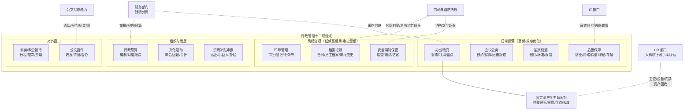

# 架构洞察（Architecture Insights）

> 基于 [事实清单](facts.md) 提炼。市场实践事实（JD 归纳）与法规事实已在 facts.md 分层标注；洞察为实务判断。

## 洞察 1：行政的专业度 = 隐性工作显性化的程度

| 四元组 | 内容 |
|--------|------|
| **陈述** | 行政工作天然不可见——物资充足、会议顺利、证照有效都是「理应如此」，只有出问题才被感知。市场实证显示，行政成熟度的直观指标是表单化程度：物资台账、资产台账、用印登记、合同台账、盘点记录（F-017）。 |
| **证据** | F-017（台账表单清单是行政工作的主要载体）、F-020（OA/资产系统线上化趋势）、F-002/F-005/F-006（资产、用印、证照均以登记台账为管理手段）。 |
| **反常识点** | 行政最容易陷入「忙而无功」：一天接了 40 个临时需求，月底却说不清自己创造了什么价值。反过来，把每类重复工作变成一张表、一个流程、一个日历节点，工作量反而下降——显性化不是增加负担，是把救火变成预防。 |
| **行动启示** | 每接管一块行政事务，先问三个问题：有没有台账？有没有周期日历（年检/盘点/预算/演练）？有没有可复用清单？模板见 [资产盘点与用印登记模板](examples/02-asset-inventory-seal-templates.md)。 |

## 洞察 2：行政风险是双峰分布——琐事练耐心，大事定生死

| 四元组 | 内容 |
|--------|------|
| **陈述** | 行政职能域的风险呈两极：一极是高频低额琐碎事务（纸笔茶水快递），另一极是低频高后果事件（违规用印、证照过期、消防事故、合同遗失）。两类事务的管理逻辑完全不同。 |
| **证据** | F-005（用印审批登记红线）、F-006（证照年报变更）、F-019（消防安全法定职责）、F-018（采购审批与钱物分离）对比 F-001/F-009（物资、后勤等高频事务）。 |
| **反常识点** | 行政新人把 90% 精力花在琐事响应上（因为琐事最吵），而决定行政职业评价的恰恰是另一极——印章没出过事、证照没过期、消防没被罚，这些「没出事」无人喝彩，但出事一次就是责任事故。风险事务的管理投入应该与其后果而非呼声成正比。 |
| **行动启示** | 把职能域按「后果严重度」分级：用印、证照、消防、合同列为一级风控（审批+登记+日历预警+留痕），物资、绿植、快递列为效率优化对象（线上化+供应商）；消防与合规问题必须书面上报留痕。 |

## 洞察 3：行政不养能力，养接口——供应商管理是行政能力的乘数

| 四元组 | 内容 |
|--------|------|
| **陈述** | 后勤保障的九成事务（保洁、绿植、车辆、维修、差旅、餐饮）都通过外部供应商交付（F-009、F-008），行政的核心能力不是自己会修会搬，而是管理供应商：选商、定价、定标准、考核、替换。 |
| **证据** | F-009（后勤各事项的供应商对接形态）、F-018（定点供应商与比价采购）、F-020（差旅平台/OA 等线上化工具）、F-010（比价与供应商管理是成本控制主要抓手）。 |
| **反常识点** | 小公司行政常把「自己动手」当敬业——自己修灯、自己跑腿订酒店，结果人成了最不可替代也最忙的瓶颈。专业行政的做法相反：把自己变成调度者，建供应商库（名称/联系人/价格/响应时限），让每个需求都有 2 家以上可选，用报修闭环和月度评分管理质量。 |
| **行动启示** | 建立分类供应商台账并年度评议末位替换；与供应商的合同写清响应时限与安全责任（尤其餐饮、消防、车辆）；报修数据月度复盘，高频故障改为根治。 |

## 洞察 4：行政预算不是「申请来的钱」，是「翻译给管理层的行政价值」

| 四元组 | 内容 |
|--------|------|
| **陈述** | 行政作为成本中心，预算编制与执行跟踪（F-010）不只是财务动作，而是行政部门向管理层证明价值的语言：固定费用可预测、变动费用可解释、专项费用有方案、人均成本有对标。 |
| **证据** | F-010（年度预算与月度跟踪、比价采购）、F-018（预算内审批与费用制度约束）、F-012（资质补贴申报可反向带来政策收入）。 |
| **反常识点** | 很多行政年底才发现超支，习惯「先花再说」；而财务视角里，超支和解释不清的支出都会压缩次年预算。更反常识的是：行政预算里藏着「收入项」——高企认定、稳岗补贴、社保补贴等政策申报（F-012）做好了，行政部门直接带来现金流入。 |
| **行动启示** | 按 [年度行政预算框架](examples/03-annual-budget-framework.md) 建「固定/变动/专项」三类预算，每月出执行率对比表；同步建资质补贴日历，把政策申报做成固定动作。 |

## 洞察 5：企业规模决定行政形态，但 SOP 是跨规模的唯一不变量

| 四元组 | 内容 |
|--------|------|
| **陈述** | 小微企业 1 人全包十二域、中型企业主管+专员分工、大型企业行政部细分专岗（F-016），组织形态随规模变；但台账、清单、流程、日历这套 SOP 体系在每种形态下都成立，且是小行政走向大行政部时唯一能直接迁移的资产。 |
| **证据** | F-016（三种规模行政形态）、F-015（市场对行政岗的通用能力要求）、F-017（表单化载体）、F-020（OA 线上化）。 |
| **反常识点** | 复合岗行政常自贬为「打杂的」，担心到大公司没有专长；实际上小公司行政的优势恰恰是全流程视角，短板只是没把经验沉淀为可展示的 SOP——同一件「安排会议」，做过 100 次没留清单叫重复劳动，留下清单模板叫方法论。 |
| **行动启示** | 每做完一类事就沉淀一份 SOP/清单/模板（本包 examples 即是范式）；跳槽与晋升时，作品集（我建的台账体系、预算表、供应商库、应急方案）比职责描述更有说服力。 |

## 知识地图（Mermaid）



## 阅读建议

```
先看全景：01 职能全景 → 洞察 2（风险双峰）
按手头事选读：管物看 02、管会看 03、管章证照看 04、管接待差旅看 05、管预算活动看 06
直接用模板：examples/01 会议清单 → examples/02 台账模板 → examples/03 预算框架
补写作短板：../official-writing（通知/纪要/报告/函）
补人事合规：../../hr/labor-law-compliance（合同/社保/档案留存年限）
```

## 跨包参照

- 公文与职场文书（行政的「笔」）：[公文写作与职场文书](../official-writing/index.md)。
- 人事行政交叉面（入离职、社保、劳动合规）：[HR 六大模块与三支柱](../../hr/hr-six-modules/index.md)、[劳动法律合规实务](../../hr/labor-law-compliance/index.md)。
- 行政人事复合岗的职业定位与进修路线：[HR 职业地图与进修路径](../../hr/hr-profession-map/index.md)。
