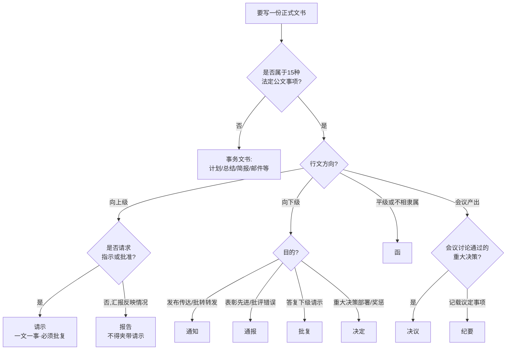

# 公文写作与职场文书 · 洞察分析

## 洞察 1：文种选择的第一变量是行文关系，不是内容主题

| 四元组 | 内容 |
|---|---|
| 陈述 | 选文种时先回答“写给谁、什么关系、要对方做什么”，再查 15 文种适用范围；行文方向（上行/下行/平行）错了，文种必然错。 |
| 证据 | F-024（行文关系按隶属关系与职权确定）；F-012/F-013（报告、请示均向上级机关）；F-016（函用于不相隶属机关之间）；F-014（批复答复下级）。 |
| 反常识点 | 同样是“请对方批准”：对上级用请示、对不相隶属单位用函、答复下级用批复——内容几乎相同，文种完全不同。新手按“主题”选文种（写会议就用通知），老手按“关系与目的”选文种。 |
| 行动启示 | 动笔前 30 秒在纸上标注：受文方是谁、我与它的关系、要它做什么（知晓/执行/批准/答复）；三者定了，文种自然浮现。 |

## 洞察 2：请示与报告混用是职场第一高频硬伤

| 四元组 | 内容 |
|---|---|
| 陈述 | “请示报告”连用、报告末尾夹带“请领导批准”、请示一文多事，是企业行文最常见错误，直接导致事项石沉大海或返工。 |
| 证据 | F-025（请示应当一文一事；不得在报告等非请示性公文中夹带请示事项）；F-012/F-013（二者适用范围分立）；F-026（请示原则主送一个上级）。 |
| 反常识点 | 很多人以为“请示报告”是一种文体，写进标题显得周全；条例恰恰要求二者分立——报告可以不回复，请示必须批复。把请求藏在报告里，上级按“阅知”处理，申请的预算/编制就永远批不下来。 |
| 行动启示 | 标题出现“请示”，正文只能有一件请求事项，结尾必须是“妥否，请批示”；凡需要上级“同意/批准”的内容，一律单独行文请示，不搭报告的便车。对照 [报告 vs 请示示例](examples/02-report-vs-request.md) 自检。 |

## 洞察 3：15 种法定公文是骨架，企业 80% 写作量是事务文书

| 四元组 | 内容 |
|---|---|
| 陈述 | 行政岗 JD 普遍要求“公文写作能力”，但日常产出最多的是通知、纪要、邮件、计划、总结；命令、决议、议案、公报等文种企业几乎不用。 |
| 证据 | F-034（计划、总结、简报、邮件等属事务文书，不属法定公文）；F-035（JD 普遍要求公文/纪要/函件起草能力）；F-037（企业借用文种集中在通知、通报、报告、请示、函、纪要）。 |
| 反常识点 | 学公文写作的人常花大力气背 15 文种定义和机关版式，回到岗位却发现 80% 时间在写邮件和会议纪要。法规学习的真正价值不是“照搬格式”，而是把“行文关系、一文一事、责任时限”的规范意识迁移到事务文书上。 |
| 行动启示 | 学习投入按 80/20 分配：先精通 6 个高频文种（通知、通报、报告、请示、函、纪要）+ 邮件与纪要模板；其余文种能识别、能查阅即可。 |

## 洞察 4：格式要素的本质是责任追溯链

| 四元组 | 内容 |
|---|---|
| 陈述 | 标题、署名、成文日期、发文字号、印章、主送/抄送这些“形式要素”，共同构成“谁发的、何时发的、发的哪一版、发给谁”的证据链。 |
| 证据 | F-018（18 要素法定清单）；F-019（标题三要素）；F-020（发文字号由代字、年份、序号组成）；F-021（成文日期署签发日期）。 |
| 反常识点 | 初学者觉得格式要素是摆架子、走过场；实际争议中，一封没有署名日期的通知、一份没有盖章的证明，会直接丧失效力。格式不是美学问题，是“事后能不能说清”的追溯问题。 |
| 行动启示 | 任何对外或需要归档的文书，发出前核对三件事：谁发的（署名/印章）、何时发的（成文日期全称）、找谁办（联系人与时限）。企业内部文书按 8 项简化清单核对即可。 |

## 洞察 5：纪要不是会议记录，“议定事项”才是主体

| 四元组 | 内容 |
|---|---|
| 陈述 | 纪要的法定功能是“记载会议主要情况和议定事项”（F-017），价值在于把讨论收敛为可执行、可追踪的决定。 |
| 证据 | F-017；F-034（会议记录属事务文书、纪要属法定文种）；纪要范例按“议题—结论—责任人—时限”归纳（见 examples/01）。 |
| 反常识点 | 新手写纪要习惯按发言顺序全文照抄，显得“详实”；但参会者真正需要的是“定了什么、谁去办、何时办完”。发言流水账是会议记录的任务，纪要越短越硬。 |
| 行动启示 | 会后 24 小时内发出纪要；每条议定事项必须含责任人和时限；行政部据此催办并在下次会议通报——纪要从“存档材料”变成“管理工具”。会议全流程配合见 [行政管理实务：会议管理](../admin-operations/concepts/03-meeting-management.md)。 |

## 知识地图（Mermaid）：文种选择决策图



## 阅读建议

```text
第一步：用决策图把手上文书定位到文种（或事务文书）
第二步：读 concepts/01 对应文种的适用范围与易混辨析
第三步：套 examples 中最近的范例/模板改写
第四步：用 concepts/04 语病清单 + 格式8要素清单发出前自检
```

## 跨包参照

- [行政管理实务](../admin-operations/index.md)：会议、印章、接待等行政流程是公文产出的上游场景
- [HR 职业地图与进修路径](../../hr/hr-profession-map/index.md)：文书写作能力在行政人事岗位能力模型中的位置
- [劳动法律合规](../../hr/labor-law-compliance/index.md)：录用通知、解除通知等人事行文的法规边界
