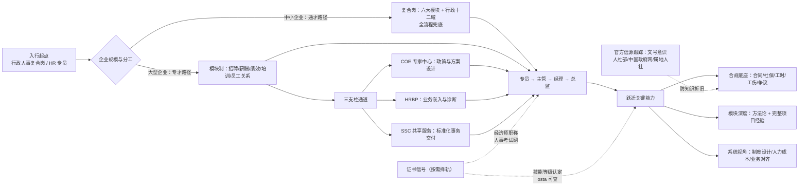

# 架构洞察（Architecture Insights）

> 基于 [事实清单](facts.md) 提炼。每条洞察按「陈述 / 证据 / 反常识点 / 行动启示」四元组组织；洞察是解释性判断，不等同于事实。

## 洞察 1：「退出国家职业资格目录」是制度切换，不是证书作废

| 四元组 | 内容 |
|--------|------|
| **陈述** | 2020 年改革把企业人力资源管理师从政府统考的职业资格，切换为备案机构组织的社会化职业技能等级认定。证书的「颁发者」变了，「能力证明」的属性没有变；旧证继续有效，新证 osta 联网可查。 |
| **证据** | F-004（2020-09-30 前第一批退出）、F-005（转为社会化等级认定）、F-006（旧证继续有效）、F-007（osta 联网查询）。 |
| **反常识点** | 「退出目录」四个字天然像「取消/作废」，培训机构正利用这种字面恐慌营销「最后一次国考」「旧证作废快换新证」——实际上 2020 年后根本不存在「国考」，旧证也不作废。政策语言与市场话术之间存在系统性误导空间。 |
| **行动启示** | 遇到任何「政策变了、必须马上行动」的证书营销，第一步永远是查人社部门原文与 osta 查询系统，而不是向销售求证；核验流程见 [证书报考与防骗指南](examples/02-certification-guide.md)。 |

## 洞察 2：证书是能力信号，不是能力本身——HR 岗位的可信信号是「处理过什么复杂问题」

| 四元组 | 内容 |
|--------|------|
| **陈述** | HR 证书属于水平评价类、非准入类（F-006），意味着市场没有「持证才能上岗」的硬门槛；用人单位真正定价的是可验证的实务能力：能否独立处理入离职、算对补偿、化解争议、写清制度。证书在求职中是简历筛选信号，在入职后的权重迅速让位于业绩。 |
| **证据** | F-006（水平评价、非准入）、F-017（JD 高频要求是实务技能与法规熟悉度，而非证书）、F-013/F-014（岗位层级晋升靠模块深度与系统设计能力）。 |
| **反常识点** | 「多考一个证多一条路」在 HR 领域回报率有限：面试官问「违法解除赔多少、试用期怎么约定才合法」，答不上来则证书反成扣分项——信号与内容不符会被当场识破。 |
| **行动启示** | 进修时间按「合规底座 → 模块实务 → 证书信号」分配；每学一个知识点就产出一份可展示物（清单、模板、案例复盘），作品集比证书堆叠更能证明能力（见 [分阶段进修行动清单](examples/01-staged-learning-plan.md)）。 |

## 洞察 3：行政人事的职业分叉在「通才 vs 专才」，选择先于努力

| 四元组 | 内容 |
|--------|------|
| **陈述** | 中小企业的「行政人事」复合岗要求通才（六大模块加行政十二域什么都要管），大企业按模块或三支柱要求专才（COE 设计、HRBP 嵌入、SSC 交付）。两类岗位的能力评价标准不同：通才卖「全流程兜底」，专才卖「单点纵深」。 |
| **证据** | F-016（中小企业复合岗 vs 大企业分设）、F-013（模块分工与层级）、F-014（三支柱岗位设置）、F-018（企业内部岗与人力资源服务业岗的通道差异）。 |
| **反常识点** | 复合岗常被自嘲为「打杂」，但它提供的是全流程视角与制度设计的天然训练场；反过来，大公司专员若只守一个 SSC 环节，视野可能比小公司通才更窄。岗位形态没有绝对优劣，错配才是风险——拿通才简历投专才岗（缺纵深）或反之（缺广度）都会在面试中露怯。 |
| **行动启示** | 跳槽前先画自己的能力雷达图（合规底座 + 六模块 + 行政各域），目标岗位要什么就补什么；复合岗出身者应主动把「什么都做过」整理成「我独立负责过哪些完整流程」，通才经验需要被重新表述为系统能力。 |

## 洞察 4：政策时效性是 HR 专业素养的第一性——知识折旧以「文号」为单位

| 四元组 | 内容 |
|--------|------|
| **陈述** | 人事行政工作几乎全部动作都落在法规与政策框架内：合同、社保、工时、休假、工伤、个税、证照，每一项都由具体文件规定且随文件修订而变化。HR 的知识不是静态学科，而是一套需要持续跟踪政策更新的实务体系。 |
| **证据** | F-002/F-004（证书制度 2020 年随 80 号文切换）、F-012（评价机制随目录改革重构）；社保费率、工时休假规则同样由国务院/人社部文件规定（详见同组 [劳动法律合规实务](../labor-law-compliance/index.md) 的 facts.md）。 |
| **反常识点** | 网上流传的大量「HR 必备常识」文章不标注发文号和年份，2020 年前写的「人力资源管理师国考指南」如今已全部过时；用过期知识办当下的事，比不懂更危险——不懂会去查，过期知识会让人自信地做错。 |
| **行动启示** | 建立「文号意识」：每条人事规则都追溯到发文机关与文号（如人社厅发〔2020〕80号、国务院令第 514 号），并定期复核时效；官方信源（人社部、中国政府网、全国人大、属地人社局）优先级高于一切二手解读。 |

## 知识地图（Mermaid）



## 阅读建议

```
想定职业方向：01 岗位版图 → 洞察 3（通才 vs 专才）→ examples/01 进修清单
想解决证书问题：02 证书双轨 → examples/02 报考防骗 → references/01 政策摘编
想开始系统进修：03 能力模型 → 同组 labor-law-compliance 合规底座 → hr-six-modules 模块纵深
```

## 跨包参照

职业地图在域内的知识谱系位置：

- **合规纵深**：能力树的合规底座展开为 [劳动法律合规实务](../labor-law-compliance/index.md)（合同、补偿、工时、社保、工伤、争议）。
- **模块纵深**：六大模块与三支柱的方法论展开为 [HR 六大模块与三支柱](../hr-six-modules/index.md)。
- **行政纵深**：行政十二职能域的实务模板见 [行政管理实务全景](../../admin/admin-operations/index.md)；文书能力见 [公文写作与职场文书](../../admin/official-writing/index.md)。
