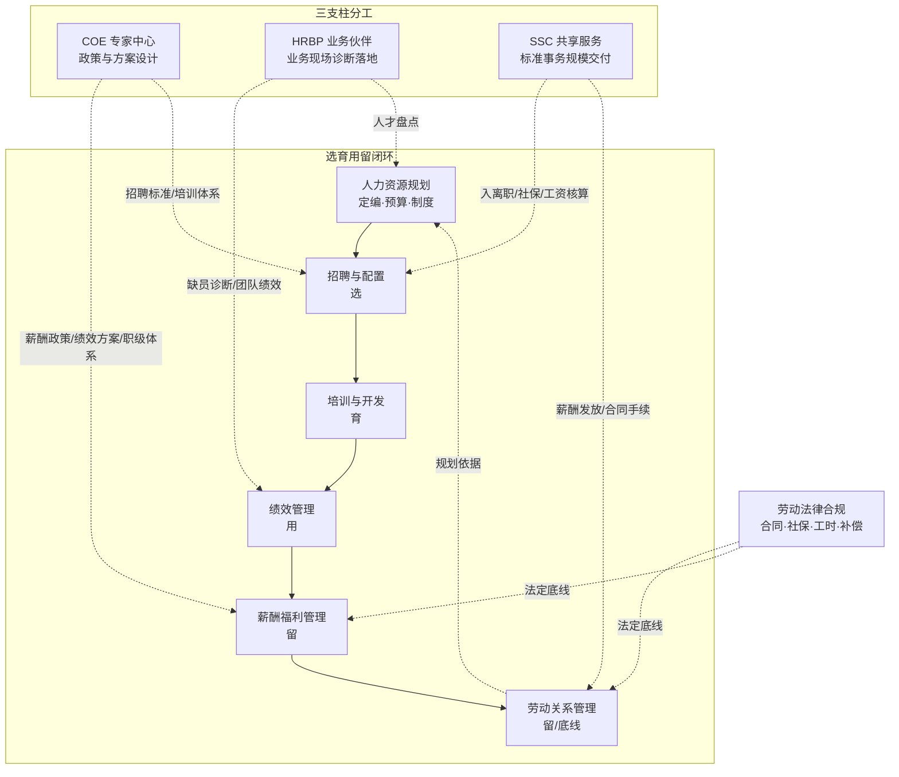

# 架构洞察（Architecture Insights）

> 基于 [事实清单](facts.md) 提炼。每条洞察按「陈述 / 证据 / 反常识点 / 行动启示」四元组组织；洞察是解释性判断，不等同于事实。

## 洞察 1：六大模块是学习地图，不是组织架构

| 四元组 | 内容 |
|--------|------|
| **陈述** | 六大模块是中国 HR 职业教育的知识目录（F-001），用于保证进修不遗漏领域；真实企业按规模和发展阶段选择分工方式——小公司一人全包、中型公司按模块设岗、大公司按三支柱切分。 |
| **证据** | F-001/F-002（模块名称与选育用留闭环）、F-014（中小企业一人覆盖多模块的市场实践）、F-009–F-013（三支柱分工）。 |
| **反常识点** | 初学者常以为「六大模块 = 公司应该有六个 HR 岗位」，于是纠结「我们公司怎么没有绩效经理」——模块的颗粒度是知识，岗位的颗粒度是经济账：每多一个专业岗，都要足够的事务量来养活。 |
| **行动启示** | 学习时按模块建立完整知识树和产出物库；求职时先识别目标公司处于哪种组织形态（复合岗/模块岗/三支柱），用对应的语言描述经验。 |

## 洞察 2：三支柱不是「把 HR 分成三拨人」，而是按「设计—嵌入—交付」给工作分层

| 四元组 | 内容 |
|--------|------|
| **陈述** | 三支柱的本质是把同一批 HR 工作按性质重切：政策方案的专业设计归 COE、业务现场的诊断与落地归 HRBP、标准化事务的规模交付归 SSC（F-011–F-013）。它回答的是「这份 HR 工作该由谁、用什么方式做」，而不是「HR 有几类人」。 |
| **证据** | F-009–F-013（三支柱定义与分工）、F-010（Ulrich 四角色思想源头）。 |
| **反常识点** | 三支柱里最容易被误建的是 SSC：很多公司以为「把事务集中起来」就是共享服务，实则在流程未标准化、系统未打通时集中，只会把分散的混乱变成集中的排队。SSC 的经济性来自规模与标准化两个前提同时成立。 |
| **行动启示** | 评估 HR 组织是否成熟，看三件事：政策有没有统一的设计者（COE 是否实）、业务现场有没有懂业务的 HR（HRBP 是否在现场）、事务有没有被标准化并稳定交付（SSC 是否有量）。个人择业同理——三个通道的能力模型完全不同，早选早积累。 |

## 洞察 3：绩效管理的价值不在「考核」，在「目标对齐与反馈」这条传动轴

| 四元组 | 内容 |
|--------|------|
| **陈述** | 绩效周期四环节（目标设定—过程辅导—考核评估—反馈应用）中，真正驱动行为改变的是目标对齐和过程反馈；考核评估只是把过程结果显影。绩效结果同时驱动薪酬、晋升、培训三类决策（F-006）。 |
| **证据** | F-006（绩效周期与结果应用）、F-016（KPI 与 OKR 的工具差异）。 |
| **反常识点** | 多数公司把 80% 的精力花在年底打分和评级校准上，而打分所依据的「事实」早就在全年沟通中被忽略了——没有过程记录的考核，本质是年底组织的一次印象派画展。工具选择（KPI 还是 OKR）反而没有管理者想象的重要，没有反馈机制，用什么工具都退化成填表。 |
| **行动启示** | 建设绩效体系的优先级：目标表可衡量 → 月度沟通制度化 → 关键事件留痕 → 结果应用兑现。见 [绩效周期实操指南](examples/02-performance-cycle.md)。 |

## 洞察 4：薪酬模块的专业含量一半在法规——算法错了赔钱，结构错了失效

| 四元组 | 内容 |
|--------|------|
| **陈述** | 薪酬是六大模块中与法律耦合最深的：社保公积金、加班费倍率、计薪天数、经济补偿基数、最低工资，每一项都有法定标准；管理上又要平衡外部竞争性（市场分位）、内部公平性（职级带宽）与个体激励（绩效挂钩）。 |
| **证据** | F-007（薪酬福利管理范围）、F-008（劳动关系衔接）；具体费率、倍率、21.75 计薪天数等法定标准在同组 [劳动法律合规实务](../labor-law-compliance/index.md) 的 facts.md 中逐条登记。 |
| **反常识点** | 「员工自愿签放弃社保协议」在实践中被不少小公司当作合规方案，但社保是法定强制义务，这类协议在仲裁中一律无效——省了几年钱，离职时一张投诉单连本带利补缴。薪酬设计的自由度全部存在于法规底线之上，底线之下没有「灵活操作」的空间。 |
| **行动启示** | 学薪酬先学法规底线（社保/加班/计薪），再学设计方法（带宽/调薪矩阵/调研）；每月工资核算建立交叉复核，数字错误在离职清算时集中爆雷。 |

## 洞察 5：招聘是入口，离职是体检——流失数据是组织健康度的诚实指标

| 四元组 | 内容 |
|--------|------|
| **陈述** | 招聘满足当期人力需求，离职数据（流失率、离职原因分布、高绩效流失占比）则反向检验招聘质量、管理质量与薪酬竞争力；离职面谈是公司少数能听到真话的渠道。 |
| **证据** | F-004（招聘配置全链路）、F-015（市场 JD 中入离职为高频职责）；模块闭环逻辑见 F-002。 |
| **反常识点** | 离职面谈最常得到的答案是「个人原因」「家庭因素」，因为员工不愿在离职时得罪公司——真话藏在追问里（「如果哪一点改变，你会选择留下？」）。更反常识的是：高绩效员工的静默离职（人在心不在）比主动离职损失更大，但它不会出现在流失报表上。 |
| **行动启示** | 把离职面谈做成结构化记录并季度复盘；同时跟踪「内部转岗率、试用期离职率、主动离职率」三个先行指标，在年报里向管理层讲清人才漏斗的漏点。 |

## 知识地图（Mermaid）



## 阅读建议

```
先建框架：01 六大模块总览 → 02 三支柱
按模块深入：03 招聘入离职 → 04 培训绩效 → 05 薪酬福利
动手产出：examples/03 JD 与面试模板 → examples/01 入离职清单 → examples/02 绩效周期
合规打底：labor-law-compliance 束（薪酬数字、合同、补偿全部以法规信源为准）
```

## 跨包参照

- 合规底座（模块动作的法律边界）：[劳动法律合规实务](../labor-law-compliance/index.md)。
- 职业定位与进修顺序：[HR 职业地图与进修路径](../hr-profession-map/index.md)。
- 行政侧配合面（入离职行政手续、物资、会议、接待）：[行政管理实务全景](../../admin/admin-operations/index.md)。
- 公文面（人事通知、制度发文、报告请示）：[公文写作与职场文书](../../admin/official-writing/index.md)。
