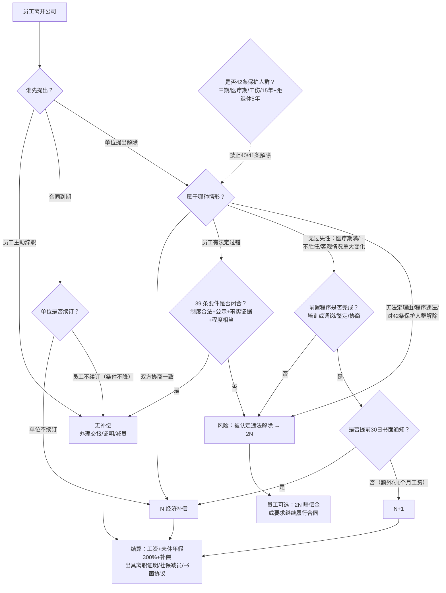

# 架构洞察（Architecture Insights）

> 基于 [事实清单](facts.md) 提炼。每条洞察按「陈述 / 证据 / 反常识点 / 行动启示」四元组组织；法规事实以 S1–S21 官方信源为准（S12 第三方聚合页仅辅助），洞察为实务判断。

## 洞察 1：劳动法的底线是强制性规范——「员工签字」不能豁免法定义务

| 四元组 | 内容 |
|--------|------|
| **陈述** | 劳动合同法与社保法规中关于试用期次数、社保缴纳、加班费倍率、解除条件的规定属于强制性规范，其立法目的是保护缔约弱势方；用人单位与劳动者的约定低于法定标准的，约定无效。 |
| **证据** | F-005/F-008（一次试用期规则，宝安法院判例：员工签署延长协议仍判无效）、F-031（社保法定强制，放弃承诺无效）、F-018（加班费倍率法定）、F-023（未休年假 300%）。 |
| **反常识点** | 民间商业逻辑里「签字画押，概不负责」天经地义，但在劳动关系中恰好反过来：越是员工「自愿」签字放弃权利的协议（放弃社保、延长试用、加班费打包），仲裁中死得越彻底——因为这类协议针对的正是法律不允许让渡的权利。 |
| **行动启示** | 审核任何员工签署的协议时先问：这条处分的是法定底线还是可协商利益？期限、倍率、社保、解除条件四件套一律不做「灵活约定」；判例研习见 [宝安延长试用期案例](examples/01-baoan-probation-case.md)。 |

## 洞察 2：合规风险定价是不对称的——守规则花成本 1，破规则赔倍数 2

| 四元组 | 内容 |
|--------|------|
| **陈述** | 劳动法规对违法行为设定了明确的惩罚性倍数：违法约定试用期按满月工资赔偿（F-007）、违法解除按经济补偿二倍赔偿 2N（F-012）、未签合同二倍工资（F-003）、未休年假 300%（F-023）、法定节假日加班 300%（F-018）。合法操作的成本（合规工资、社保、补偿）与违法成本之间存在系统性倍数差。 |
| **证据** | F-003、F-007、F-012、F-018、F-023 均为法定倍数条款；F-031（未缴社保事后补缴+滞纳金）。 |
| **反常识点** | 很多小公司把「不缴社保、试用期拉长、加班不给钱」当作人力成本控制手段，但这不是省钱而是举债——每一笔省下的钱都挂着 2–3 倍的或有负债，且劳动仲裁不收费、员工维权门槛极低（F-045/F-046），离职时刻就是集中兑付时刻。合规不是成本中心，是最便宜的风险管理。 |
| **行动启示** | 用「或有负债」视角管理人事决策：每个违规操作标注潜在赔付额（2N、二倍工资、300% 折算）；每季度跑一遍 [合规自查清单](examples/03-compliance-self-check.md)，整改成本远低于败诉赔付。 |

## 洞察 3：仲裁的胜负在日常——举证责任倒置使「留痕」本身就是合规

| 四元组 | 内容 |
|--------|------|
| **陈述** | 劳动争议中，考勤、工资、制度、考核等由用人单位掌握管理的证据，单位不提供即承担不利后果（F-048）；工伤认定中单位否认工伤的由单位举证（F-042）。这意味着法律把「事实不明」的风险分配给了管理方。 |
| **证据** | F-048（调解仲裁法第 6 条）、F-042（工伤认定办法第 17 条）、F-009（过失性辞退须证明违纪事实与制度依据）。 |
| **反常识点** | HR 常以为「打官司靠律师」，实际上仲裁庭上律师只能解释证据、变不出证据——没有公示记录的员工手册等于不存在，没有员工确认的考勤等于单位没考勤，没有签收的警告等于没警告过。管理动作发生时没留痕，在法律上就等于没发生。 |
| **行动启示** | 把「书面化+签收」嵌入每一个人事动作：制度公示签收、考勤月确认、警告书面送达、考核面谈签字、解除通知 EMS 送达；证据归档清单见 [examples/03 第七节](examples/03-compliance-self-check.md)。 |

## 洞察 4：离职是总清算时刻——时效规则决定风险敞口的关闭方式

| 四元组 | 内容 |
|--------|------|
| **陈述** | 仲裁时效一般为 1 年（F-046），但劳动关系存续期间拖欠劳动报酬不受时效限制，离职后须在 1 年内主张（F-047）。这意味着员工在职期间累积的加班费、工资差额主张权一直「活着」，离职时钟才开始走。 |
| **证据** | F-046（1 年时效与中断中止）、F-047（劳动报酬特例）、F-045（仲裁前置、零受理费）。 |
| **反常识点** | 「员工干了五年都没吭声，肯定不会告了」是最危险的错觉——沉默不是放弃，是在等待最有利的时点（离职时无顾虑、可一并主张）。HR 以为的「稳定」，在时效规则下其实是「风险敞口持续打开」。 |
| **行动启示** | 离职面谈与结算时做「全科目清算」：工资、加班费、年假折算、社保基数一次性核对并签署结清协议；在职期间把加班费、年假这类时间敏感科目的争议消化在当期（当月确认、当年清零）。 |

## 洞察 5：解除补偿的分歧 90% 源于定性错误——先定性，后算账

| 四元组 | 内容 |
|--------|------|
| **陈述** | 离职在法律上分为员工辞职、协商解除、合同到期、过失性辞退（39 条）、无过失性辞退（40 条）、违法解除等不同情形，补偿口径分别为无补偿、N、N、无补偿（需证据）、N 或 N+1、2N。口径差异完全由情形定性决定。 |
| **证据** | F-009（39 条六情形无补偿）、F-010（40 条三情形+30 日通知）、F-011（N 计算）、F-012（2N）、F-013（+1 仅限 40 条）、F-014（42 条保护人群）。 |
| **反常识点** | 实务中「N+1」被传播成万能公式，很多 HR 以为辞退就是 N+1 了事——但协商解除和合同到期根本没有 +1；更危险的是反过来：拿着 39 条「严重违纪」的理由却没有制度与证据，仲裁重新定性为违法解除，N+1 的预算瞬间变 2N。补偿金额是算出来的，更是定性定出来的。 |
| **行动启示** | 任何解除动作走四步法：定性（哪一条）→ 查要件（证据链是否闭合）→ 算补偿（[计算示例](examples/02-compensation-calculation.md)）→ 走程序（书面+工会+送达）；拿不准的情形先按 2N 风险敞口评估再决策。决策树见下方知识地图。 |

## 洞察 6：HR 的专业度体现在「数字可溯源」——法规知识以文号和数字为锚点

| 四元组 | 内容 |
|--------|------|
| **陈述** | 人事合规的核心知识形态是精确数字：试用期 1/2/6 个月、补偿 N 的月份折算、加班 150/200/300%、月加班 36 小时上限、计薪 21.75 天、年假 5/10/15 天、仲裁 1 年、养老 16%/8%、公积金 5%–12%、产假 98 天、工伤 48 小时/30 日/1 年。每个数字背后都是具体条文。 |
| **证据** | F-005、F-011、F-017、F-018、F-019、F-022、F-026、F-030、F-034、F-038、F-040、F-046。 |
| **反常识点** | 网上流传的「HR 必备常识」帖大量数字过时或张冠李戴（如用 30 天折算日工资、把年假说成本企业工龄、声称试用期可延长）。用错数字的代价不是「显得不专业」，而是直接算错钱、签错合同——合规知识没有「大概」，每个数字都要能回答「出自哪部法哪一条」。 |
| **行动启示** | 建立个人「数字—文号」对照卡（本束 facts.md 即是），每个数字挂条文；政策更新以文号为锚复核（如失业费率 1% 是阶段性政策，关注续期文件）；属地数字（基数、最低工资、奖励假）查属地人社局，不引用跨省口径。 |

## 知识地图（Mermaid）：离职解除补偿决策树



## 阅读建议

```
应急查规则：02 解除补偿决策 → examples/02 计算示例 → 01 合同全周期
系统补底座：01 → 03 工时休假 → 04 五险一金 → 05 工伤女工 → 06 争议处理
练风险意识：examples/01 宝安判例（强制性规定）→ examples/03 合规自查（每季度跑）
法条溯源：references/01 条文摘编 → references/02 法规索引 → 官方原文（S1–S21）
```

## 跨包参照

- 合规规则在管理流程中的落地：[HR 六大模块与三支柱](../hr-six-modules/index.md)（入离职清单、薪酬核算、绩效应用边界）。
- 职业进修路线与证书制度：[HR 职业地图与进修路径](../hr-profession-map/index.md)。
- 行政侧合规面（印章、证照、档案、安全消防）：[行政管理实务全景](../../admin/admin-operations/index.md)。
