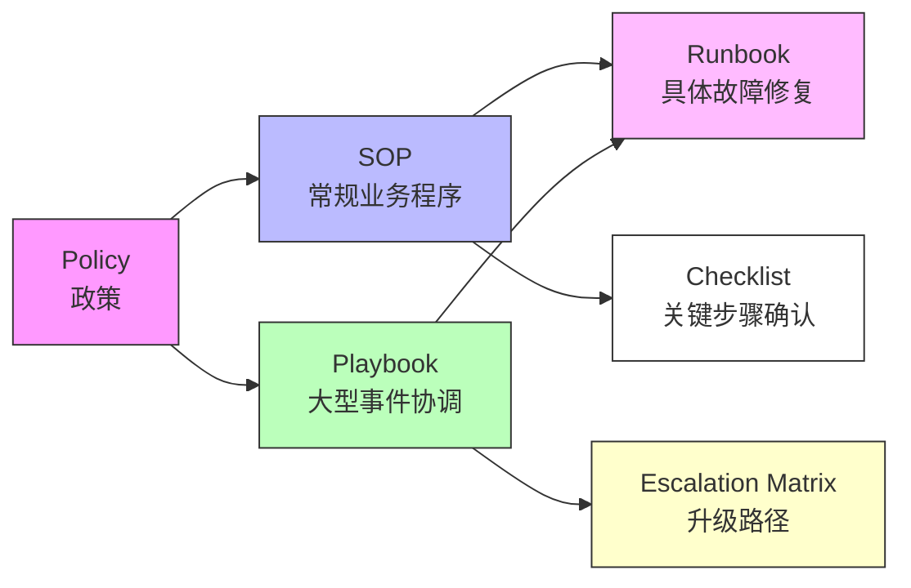

# SOP / runbook / playbook 辨析

> 三类名称在现代组织中都指"程序性文档"，但各自针对不同的问题空间。混淆三者会导致：该用 checklist 时写了长篇 runbook，或该用 playbook 时却写了机械 SOP。

## 一、核心区分维度

| 维度 | SOP | runbook | playbook |
|------|-----|---------|----------|
| 典型问题 | "常规任务应该怎么做" | "遇到特定告警 / 故障怎么处理" | "发生大型事件时谁来做什么" |
| 关注点 | 一致性与合规 | 技术执行与恢复 | 人员协调与决策 |
| 触发方式 | 例行 / 计划性 | 告警 / 预定义触发条件 | 事件严重级宣告 |
| 内容形态 | 步骤式 / 层级式为主 | 条件分支、命令 + 预期输出、回滚 | 角色分配、沟通模板、升级路径 |
| 语言风格 | 命令式（合规场景） | 操作式（命令 + 输出） | 说明式（框架 + 决策树） |
| 典型受众 | 一线执行者 | SRE / 运维工程师 | 事件指挥官 + 跨职能团队 |
| 更新频率 | 季度复审 / 变更触发 | 每次 post-incident 复盘后 | 每次重大事件后 |

> 上述区分基于行业实践资料（F-021～F-023，引用 S9），并在 WHO / 航空 / GMP 等硬监管行业中观察到类似分工——只是以"政策 / 程序 / 作业指导书 / 记录"四层呈现。

## 二、关系图

> 示意：SOP 和 playbook 同属"程序"层，SOP 管常规业务，playbook 管复杂事件；runbook 是 SOP 在技术故障场景的具体化形式；checklist 是高风险 SOP 的浓缩形态。

## 三、选型决策矩阵

当组织需要新建一份程序性文档时，可用以下二维矩阵选型（综合 F-017、F-021～F-023）：

| | 任务可预测性低 | 任务可预测性高 |
|---|---|---|
| **后果严重** | **Playbook**（角色 + 沟通 + 决策框架） | **SOP + runbook**（标准步骤 + 故障修复） |
| **后果一般** | **Checklist**（关键节点打勾） | **单页 SOP / 作业指导书** |

### 典型场景举例

| 场景 | 推荐形态 | 理由 |
|------|---------|------|
| 外科手术安全检查 | Checklist | 关键步骤极少、后果极高、需口头逐项确认 |
| 数据中心宕机响应 | Playbook + runbook | 首次发生不可预测，需协调多人，修复动作可脚本化 |
| 服务器重启（已知故障模式） | Runbook | 触发条件明确、命令序列固定、有回滚路径 |
| 每月财务结账流程 | SOP | 例行任务、高可重复、合规留痕要求高 |
| 新员工入职引导 | 单页 Checklist | 步骤固定、后果低、以"完成即可"为导向 |
| 战略决策会议 | 无 SOP | 不可预测 + 创造性，写 SOP 会扼杀适应性 |

## 四、常见误区

1. **"SOP 万能论"**：把一切流程都写成 SOP，导致文档庞大、员工抵触、执行变形。实际上不可预测场景应写 playbook 或仅设原则边界。
2. **"runbook 是高级 SOP"**：runbook 本质是 SOP 在技术运维场景的具体化，但两者设计原则不同——runbook 强调"条件→动作"的映射，SOP 强调流程的连续性。
3. **"playbook 是 SOP 的扩展"**：playbook 处理的是 SOP 无法覆盖的场景，核心差异是"协调人"而非"执行动作"。

## 参考

- [事实清单（F-021～F-023）](../facts.md)
- [洞察笔记：文档粒度由可预测性×后果决定](../insights.md)
- [概念：SOP 的要素与文档层级](02-elements-and-structure.md)
