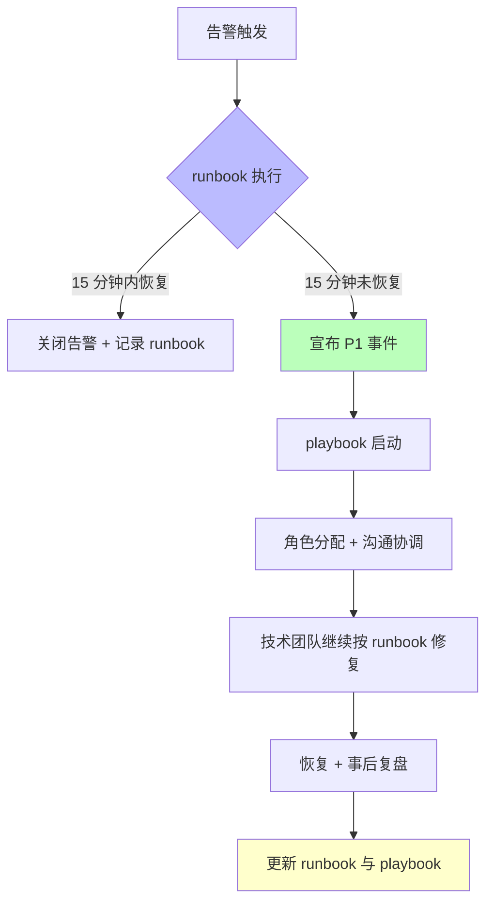

# runbook vs playbook 对照示例：主数据库宕机

> 本示例以"**主数据库突然宕机**"场景为例，并行呈现 runbook（技术修复）与 playbook（事件协调）两种文档，展示二者分工与衔接。

## 场景背景

- 系统：线上 MySQL 主从架构，主库承载核心交易；
- 告警：监控告警"主库连接失败（连接数超限）"；
- 影响：交易接口返回 500，预计影响 10 万 / 小时订单。

---

## A. runbook（技术修复）

**文件定位**：SRE / DBA 内部文档，触发条件 = 告警命中。

```markdown
## 触发条件
监控告警：mysql_primary_down（severity: P1）

## 步骤 1：确认主库状态
- 执行：`mysql -h primary -u monitor -p'...' -e "SHOW STATUS LIKE 'Threads_connected';"`
- 预期输出：
  - Threads_connected > 阈值（如 5000）
  - Aborted_connects 激增
- 若未命中预期 → 转步骤 5（排查网络层）

## 步骤 2：尝试优雅重启
- 执行：`systemctl restart mysql`
- 预期输出：服务 60 秒内回到 RUNNING，Threads_connected 重置 < 100

## 步骤 3：切换至从库（若重启失败）
- 执行：`mysql -h slave-01 -e "STOP SLAVE; RESET SLAVE ALL; CHANGE MASTER TO ..."`
- 预期输出：从库提升为只读
- 执行 DNS 切换：primary → slave-01
- 预期输出：5 分钟内应用端可重新连接

## 步骤 4：验证数据一致性
- 执行：`pt-table-checksum --replicate=checksum_table`
- 预期输出：无差异行

## 步骤 5：升级
- 若步骤 1–4 均失败，立即执行 playbook 中"升级 P1"环节（见下方）
```

**runbook 要点**（F-021）：
- 每条命令带预期输出；
- 步骤按成功概率排序；
- 最后一步是"何时升级到 playbook"的条件；
- 与告警系统链接，触发即可一键打开。

---

## B. playbook（事件协调）

**文件定位**：跨职能应急响应文档，触发条件 = 宣布 P1 事件。

```markdown
## 触发条件
runbook 步骤 5 判定无法在 15 分钟内恢复，或影响用户数 > 1 万

## 角色分配
- 事件指挥官（IC）：____（DBA 主管）
- 技术负责人：____（SRE on-call）
- 沟通负责人：____（客户成功）
- 记录员：____（值班 PM）

## 时间线
- T+0：IC 宣布 P1，通报所有角色
- T+5：技术负责人汇报当前进度与 ETA
- T+15：IC 向高管群发送第一份状态通报
- T+30：每小时更新一次，直至恢复
- T+恢复：事件指挥官宣布结束，启动 post-incident review

## 沟通模板
- 对内（技术群）：「【P1】主库宕机，当前执行 runbook DB-001 步骤 N，ETA X 分钟」
- 对外（客服 / 用户群）：「【系统公告】数据库服务暂不稳定，正在修复，预计 X 分钟恢复」
- 向高管：「【P1 通报】影响订单 XX 单，根因初步判断为 ___，已启动 ___ 预案」

## 决策框架
- 是否开启只读模式？→ 影响用户数 > 10 万 且 ETA > 30 分钟时建议开启
- 是否回滚最近上线版本？→ 若有证据指向最近发布导致连接泄漏，优先回滚
```

**playbook 要点**（F-022）：
- 不写命令，写角色与节奏；
- 提供沟通模板，让沟通负责人直接复制使用；
- 决策框架列出"什么条件下做什么决定"，而非具体决定。

---

## C. 二者如何协同



> **核心结论**（F-023）：
> - runbook = "机器坏了怎么办"（技术操作，可脚本化）；
> - playbook = "事情大了怎么协调"（人员协调，不可完全脚本化）；
> - 大型事件中 playbook 管总体协调，具体修复动作调用各 runbook。

## 参考

- [概念：SOP / runbook / playbook 辨析](../concepts/04-runbook-playbook-sop.md)
- [事实清单（F-021～F-024）](../facts.md)
- [洞察笔记：文档粒度由可预测性×后果决定](../insights.md)
