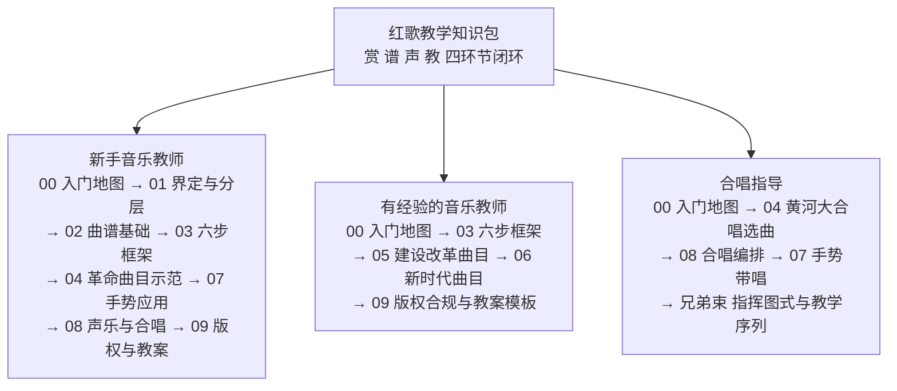

# 入门地图：红歌教学教什么、本知识包怎么用

## 学习目标

- 说清红歌教学的"赏—谱—声—教"四环节闭环，能判断一节红歌课缺了哪一环；
- 判断自己属于哪类读者，按读者路径图选出适合自己的阅读顺序；
- 说出红歌教学与一般唱歌课的三点不同，知道课标、法律、版权三条硬约束的出处；
- 遇到手势技术细节、声乐机能训练问题时，知道去声乐域的哪个兄弟束查，而不是在本束硬找。

## 一个典型问题：红歌课好上吗？

很多教师第一次接红歌单元时的做法是：放一遍音频、讲一段革命故事、跟着录音唱几遍。课上得热闹，但学生离开录音就不会唱，说不出音乐为什么振奋、为什么抒情。问题不在素材——《义务教育艺术课程标准（2022 年版）》规定的核心素养本就是审美感知、艺术表现、创意实践、文化理解四个方面（[facts.md](../facts.md) F-031），并要求将革命文化有机融入课程（F-032）；教材也有人音版八年级上册"百年风华"这样成单元的红歌教学内容（F-036），教科书分简谱版与五线谱版、每单元后设"实践与创造"评价栏目并配套教师用书与音视频资源（F-038）。素材与课标都在，缺的是把素材组织成闭环的备课结构。

## 知识包定位：赏—谱—声—教四环节闭环

本束把备课结构拆成四个不可再分的环节（[insights.md](../insights.md) 洞察一）：

| 环节 | 解决什么 | 对应课标素养 | 本束篇目 |
|------|----------|--------------|----------|
| 赏 | 完整听赏与背景情境，审美感知入口 | 审美感知、文化理解 | [03](03-six-step-appreciation.md)、[04](04-revolutionary-era-songs.md)、[05](05-construction-reform-era-songs.md)、[06](06-new-era-main-melody-songs.md) |
| 谱 | 曲谱把音乐外化为可反复阅读的对象 | 审美感知、创意实践 | [02](02-notation-basics.md)、[09](09-score-library-copyright-and-lesson-design.md) |
| 声 | 音准、节奏、发声等身体机能训练 | 艺术表现 | [07](07-curwen-gestures-in-red-song-class.md)、[08](08-vocal-foundations-and-chorus.md) |
| 教 | 学段目标、活动编排与评价 | 四素养统整 | [09](09-score-library-copyright-and-lesson-design.md) |

四栏任一栏为空，这节课不算备完。本知识包的四条产品线——曲谱库（09 篇版权合规）、赏析（03 框架 + 04/05/06 示范）、歌谱（02 篇曲谱基础）、手势声乐（07/08 篇课堂应用）——正是按这四环节组织的。

### 四环节备课自查清单

备完一节课，逐项打勾：

- [ ] **赏**：背景讲述是否压在 3—5 分钟？听赏前是否给了明确任务（听副歌、听结构、听音色对比）？
- [ ] **谱**：用的是简谱还是五线谱版本？难点音程与节奏是否在谱面标注？曲谱来源是否过了版权核查（[09 篇](09-score-library-copyright-and-lesson-design.md) 决策树）？
- [ ] **声**：有没有发声热身？音准用什么带（柯尔文手势，[07 篇](07-curwen-gestures-in-red-song-class.md)）？齐唱还是分声部（[08 篇](08-vocal-foundations-and-chorus.md)）？
- [ ] **教**：对应哪个学段目标（F-034）？输出任务用什么评价（教材"实践与创造"栏目，F-038）？

## 红歌教学与一般唱歌课的三点不同

1. **课程定位有明文要求**：课标修订原则载明"将社会主义先进文化、革命文化、中华优秀传统文化……有机融入课程，增强课程思想性"（F-032）；第一学段要求学唱国歌，第二学段要求学唱反映革命文化的歌曲（F-034）。红歌不是可选补充，是课标内的人文主题。
2. **国歌有专门法律**：《国歌法》2017 年 10 月 1 日起施行，规定奏唱场合、礼仪、标准曲谱与录音版本，并要求中小学将国歌作为爱国主义教育重要内容组织学唱（F-068）。国歌教学的严肃性高于一般歌曲。
3. **版权状态逐曲不同**：各曲目保护期差异极大（F-065、F-066、F-067），课堂能用不等于演出、录播、网络传播能用。曲谱库建设的第一条规矩是版权合规，详见 [09 篇](09-score-library-copyright-and-lesson-design.md)。

## 术语地图（看到词知道在哪一篇）

| 术语 | 所属层 | 一句话解释 | 出处 |
|------|--------|------------|------|
| 红歌 | 概念层 | 约定俗成的泛指，非严格音乐术语、无法定名录 | [01 篇](01-red-song-definition-and-eras.md) |
| 四代曲目层 | 概念层 | 革命战争/建设/改革开放/新时代四代，决定唱法标签 | [01 篇](01-red-song-definition-and-eras.md) |
| 赏—谱—声—教 | 备课层 | 红歌教学四环节闭环，缺一不可 | 本篇 |
| 六步赏析框架 | 备课层 | 背景→曲式→旋律→歌词→演唱处理→教学要点 | [03 篇](03-six-step-appreciation.md) |
| 简谱首调 | 记谱层 | 1—7 对应 do—si，1=C 定调，红歌课堂默认谱式 | [02 篇](02-notation-basics.md) |
| 进行曲/分节歌/颂歌 | 体裁层 | 群众歌曲三大体裁，对应不同教学用途 | [02 篇](02-notation-basics.md) |
| 齐唱/轮唱/二声部 | 合唱形式层 | 众人唱同一旋律为齐唱；同旋律错开进入为轮唱；不同旋律同时进行为二声部 | [08 篇](08-vocal-foundations-and-chorus.md) |
| 柯尔文手势 | 训练层 | 手型管音级、高度管相对位置的音高锚点 | [07 篇](07-curwen-gestures-in-red-song-class.md) |
| 保护期/法定许可 | 法律层 | 作者终生加死后五十年；教科书汇编可不经许可但应付酬 | [09 篇](09-score-library-copyright-and-lesson-design.md) |

## 三类读者画像与阅读路径

**图 1｜三类读者的分支阅读路径**：中心为本束四环节主线，三条分支按身份给出阅读顺序（数字为概念文档编号）。新手教师走完全程打地基；有经验教师跳过识谱常识，直接补赏析框架、新时代曲目与版权短板；合唱指导重点在 04（《保卫黄河》轮唱）、08（合唱编排）与 07（手势带唱），技术训练跳转兄弟束。

- **新手音乐教师**：00 → 01（先搞清"红歌"指什么、分哪几代）→ 02（简谱读法与三大体裁）→ 03（六步赏析框架）→ 04（曲目示范，照表备课）→ 07（手势带唱）→ 08（声音与合唱要求）→ 09（曲谱版权与教案模板）。课标分学段要求是选课底线：一至七年级以音乐、美术为主线，八至九年级分项开设（F-033）；第一学段学唱国歌、第二学段学唱反映革命文化的歌曲（F-034）。
- **有经验的音乐教师**：00 → 03（把"讲故事"升级为可操作框架）→ 05、06（补建设改革期与新时代曲目，注意时代唱法差异）→ 09（版权合规是最容易踩雷的一环，保护期推算与法定许可边界务必过一遍）。01、02 可按需翻阅。
- **合唱指导**：00 → 04（《黄河大合唱》选曲与轮唱）→ 08（齐唱/轮唱/二声部编排）→ 07（柯尔文手势带音准）；指挥图式与手势教学序列去兄弟束深读（见下节）。

### 第一周行动建议

- 第 1 天：读本篇 + [01 篇](01-red-song-definition-and-eras.md)，把手里教材的红歌曲目按四代分层归档；
- 第 2—3 天：读 [02 篇](02-notation-basics.md)，核对自己简谱符号是否能讲全（调号、高低音点、延时线、减时线）；
- 第 4—5 天：读 [03 篇](03-six-step-appreciation.md) + [04 篇](04-revolutionary-era-songs.md)，照六步表备一节国歌课；
- 第 6—7 天：读 [07 篇](07-curwen-gestures-in-red-song-class.md) 练熟七个手型，读 [09 篇](09-score-library-copyright-and-lesson-design.md) 给现有曲谱库做一次版权登记。

## 与声乐域两个兄弟束的关系

本束是 yishu（艺术）域 hongge（红歌）专题束，与 vocal（声乐）域两个兄弟束构成"课堂应用 vs 技术详解"的分工：

| 兄弟束 | 它负责什么 | 本束什么情况下链过去 |
|--------|------------|----------------------|
| [美通唱法与咽音体系教学教程](../../../vocal/meitong-yanyin-pedagogy/concepts/00-why-vocal-pedagogy.md) | 歌唱生理机能：呼吸器官、声带闭合与共鸣、混声换声、常见发声毛病纠正、嗓音保健 | 08 篇讲呼吸、咬字、音色只给课堂要求与提示；机能原理、纠错练习、嗓音病变处理链到 [生理基础](../../../vocal/meitong-yanyin-pedagogy/concepts/01-singing-physiology.md)、[常见毛病纠正](../../../vocal/meitong-yanyin-pedagogy/concepts/07-common-faults.md)、[嗓音保健](../../../vocal/meitong-yanyin-pedagogy/concepts/08-voice-health.md) |
| [手势辅助声乐教学教程](../../../vocal/gesture-vocal-pedagogy/concepts/00-overview-why-gestures.md) | 柯尔文手势技术细节：七型手型逐型详解、镜面教学约定、教学五序列、指挥图式、反模式与安全 | 07 篇只讲红歌课堂怎么用手势；手型精确规格链到 [柯尔文七唱名手势](../../../vocal/gesture-vocal-pedagogy/concepts/02-curwen-hand-signs.md)，撤架序列链到 [手势教学五序列](../../../vocal/gesture-vocal-pedagogy/concepts/06-teaching-sequence.md)，起拍收拍链到 [指挥手势基础](../../../vocal/gesture-vocal-pedagogy/concepts/04-conducting-basics.md) |

一句话分工：**兄弟束讲"技术本身怎么练"，本束讲"红歌课堂怎么用"**。手势只编码音高、不打拍子；气息、共鸣、混声的机能训练不在本束重复。

## 本束的几条约定

1. **事实可回查**：每篇正文回指 [facts.md](../facts.md) 的 F 编号（F-001 三位制），68 条事实逐条内嵌信源 URL；备课与课堂转述以 facts 为准。
2. **待核事实用"一说"**：《我的祖国》（F-024）、《走进新时代》（F-027）、《不忘初心》（F-028）等条目的创作信息目前为单源待核，正文一律用"通行记载/一说"表述，课堂上不作定论（详见 [03 篇](03-six-step-appreciation.md)）。
3. **版权红线**：保护期内曲目（如《歌唱祖国》保护期至 2057 年底、《没有共产党就没有新中国》至 2049 年底、《黄河大合唱》词至 2052 年底，F-066、F-067）**不转录歌词与曲谱全文**；《义勇军进行曲》财产权虽已届满（F-065），作为国歌另遵《国歌法》使用标准曲谱（F-068）。完整规则见 [09 篇](09-score-library-copyright-and-lesson-design.md)。
4. **不配手势示意图**：网络流传的手势图错误率高，本束 07 篇只给文字规格表，精确手型以兄弟束 [02 篇](../../../vocal/gesture-vocal-pedagogy/concepts/02-curwen-hand-signs.md) 的文字总表为准，不要让学生对着不明来源的示意图练。

## 本束不提供什么

- 不提供可下载的盗版曲谱：曲谱获取走正版教材、官方发布与授权渠道，规则在 [09 篇](09-score-library-copyright-and-lesson-design.md)；
- 不替代声乐训练：呼吸、共鸣、混声的系统训练与嗓音治疗归美通咽音兄弟束；
- 不重复手势技术手册：七型逐型详解、镜面约定、反模式清单归手势声乐兄弟束，本束只讲红歌课堂整合；
- 不做党史定论：历史背景以 facts 登记的信源为准，待核条目标注"一说"，音乐课不越位成历史课。

## 常见问题速答

- **问：红歌课就是唱歌加讲革命故事吗？**
  不是。故事只占赏析六步的第一步（背景），且要压在 3—5 分钟（[03 篇](03-six-step-appreciation.md)）。曲式、旋律、歌词文学性、演唱处理才是音乐课本体，否则不落在课标四大素养上（F-031）。
- **问：我带的是小学低段，学生连简谱都不识，能用这套吗？**
  能，而且低段更要用柯尔文手势带音准（[07 篇](07-curwen-gestures-in-red-song-class.md)）。课标对第一学段的明文要求是学唱国歌（F-034），曲目短、动作化教学多，曲谱阅读要求随学段递进，不必一步到位。
- **问：班里学生爱唱流行歌，不爱唱老红歌怎么办？**
  用新时代曲目过渡（[06 篇](06-new-era-main-melody-songs.md)）：《灯火里的中国》《不忘初心》本身就是流行抒情唱法，再倒推进行曲风格的革命曲目，做风格对比听辨，比直接说教有效。
- **问：网上搜到的曲谱能直接印讲义吗？**
  不能直接印。来源不明的曲谱可能侵权且可能有误；先过 [09 篇](09-score-library-copyright-and-lesson-design.md) 的曲谱来源决策树，教科书汇编适用法定许可但要付酬（F-063、F-064），网络传播与演出另有边界。
- **问：手势图网上一搜就有，为什么不让照着练？**
  网络示意图常见手型错误与高度错误（07 篇反模式清单）。手势的手型规格以手势声乐兄弟束的文字总表为准（F-042~F-050），先按文字练准再带学生。
- **问：合唱队排《保卫黄河》，本束够用吗？**
  选曲与轮唱处理用 [04 篇](04-revolutionary-era-songs.md)、合唱编排用 [08 篇](08-vocal-foundations-and-chorus.md)；指挥图式、分声部排练序列需跳转 [手势声乐束教学序列](../../../vocal/gesture-vocal-pedagogy/concepts/06-teaching-sequence.md)，本束不重复。

## 配套阅读

- [facts.md](../facts.md)：68 条零推测事实登记（F-001~F-068），每条内嵌信源 URL，本束所有论断的最终依据；
- [insights.md](../insights.md)：7 条洞察（四环节闭环、版权瓶颈、手势性价比、曲式可教性、史实入口论、时代唱法分层、简谱路径锁定），各篇结构由其驱动；
- 声乐域兄弟束入口：[美通咽音束 00 篇](../../../vocal/meitong-yanyin-pedagogy/concepts/00-why-vocal-pedagogy.md)、[手势声乐束 00 篇](../../../vocal/gesture-vocal-pedagogy/concepts/00-overview-why-gestures.md)。

## 一页纸总结

- **一条主线**：赏—谱—声—教四环节闭环，对应课标四大核心素养；
- **三代读者**：新手全程读、有经验教师补框架与版权、合唱指导重 04/07/08；
- **三条硬约束**：课标（F-032、F-034）、国歌法（F-068）、版权（F-065~F-067）；
- **两个不重复**：声乐机能归美通咽音束、手势技术归手势声乐束，本束只讲红歌课堂整合。

## 小结

- 红歌教学的最小闭环是"赏—谱—声—教"四环节，对应课标四大核心素养（F-031、F-032），缺一环即不构成教学；
- 三类读者各有路径：新手走完全程、有经验教师补框架与版权、合唱指导重 04/07/08 并跳转兄弟束；
- 红歌教学有三条硬约束：课标要求革命文化融入（F-032、F-034）、国歌遵《国歌法》（F-068）、曲谱逐曲查版权（F-065~F-067）；
- 本束管"红歌课堂怎么用"，声乐机能与手势技术的系统训练归 vocal 域两个兄弟束；
- 事实回指 F 编号、待核用"一说"、保护期内不转录、手势不照错误图练，是全束统一约定。

下一篇：[红歌的界定与时代分层](01-red-song-definition-and-eras.md)——先搞清"红歌"到底指什么。
