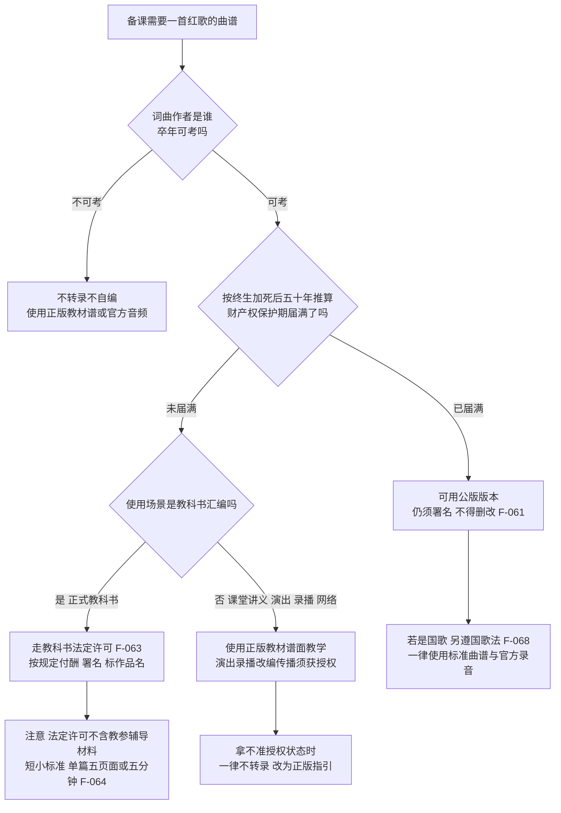

# 曲谱库建设、版权合规与教案设计

## 学习目标

- 能按"作者终生 + 死亡后五十年"规则推算一首歌曲的财产权保护期，说出合作作品的计算方式；
- 能用来源决策树判断一份曲谱该从公版、正版教材还是授权渠道获取；
- 能说清教科书法定许可的适用场景、付酬标准与"短小"边界，知道它不覆盖演出、录播与网络传播；
- 能按"赏—谱—声—教"四环节写出一份结构完整的红歌教案；
- 能对照版权红线清单自查课件与活动材料。

## 一、曲谱库的真正瓶颈是版权合规

红歌曲谱在网上极易获得，但各曲目的法律状态差异极大（[insights.md](../insights.md) 洞察二）。曲谱库的最小可用单位不是"一份谱"，而是每份谱附带的**权利状态向量**：词/曲作者及卒年 → 保护期是否届满 → 使用场景是否落入法定许可 → 署名与作品完整性是否保持。资源获取成本趋近于零，但权利核查成本不可压缩、不可省略。

## 二、保护期计算方法

法律依据：《中华人民共和国著作权法》1990 年通过，经 2001、2010、2020 年三次修正，现行版本为 2020 年第三次修正（F-060）。核心规则（F-062、F-061）：

1. **自然人作品**：发表权及财产性权利的保护期为作者**终生及其死亡后五十年**，截止于作者死亡后第五十年的 **12 月 31 日**；
2. **合作作品**：截止于**最后死亡的作者**死亡后第五十年的 12 月 31 日；
3. **法人或非法人组织作品**：保护期为五十年；
4. **人身权不限时**：署名权、修改权、保护作品完整权的保护期不受限制（F-061）——保护期届满只意味着财产权消灭，随意删改词曲、不署名仍侵权。

本束 facts 已推算的曲目状态（卒年信源与法条均在条目内）：

| 曲目 | 词/曲作者卒年 | 保护期结论 | 条目 |
|------|----------------|------------|------|
| 《义勇军进行曲》 | 曲聂耳 1935 卒；词田汉 1968 卒 | 曲至 1985-12-31；词至 2018-12-31；**合作作品整体按田汉计，至 2018-12-31 已届满** | F-065 |
| 《黄河大合唱》 | 曲冼星海 1945 卒；词光未然 2002 卒 | 曲至 1995-12-31；词至 2052-12-31；**整体按光未然计，至 2052-12-31** | F-066 |
| 《没有共产党就没有新中国》 | 曹火星词曲合一，1999 卒 | **至 2049-12-31** | F-067 |
| 《歌唱祖国》 | 王莘词曲合一，2007 卒 | **至 2057-12-31** | F-067 |

推算方法示范（以《歌唱祖国》为例）：王莘 2007 年逝世（F-023）→ 2007 + 50 = 2057 → 截止于 2057 年 12 月 31 日。新曲目照此办理；作者在世的，保护期当然未届满。

**国歌特别规定**：《国歌法》2017 年 10 月 1 日起施行，对国歌奏唱场合、礼仪、标准曲谱与录音版本、教育（中小学须组织学唱）及法律责任作出规定（F-068）。即使《义勇军进行曲》财产权已届满，奏唱仍须使用标准曲谱与官方录音、遵守奏唱礼仪，不得篡改词曲。

## 三、曲谱来源决策树

**图 1｜曲谱来源决策树**：先查作者卒年（不可考则按保护期内对待），再推算保护期；届满的可用公版版本但人身权永久；未届满的只有教科书汇编一条法定许可通道，其余场景凭正版教材教学、对外使用须授权；拿不准一律不转录。

## 四、教科书法定许可的边界

《著作权法》第二十五条：为实施义务教育和国家教育规划而编写出版教科书，可以不经著作权人许可，在教科书中汇编已经发表的作品片段或者短小的文字作品、音乐作品或者单幅美术、摄影、图形作品，但应当按照规定支付报酬、指明作者姓名或名称、作品名称，且不得侵犯著作权人依法享有的其他权利（F-063）。

配套规章《教科书法定许可使用作品支付报酬办法》（2013 年 12 月 1 日起施行）规定（F-064）：

- 教科书汇编音乐作品报酬标准为**每首 300 元**；
- "短小的音乐作品"指九年制义务教育和国家教育规划教科书中使用的**单篇不超过 5 页面或时长不超过 5 分钟**的单声部音乐作品（多声部乘以相应倍数）；
- **教科书不包括教学参考书和教学辅导材料**。

教师最易犯的错误是"课堂里能用 = 哪里都能用"。法定许可仅覆盖教科书汇编这一场景；**校园演出、录音录像、改编编曲、公众号/短视频传播、自编讲义大范围印发均不适用**（洞察二）。教材本身分简谱版与五线谱版、配套教师用书与音视频资源（F-038），课堂教学以正版教材谱面为准即可。

## 五、曲谱库条目登记字段

建设校内/组内曲谱库时，每条目强制登记四个字段（洞察二）：

1. **词/曲作者及卒年**（用于推算，参 F-013、F-014、F-017、F-018、F-021、F-023 等条目示范）；
2. **保护期截止日**（按 F-062 规则逐条推算，F-065/F-066/F-067 为示范）；
3. **使用场景与授权状态**（课堂教学/教科书/演出/录播/网络，各场景分别标注）；
4. **署名与版本来源**（版本出处、是否官方标准谱；国歌一律标准曲谱，F-068）。

谱式收录以简谱版为主体、五线谱版作对照与拓展（洞察七；教材双版本 F-038）。

## 六、教案基本结构：赏—谱—声—教四环节模板

教案不是素材堆砌，四环节任一栏为空不算备完（洞察一）。模板如下（按本模板填写的完整教案样例将在本束示例层提供）：

| 环节 | 教师活动 | 学生活动 | 课标与事实依据 |
|------|----------|----------|----------------|
| 赏 | 背景讲述 3—5 分钟（只选一个史实细节）；完整播放，给出明确听赏任务 | 带任务静听；回答听辨问题（曲式、旋律、音色对比） | 审美感知/文化理解（F-031）；曲目档案 F-011~F-030；框架见 [03 篇](03-six-step-appreciation.md) |
| 谱 | 选定简谱/五线谱版本，标注难点音程与节奏；带读谱 | 视唱旋律片段；找调式音（4 和 7 出现多少） | 简谱读法 F-057；体裁 F-058；双版本 F-038；见 [02 篇](02-notation-basics.md) |
| 声 | 发声热身提示；柯尔文手势带音高；组织齐唱/轮唱/二声部 | 气息与咬字练习；跟手势唱；分组合唱 | 艺术表现（F-031）；手势 F-043/F-044；合唱形式见 [08 篇](08-vocal-foundations-and-chorus.md) |
| 教 | 对应学段目标编排活动；用"实践与创造"类栏目布置输出任务与评价 | 完成演唱/听辨/结构图示等输出任务 | 学段要求 F-033、F-034；评价栏目 F-038 |

备课自查三问：①本课曲目属于哪一代、用哪档音色（[01 篇](01-red-song-definition-and-eras.md) 分层、[08 篇](08-vocal-foundations-and-chorus.md) 音色表）？②课件材料是否过了版权红线（下节清单）？③待核史实是否已改为"一说"表述（F-024、F-027、F-028）？

## 七、版权红线清单

- 保护期内曲目**不转录歌词全文、不抄录旋律谱**进课件、讲义、公众号、短视频：《黄河大合唱》整体至 2052 年底（F-066）、《没有共产党就没有新中国》至 2049 年底（F-067）、《歌唱祖国》至 2057 年底（F-067）；《我的祖国》《唱支山歌给党听》《我和我的祖国》《走进新时代》《不忘初心》《灯火里的中国》《共筑中国梦》等 facts 未推算或新作，一律按保护期内对待；
- 保护期届满（如《义勇军进行曲》，F-065）也只可作极短识读引用，且**国歌一律使用标准曲谱与官方录音、遵奏唱礼仪**（F-068），不自行改编；
- 任何曲目**不删改词曲、不省略署名**——署名权、修改权、保护作品完整权永久（F-061）；
- 教科书法定许可**不覆盖**教学参考书、辅导材料（F-064），更不覆盖校园演出、录播、网络传播与改编；这些场景使用保护期内曲目须获授权；
- 拿不准授权状态时，一律不转录，改为"见正版教材/官方发布"式指引；
- 曲谱库每条目登记作者卒年、保护期截止日、场景授权状态、版本来源四字段。

## 八、使用场景权限速查表

同一份谱，换个场景法律状态就变。备课与活动报批时对照：

| 使用场景 | 保护期内曲目 | 保护期届满曲目（如《义勇军进行曲》F-065） |
|----------|--------------|--------------------------------------------|
| 课堂教学（用正版教材谱面与官方音频） | 可以，教材汇编走法定许可、由出版方付酬（F-063） | 可以 |
| 自编讲义/课件转录歌词曲谱 | 不可以（法定许可不含教参辅导材料，F-064） | 可作极短识读引用；仍须署名、不得删改（F-061） |
| 校园艺术节公开演出 | 须获授权或使用正版演出授权渠道 | 可以，仍须署名完整 |
| 演出录音录像、校园电视台播放 | 须获授权 | 可以，仍须署名完整 |
| 公众号/短视频/网络平台发布 | 须获授权，不用来路不明伴奏 | 可以；国歌另有标准版本要求（F-068） |
| 改编编曲（加二声部、换伴奏） | 须获授权（改编权） | 可以改编但不得歪曲篡改；国歌不得改编（F-068） |
| 国歌奏唱（任何场景） | —— | 一律标准曲谱与官方录音、遵礼仪（F-068） |

拿不准的场景，按决策树末梢处理：**一律不转录，改为"见正版教材/官方发布"指引**。

## 九、保护期推算课堂练习（教师自查）

照第二节方法推算，答案在括号内：

1. 某曲作者 2001 年逝世，词曲合一，保护期截止于？（2051 年 12 月 31 日）
2. 某合作歌曲词作者 1990 年卒、曲作者 2010 年卒，整体保护期截止于？（按最后死亡者计：2060 年 12 月 31 日）
3. 某新时代歌曲作者仍在世，保护期？（未届满，按保护期内对待）
4. 《黄河大合唱》曲谱 1995 年后是否可自由使用？（曲的财产权 1995 年底届满，但词至 2052 年底；合作作品整体按词作者计，且词曲配合使用不可割裂，整体按保护期内对待，F-066）

第 4 题是最易踩的坑：**合作作品整体保护期按最后死亡的作者算**，不能因为曲先过期就把整首歌当公版。

## 常见问题速答

- **问：教材里印了这首歌，我把教材那页拍照发家长群可以吗？**
  拍照整本/整页传播属于复制传播行为，超出课堂教学范围；课堂教学用教材正版谱面没有问题，对外分享请改为指明教材版本与页码、让家长自行查阅，不发整页扫描。
- **问：学生社团要在视频号发演唱视频，用哪类歌最稳妥？**
  优先选保护期届满且非国歌的公版曲目，或使用平台已获授权的曲库伴奏并按平台规则发布；保护期内曲目（F-066、F-067 及 2014 年后新作 F-028~F-030）发布前先取得授权，不抱"非盈利就不侵权"的侥幸——法定许可不含网络传播。
- **问：讲义里只引一句歌词讲词曲配合，算侵权吗？**
  分析性、评论性的适当引用与全文转录性质不同；本束红线针对的是全文转录歌词与完整旋律谱。稳妥做法：引用控制在必要的最短范围、注明出处，保护期内作品不整段照抄。
- **问：曲谱库建在共享文档里给全组用，要注意什么？**
  每条目先填第五节四字段再传谱；保护期内曲目不传谱文件，只登记"使用教材 XX 版第 X 页"这类正版指引；库负责人每学期按决策树复查一次授权状态。

## 小结

- 保护期规则：自然人作品终生加死后五十年、截止于第五十年 12 月 31 日，合作作品按最后死亡作者计（F-062）；人身权永久（F-061）；
- 已推算结论：《义勇军进行曲》整体 2018 年底届满（F-065）、《黄河大合唱》整体至 2052 年底（F-066）、《没有共产党就没有新中国》至 2049 年底、《歌唱祖国》至 2057 年底（F-067）；国歌另遵《国歌法》（F-068）；
- 法定许可仅限教科书汇编：每首 300 元、短小=5 页面或 5 分钟内、不含教参（F-063、F-064）；
- 教案按赏—谱—声—教四环节落表，课标依据 F-031/F-033/F-034/F-038；
- 红线一句话：保护期内不转录、届满不妄改、国歌用标准谱、课外使用先授权、拿不准就不转录。

上一篇：[红歌演唱的声乐基础与合唱编排](08-vocal-foundations-and-chorus.md)｜回到 [概念文档目录](index.md)。
