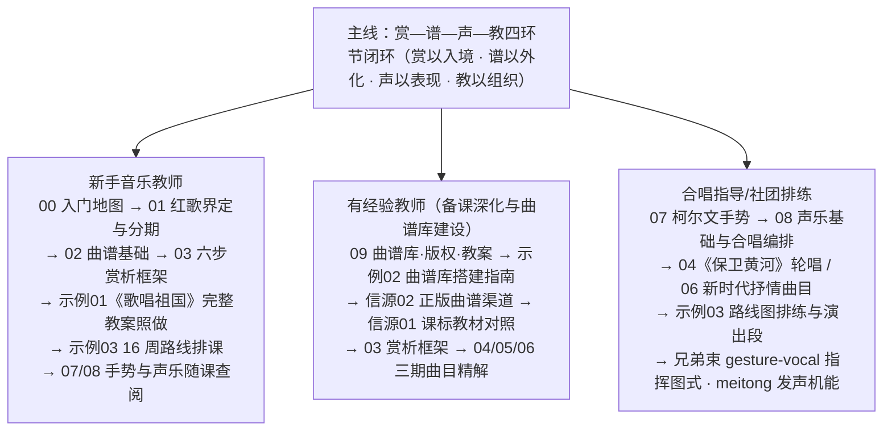

# 红歌教学教程：曲谱库·赏析·歌谱·柯尔文手势与声乐

本知识包（bundle）是面向中小学音乐教师、合唱指导与教研人员的**教学型**红歌（红色歌曲）中文教程，基于 Web 公开信源调研整理（信源逐条登记于 [事实清单](facts.md)，编号 F-001 至 F-068）。一句话定位：**面向音乐教师的红歌教学完整教程——曲谱库建设、教学型赏析、歌谱合规使用、柯尔文手势与声乐教学结合**。教程主线为"赏—谱—声—教"四环节闭环（详见下文[知识结构](#知识结构赏谱声教闭环)与 [架构洞察](insights.md) 洞察一）。


> ⚠️ **版权红线先行**：本教程中所有保护期内曲目（如《歌唱祖国》保护期至 2057 年底、《没有共产党就没有新中国》至 2049 年底、《黄河大合唱》词至 2052 年底，见 [facts.md](facts.md) F-065～F-067）一律不转录歌词与旋律谱，只做曲式、节奏、音程的文字描述与正版教材谱面使用指引；曲谱获取、保护期推算与使用边界见 [概念09·曲谱库建设、版权合规与教案设计](concepts/09-score-library-copyright-and-lesson-design.md)。

## 📚 快速导航

### [概念文档](concepts/index.md) — 10 篇核心概念

| 序号 | 文档 | 内容 |
| -- | -- | -- |
| 00 | [入门地图：红歌教学教什么、本知识包怎么用](concepts/00-overview-reading-map.md) | 知识包四环节定位、三类读者画像与阅读路径、与声乐域两个兄弟束的分工 |
| 01 | [红歌的界定与时代分层](concepts/01-red-song-definition-and-eras.md) | 红歌概念边界、三阶段分期与课堂四代曲目层、群众歌咏传统、《国际歌》传入 |
| 02 | [曲谱基础：简谱为主、五线谱为辅](concepts/02-notation-basics.md) | 简谱源流与读法、节拍调式速览、进行曲/分节歌/颂歌三大体裁与听辨方法 |
| 03 | [教学型赏析六步框架](concepts/03-six-step-appreciation.md) | 背景→曲式→旋律→歌词→演唱处理→教学要点，每步问题清单与操作提示 |
| 04 | [革命时期曲目赏析示范](concepts/04-revolutionary-era-songs.md) | 《义勇军进行曲》《没有共产党就没有新中国》《黄河大合唱》选曲六步示范与版权状态 |
| 05 | [建设与改革时期曲目赏析示范](concepts/05-construction-reform-era-songs.md) | 《歌唱祖国》《我的祖国》《唱支山歌给党听》《我和我的祖国》《走进新时代》四栏精解 |
| 06 | [新时代主旋律曲目赏析示范](concepts/06-new-era-main-melody-songs.md) | 《不忘初心》《共筑中国梦》《灯火里的中国》；流行抒情风格与唱法分层 |
| 07 | [柯尔文手势在红歌课堂的应用](concepts/07-curwen-gestures-in-red-song-class.md) | 七音手型表、课堂操练三步、曲目结合点、脚手架撤除与常见错误 |
| 08 | [红歌演唱的声乐基础与合唱编排](concepts/08-vocal-foundations-and-chorus.md) | 呼吸·咬字·音色三要素、齐唱/轮唱/二声部编排与嗓音安全 |
| 09 | [曲谱库建设、版权合规与教案设计](concepts/09-score-library-copyright-and-lesson-design.md) | 保护期推算、曲谱来源决策树、教科书法定许可边界、四环节教案模板、版权红线清单 |

### [实践示例](examples/index.md) — 3 篇实操指南

| 序号 | 文档 | 内容 |
| -- | -- | -- |
| 01 | [《歌唱祖国》单曲目完整教案（45 分钟）](examples/01-gechang-zugu-complete-lesson.md) | 五环节流程表（手势练声／背景赏析／视唱曲谱／演唱处理／作业小结）、教师话术、学生活动、常见课堂问题应对 |
| 02 | [红歌曲谱库搭建指南](examples/02-red-song-score-library-guide.md) | 时代/年级/曲式三维标签目录树、正版资源信源清单、保护期计算表、入库登记表模板与每学期版权自查清单 |
| 03 | [学期 16 周教学路线图](examples/03-sixteen-week-teaching-roadmap.md) | 16 周周次表（主题/曲目/手势与声乐重点/对应概念篇）、手势密度学期曲线、过程性评价表、排练演出版权提醒 |

### [信源参考](references/index.md) — 3 篇信源登记

| 序号 | 文档 | 内容 |
| -- | -- | -- |
| 01 | [课标与教材信源](references/01-curriculum-textbooks.md) | 义务教育艺术课程标准（2022 年版）教育部官方 PDF、高中音乐课程标准、人教社/人音社教材与教师用书、教材配套音响正规获取渠道 |
| 02 | [曲谱与音频正版信源](references/02-scores-audio-licensed.md) | 出版社正版乐谱、国图/国家版本馆馆藏、公版库 IMSLP 适用边界、正版流媒体、《国歌法》标准曲谱与官方录音渠道；不收录任何盗版站点 |
| 03 | [红歌史料与教学法信源](references/03-red-song-history-pedagogy.md) | 黄河大合唱官网、聂耳/冼星海/曹火星/王莘等作曲家权威纪念报道、中国音协、柯达伊教学法中文专著与 BKA/Kodály Institute/UNESCO 外文权威源、柯尔文手势一手文献 |

### 工作文档

- [事实清单](facts.md) — 68 条零推测客观事实登记（F-001 至 F-068）：红歌概念与历史分期、11 首代表曲目档案、课标与教材收录、柯尔文手势与柯达伊体系、简谱与曲式基础、著作权保护期与教科书法定许可，信源 URL 逐条内嵌。

- [架构洞察](insights.md) — 红歌教学知识地图的七条核心洞察：赏—谱—声—教四环节闭环、曲谱库瓶颈在版权合规、手势是音高内化脚手架、群众歌曲曲式简单性是教学资产、赏析需要可操作框架、时代分层决定唱法与编排、简谱为主五线谱为辅的历史路径。

## 🚀 推荐阅读路径



**图 1｜三类读者的分支阅读路径**：中心为本束主线"赏—谱—声—教"四环节闭环，三条分支按读者身份给出建议阅读顺序（数字为概念文档编号，信源篇以"信源NN"标注），与下方代码块的完整路径一一对应。

```
新手音乐教师（第一次系统教红歌）：
  概念00（入门地图）→ 概念01（界定与分期）→ 概念02（曲谱基础）→ 概念03（六步赏析）→
  示例01（《歌唱祖国》完整教案照做）→ 示例03（16 周路线排课）→
  概念07/08（手势与声乐随课查阅）

有经验教师（备课深化与曲谱库建设）：
  概念09（曲谱库·版权·教案）→ 示例02（曲谱库搭建指南）→ 信源02（正版曲谱渠道）→
  信源01（课标教材对照）→ 概念03（赏析框架）→ 概念04/05/06（三期曲目精解）

合唱指导/社团排练：
  概念07（柯尔文手势）→ 概念08（声乐基础与合唱编排）→ 概念04/06（轮唱与抒情曲目）→
  示例03（路线图排练与演出段）→
  兄弟束 gesture-vocal-pedagogy（指挥图式）/ meitong-yanyin-pedagogy（发声机能）
```

## 知识结构：赏—谱—声—教闭环

- **赏（审美感知入口）**：[教学型赏析六步框架](concepts/03-six-step-appreciation.md)——背景→曲式→旋律→歌词→演唱处理→教学要点，每步配问题清单；[04 革命时期](concepts/04-revolutionary-era-songs.md)、[05 建设与改革时期](concepts/05-construction-reform-era-songs.md)、[06 新时代](concepts/06-new-era-main-melody-songs.md) 三期曲目做六步示范。史实是入口、框架才是主体——避免把音乐课上成党史故事课（[insights.md](insights.md) 洞察五）。

- **谱（符号化客体）**：[曲谱基础](concepts/02-notation-basics.md)——简谱为主、五线谱为辅，进行曲/分节歌/颂歌三大体裁听辨；[曲谱库建设与版权合规](concepts/09-score-library-copyright-and-lesson-design.md) + [曲谱库搭建指南](examples/02-red-song-score-library-guide.md) + [曲谱与音频正版信源](references/02-scores-audio-licensed.md)——每份谱必须附带权利状态向量（作者卒年→保护期→使用场景→署名），资源获取成本趋近于零但权利核查不可省略（洞察二）。

- **声（艺术表现主体）**：[柯尔文手势在红歌课堂](concepts/07-curwen-gestures-in-red-song-class.md)——七音手型把抽象音高转译为身体空间位置，是音高内化的脚手架，搭架之后必须撤架（洞察三）；[声乐基础与合唱编排](concepts/08-vocal-foundations-and-chorus.md)——呼吸·咬字·音色三要素，齐唱/轮唱/二声部编排与嗓音安全；不同时代曲目唱法须分层，不能用一种喊唱法唱所有时代（洞察六）。

- **教（课堂组织）**：[09 篇四环节教案模板](concepts/09-score-library-copyright-and-lesson-design.md) 把赏谱声教落到备课清单；[《歌唱祖国》45 分钟完整教案](examples/01-gechang-zugu-complete-lesson.md) 提供可照做的单课例；[学期 16 周路线图](examples/03-sixteen-week-teaching-roadmap.md) 给出周次安排、手势密度曲线与过程性评价，对应课标学段目标。

## 与声乐域兄弟束的关系

- **[meitong-yanyin-pedagogy 美通唱法与咽音体系教学教程](../../vocal/meitong-yanyin-pedagogy/index.md)**：管"声音怎么练出来"——呼吸、喉位、共鸣、换声、混声、咬字等发声机能的系统训练与嗓音保健。本束 [概念08](concepts/08-vocal-foundations-and-chorus.md) 只讲红歌演唱的声乐要点与合唱编排，机能训练细节链向该束。

- **[gesture-vocal-pedagogy 手势辅助声乐教学教程](../../vocal/gesture-vocal-pedagogy/index.md)**：管"手势怎么做标准"——柯尔文七唱名手型、声乐课堂五类手势、指挥图式与体态律动的系统教学。本束 [概念07](concepts/07-curwen-gestures-in-red-song-class.md) 只讲手势在红歌课堂的曲目结合点、操练三步与撤架时机。

- **分工一句话**：本束管"教什么歌、怎么备课、谱从哪来、课怎么排"，声乐域两个兄弟束管"声音机能训练"与"手势/指挥系统"；三束事实层共享柯达伊与柯尔文手势部分信源，洞察层互参呼应（见 [insights.md](insights.md) 与兄弟束 insights 的交叉引用）。

```{toctree}
:hidden:
:maxdepth: 7

concepts/index
examples/index
references/index
facts
insights
```
