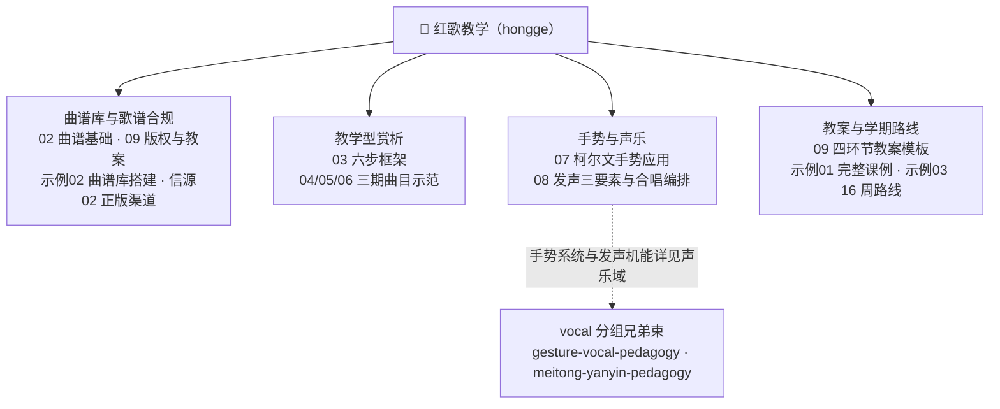

# 🚩 红歌教学（hongge）

本分组收录红色歌曲（红歌）教学知识包，面向中小学音乐教师、合唱指导与教研人员，把红歌课堂从"放一遍音频、讲一段革命故事、跟着录音唱几遍"的经验做法，整理为有课标依据、有信源、有步骤、可照做的中文教程。分组定位一句话：**红色歌曲教学——曲谱库、教学型赏析、歌谱合规、手势与声乐教学结合**。当前含 1 个知识包，以"赏—谱—声—教"四环节闭环为主线：赏（六步框架与三期曲目示范）、谱（简谱基础、曲谱库建设与版权合规）、声（柯尔文手势音高锚点与声乐合唱基础）、教（四环节教案、完整课例与学期路线）。


## 知识包列表

| 知识包 | 定位 | 说明 |
|--------|------|------|
| [hongge-pedagogy/](hongge-pedagogy/index.md) | 红歌教学教程：曲谱库·赏析·歌谱·柯尔文手势与声乐 | 10 篇概念（红歌界定与时代分层、简谱曲式基础、赏析六步框架、革命/建设改革/新时代三期曲目示范、柯尔文手势课堂应用、声乐基础与合唱编排、曲谱库版权与教案设计）+ 3 个示例（《歌唱祖国》45 分钟完整教案、红歌曲谱库搭建指南、学期 16 周教学路线图）+ 课标教材/正版曲谱音频/红歌史料教学法三类信源，68 条事实登记（F-001 至 F-068）与七条架构洞察 |

## 分组知识地图



**图 1｜红歌教学分组知识地图**：四大分支对应"赏—谱—声—教"四环节——谱（曲谱库与歌谱合规）、赏（教学型赏析）、声（手势与声乐）、教（教案与学期路线）；手势系统训练与发声机能训练链向声乐（vocal）分组的两个兄弟束，本分组只聚焦红歌课堂的应用结合点。

```{toctree}
:hidden:
:maxdepth: 7

hongge-pedagogy/index
```
