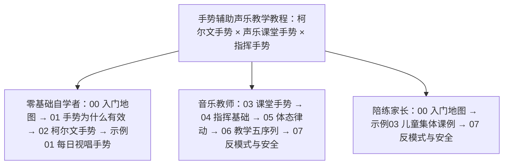

# 手势辅助声乐教学教程

本知识包（bundle）是面向零基础自学者、音乐教师与陪练家长的**教学型**中文教程，基于 Web 公开信源调研整理（信源逐条登记于 [事实清单](facts.md)）。教程整合课堂上常见的三套手势体系：

- **柯尔文手势（Curwen hand signs）**：源自 Glover 的 Norwich sol-fa、经 Curwen 定型、被柯达伊体系采纳的七唱名手型——用手型与空间高度把音级与音程关系可视化，服务视唱练耳与音准建立（GV-13、GV-14）；
- **声乐课堂手势**：教师在练声中以手势提示呼吸支撑、喉咙打开、共鸣位置等发声机能的教学提示动作，与金铁霖"启发式感觉教学"的形象化提示同源（GV-24、GV-25）；
- **指挥手势**：2/3/4 拍基本图式与拍点（ictus），服务集体歌唱的起收、速度与力度组织，已进入中国中学音乐教材与义务教育艺术课标（GV-21、GV-22、GV-23）。

三套手势回答三个不同问题：柯尔文手势回答"这个音有多高"，声乐课堂手势回答"身体该怎么用"，指挥手势回答"大家怎么一起动"。

> ⚠️ **安全提示**：本教程为知识整理，不替代面授教师。练习中出现疼痛、嘶哑、失声等症状应停止练习并就医（耳鼻喉科/艺术嗓音医学门诊）；手势是发声与音高学习的辅助提示，不能替代嗓音机能训练本身，更不可当作嗓音疾病的治疗手段。发声机能与嗓音保健内容见姊妹束《[美通唱法与咽音体系教学教程](../meitong-yanyin-pedagogy/index.md)》。


> 封面图为氛围插画。

## 📚 快速导航

### [概念文档](concepts/index.md) — 8 篇核心概念（已发布）

| 序号 | 文档 | 内容 |
| -- | -- | -- |
| 00 | [入门地图：为什么用手势教音乐](concepts/00-overview-why-gestures.md) | 读者画像、三套手势的分工地图、本束用法与学习顺序、安全边界 |
| 01 | [手势为什么有效：具身认知与音高—高度隐喻](concepts/01-why-gestures-work.md) | pitch is height 概念隐喻、音高—空间映射实验、手势作为转译器的认知机制 |
| 02 | [柯尔文七唱名手势](concepts/02-curwen-hand-signs.md) | do–ti 七型手型与身体高度、手型×高度双编码、引入顺序与练习剂量 |
| 03 | [声乐课堂五类手势](concepts/03-vocal-studio-gestures.md) | 呼吸、打开、共鸣、位置、起收五类机能提示手势与启发式感觉教学 |
| 04 | [指挥手势基础](concepts/04-conducting-basics.md) | 2/3/4 拍图式、拍点 ictus、起拍收拍、课堂集体歌唱组织 |
| 05 | [达尔克罗兹体态律动](concepts/05-dalcroze-eurhythmics.md) | eurhythmics/solfège/improvisation 三分支、身体即乐器、节奏同步机制 |
| 06 | [手势教学五序列](concepts/06-teaching-sequence.md) | 身体模仿→空间定位→唱名符号→撤离手势的教学进阶与脚手架撤除 |
| 07 | [反模式与安全](concepts/07-pitfalls.md) | 手势依赖、两套逻辑混用、错误手型强化、嗓音安全红线 |

### [实践示例](examples/index.md) — 3 篇实操指南（已发布）

| 序号 | 文档 | 内容 |
| -- | -- | -- |
| 01 | [视唱每日手势练习](examples/01-solfege-daily-routine.md) | 柯尔文手势四周日程：三音锚定→音阶→跳进→短句→歌曲，分步流程、剂量、可观察自检与撤架节点 |
| 02 | [20 分钟练声手势流程](examples/02-vocal-warmup-gestures.md) | 练声五段式手势流程：呼吸→打开→共鸣→音阶→母音乐句，手势与发声目标对应、与姊妹束清单搭配 |
| 03 | [儿童集体课例](examples/03-group-class-lesson.md) | 45 分钟集体课设计：律动导入、柯尔文新授、手势接龙/看手猜音游戏、指挥合练、内化小结 |

### [信源参考](references/index.md) — 2 篇信源登记

| 序号 | 文档 | 内容 |
| -- | -- | -- |
| 01 | [核心著作、机构与教材课标信源](references/01-core-books-methods.md) | Glover/Curwen 一手著作、Waterhouse/Southcott/Asztalos 考证、Kodály 与 Dalcroze 官方机构、金铁霖教材、中国课标与指挥图式教材 |
| 02 | [具身认知、音高空间隐喻与手势教学实证研究信源](references/02-science-embodied.md) | 概念隐喻理论、音高—空间映射实验、Steeves/Cassidy/McClung 等实证研究（阳性与阴性并列）、体态律动具身机制 |

### 工作文档

- [事实清单](facts.md) — 33 条零推测客观事实登记（GV-01 至 GV-33，五组：人物源流/柯尔文手型/机构/指挥课标中国/具身认知实证，信源 URL 逐条内嵌）
- [架构洞察](insights.md) — 手势教学知识地图的核心洞察（转译器本质、两套逻辑、脚手架撤除、身体经验先行、群体/个体分工）

## 🚀 快速开始

如果你之前从未接触过手势教学：

1. 先读 [事实清单](facts.md) 与 [架构洞察](insights.md)，了解本束的证据基础与核心命题
2. 概念 00（入门地图）与概念 01（手势为什么有效）建立总图，再按身份选分支路径
3. 想立刻上手视唱：概念 02（柯尔文七唱名手势）→ 示例 01（每日手势练习），每次 5 分钟即可开练
4. 声乐教师：概念 03（声乐课堂五类手势）→ 概念 04（指挥基础）→ 示例 02/03
5. 家长陪练：示例 03（儿童集体课例）+ 概念 07（反模式与安全）
6. 发声机能训练（呼吸、喉位、共鸣、练声步骤）不在本束，请读姊妹束《[美通唱法与咽音体系教学教程](../meitong-yanyin-pedagogy/index.md)》

## 📖 推荐学习路径



**图 1｜三种读者画像的分支路径**：中心为本束三套手势体系，三条分支按身份给出建议阅读顺序（数字为概念文档编号），与下方代码块的完整路径一一对应。

```
零基础自学者（第一次接触手势/视唱）：
  概念00（地图）→ 概念01（为什么有效）→ 概念02（柯尔文手势）→
  示例01（每日视唱手势）→ 概念06（教学五序列，理解何时撤手势）→
  概念07（反模式随用随查）

音乐教师（课堂教学参考）：
  概念03（声乐课堂五类手势）→ 概念04（指挥基础）→ 概念05（体态律动）→
  概念06（教学五序列）→ 示例02（练声手势流程）→ 示例03（集体课例）→
  references/01（教材课标选读）→ references/02（实证研究对照）

陪练家长（陪孩子练唱）：
  概念00（地图）→ 示例03（儿童集体课例）→ 概念07（反模式与安全）→
  概念02（柯尔文手势，家长先学会再陪练）
```

## 🔗 与姊妹束的关系

本束与同目录姊妹束《[美通唱法与咽音体系教学教程](../meitong-yanyin-pedagogy/index.md)》分工如下：

- **本束管"手势"**：音高的符号化转译（柯尔文）、发声机能的课堂提示（声乐课堂手势）、集体歌唱的组织（指挥）——回答"教师的手在做什么、为什么这样做有效"；
- **姊妹束管"机能"**：呼吸、喉位、共鸣、换声等发声器官训练的完整体系（咽音八步骤、美通技术、嗓音保健）——回答"声音本身怎么练"；
- 两束交叉引用：本束概念 03 的机能提示手势回链姊妹束的生理基础与练声步骤，姊妹束教学法篇可回链本束的手势提示手段。嗓音安全与就医红线以姊妹束嗓音保健篇为准。

```{toctree}
:hidden:
:maxdepth: 7

concepts/index
examples/index
references/index
facts
insights
log
```
