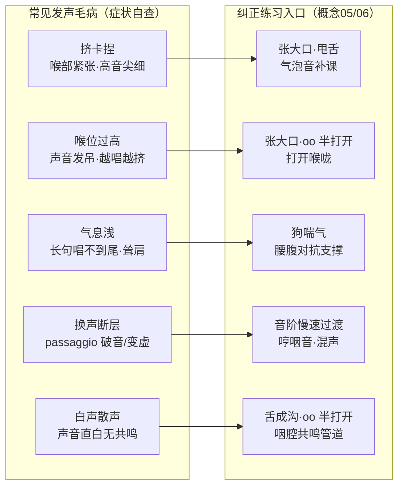

# 常见发声毛病与纠正

**图 1｜五类高频毛病的纠正练习映射**：左侧对照症状判断属于哪一类，再按箭头到右侧回链对应练习（详细动作见概念05/06）；多个毛病常同时出现，通用顺序为先呼吸（狗喘气）→ 再放松（张大口、甩舌）→ 然后位置（哼咽音、张小口咽音）→ 最后整合（音阶、母音、oo、打开喉咙）。

本节的"毛病—机理—练习"映射，是教学视角的**组织框架**（参考林俊卿《歌唱发音不正确的原因及纠正方法》一书的纠正思路，[facts.md](../facts.md) F-030；以及潘乃宪以"辨证施治"原则辨证发声机能问题的体系，F-053）。五类毛病按高频到低频排列；每条先描述**可观察症状**，再给**机理判断**，最后落到**练习映射**。

> **使用方法**：先对照症状判断"属于哪一类"，再按映射表回链到对应练习。多个毛病常同时出现（如挤卡伴气息浅），优先处理最根本的一个（通常先调呼吸与喉位）。

## 毛病一：挤卡、捏（喉部紧张）

- **症状**：发声时喉头周围发紧，像"卡着嗓子"唱；高音尤甚，声音尖、细、不通透；唱完喉部疲劳。
- **机理**：喉外肌与下巴紧张参与发声，声门过度闭合（F-041 的协调问题）；常因想"够到"高音而用喉部用力。
- **练习映射**：[张大口](05-eight-steps-silent.md#练习一张大口放松下颌与喉外肌)（松下颌）、[震摇下巴与甩舌](05-eight-steps-silent.md#练习二震摇下巴与甩舌松解舌根与下巴紧张)（松舌根）、[气泡音补课](06-eight-steps-voiced.md#补课气泡音插在步骤一二之间)（重建声带闭合与放松的平衡）。

## 毛病二：喉位过高（唱歌像"吊着嗓子"）

- **症状**：喉头在发声时明显上提，声音单薄、发"吊"，音高越往上越挤；换声区难以过渡。
- **机理**：喉位随音高上提是常见代偿；SLS 等体系主张歌唱时喉头保持日常说话时的稳定位置（F-077）。
- **练习映射**：[张大口](05-eight-steps-silent.md#练习一张大口放松下颌与喉外肌)（下巴后缩带动喉位放松）、[打开喉咙（步骤八）](06-eight-steps-voiced.md#进阶三步骤八用打开喉咙方法结合咽音歌唱)、[oo 母音"半打开"](06-eight-steps-voiced.md#进阶二步骤七单独用咽部发-oo-母音半打开课)。

## 毛病三：气息浅（支撑不足）

- **症状**：长句唱不到尾、气息"虚"、声音发飘；唱时耸肩、胸式呼吸明显。
- **机理**：未形成腹式/腰腹对抗支撑，气息在胸腔即止，无法提供稳定气压（F-041 狗喘气训练目标）。
- **练习映射**：[狗喘气](05-eight-steps-silent.md#练习四狗喘气气息支持与腹式弹动)（腹式弹动）、[概念01 呼吸动力系统](01-singing-physiology.md#一呼吸动力系统)（腰腹对抗原理）、[音阶（步骤五）](06-eight-steps-voiced.md#步骤五用发咽音方法发准确音高音阶)（在旋律中保持支撑）。

## 毛病四：换声断层（换声区"裂缝/破音"）

- **症状**：音高上行到某个区域（passaggio）时声音"翻车"、断档或突然变虚变炸；男声/女声都有，位置因声部而异。
- **机理**：胸声（甲杓肌 TA 主导）与头声（环甲肌 CT 主导）两组肌肉未平衡渐变，在换声区硬切（F-074）；咽音体系恰以"咽音"作为真声与假声之间的过渡机制（F-001、F-003）。
- **练习映射**：[音阶（步骤五）](06-eight-steps-voiced.md#步骤五用发咽音方法发准确音高音阶)（小音程慢速过换声区）、[混声与换声区](03-meitong-technique.md#hunshen-huansheng)（混声原理）、[哼咽音（步骤三）](06-eight-steps-voiced.md#步骤三哼咽音的练习)（建立过渡位置）。

## 毛病五：白声、散声（声音发白无共鸣）

- **症状**：声音直、白、散，缺少泛音与"立起来"的圆润感；常见于流行歌"大白嗓"式演唱。
- **机理**：发音管/咽腔未打开，喉位偏高，共鸣腔未参与（F-070 歌手共振峰的产生依赖喉管与咽腔的截面积比，F-071）。
- **练习映射**：[舌成沟](05-eight-steps-silent.md#练习三舌成沟舌位与咽腔通道的预备)（咽腔通道）、[oo 母音"半打开"](06-eight-steps-voiced.md#进阶二步骤七单独用咽部发-oo-母音半打开课)（咽部造型）、[概念01 共鸣腔与发音管](01-singing-physiology.md#三共鸣腔与发音管)。

## 纠正练习的通用顺序

1. **先呼吸**：狗喘气 + 概念01 呼吸基础（气息是一切的前提）；
2. **再放松**：张大口、震摇下巴甩舌（去掉喉外肌与下巴的代偿）；
3. **然后位置**：哼咽音、张小口咽音（建立高位置与集中度）；
4. **最后整合**：音阶、母音、oo"半打开"、打开喉咙（把正确状态带进歌唱）。

> 若纠正两周仍无改善，或伴随**疼痛、持续嘶哑、失声**，属医学范畴，请停止自学并就医（[概念08](08-voice-health.md)）——不是所有"毛病"都靠练习解决，有些是嗓音疾病信号。

下一篇：[嗓音保健与治疗边界](08-voice-health.md)——声带小结、用嗓卫生与就医红线。
