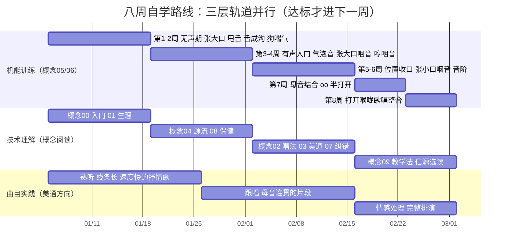

# 八周自学路线图

**图 1｜八周自学路线：三层轨道并行**——机能训练（主线）按周递进，技术理解（概念阅读）与曲目实践（熟听→跟唱→排演）同步推进；每周节点对照正文自检标尺，**达标才进下一周**，周次是下限不是上限。

本路线把 [概念05](../concepts/05-eight-steps-silent.md)、[概念06](../concepts/06-eight-steps-voiced.md) 的八步骤铺进八周，配套 [每日练声清单](01-daily-practice-routine.md) 使用。设计原则：**无声打底两周、有声逐级推进、每步达标才进下一步**——林俊卿体系八步骤本身就是“实验证明比六步骤见效快”的渐进脚手架（F-040），跳级练习是最常见的低效原因。

> 周次是下限不是上限：某周自检不达标，就原地再练一周。肌肉协调没有赶进度这回事。

## 第 1–2 周：无声期（打地基）

- **目标**：四个无声练习全部达标，建立对镜自练习惯。

- **练习重点**：[张大口](../concepts/05-eight-steps-silent.md#练习一张大口放松下颌与喉外肌)（下巴放松后缩）→ [震摇下巴与甩舌](../concepts/05-eight-steps-silent.md#练习二震摇下巴与甩舌松解舌根与下巴紧张)（舌如软布条）→ [舌成沟](../concepts/05-eight-steps-silent.md#练习三舌成沟舌位与咽腔通道的预备)（舌面凹沟可见）→ [狗喘气](../concepts/05-eight-steps-silent.md#练习四狗喘气气息支持与腹式弹动)（腹弹胸不动）。

- **同时阅读**：[概念00](../concepts/00-why-vocal-pedagogy.md)、[概念01](../concepts/01-singing-physiology.md)（理解呼吸、喉位、共鸣）。

- **第 2 周末自检**：

  - [ ] 张大口能到三指以上且下巴不前顶、颈部不绷；

  - [ ] 甩舌连续 30 秒舌是被动摆动；

  - [ ] 舌成沟能保持 5 秒以上；

  - [ ] 狗喘气 30 秒不头晕、不耸肩、腹部明显弹动。

## 第 3–4 周：有声入门（气泡音 + 张大口咽音 + 哼咽音）

- **目标**：找到放松状态下的声带闭合与高位置共鸣。

- **练习重点**：

  - [气泡音补课](../concepts/06-eight-steps-voiced.md#补课气泡音插在步骤一二之间)：每日 1–2 分钟，从慢气泡过渡到连贯低音；

  - [步骤二·张大口咽音](../concepts/06-eight-steps-voiced.md#步骤二用张大口的姿势发咽音)：在无声张大口姿势上发明亮集中的声音，每次 3 秒；

  - [步骤三·哼咽音](../concepts/06-eight-steps-voiced.md#步骤三哼咽音的练习)：闭口哼，眉心/面罩有振动感。

- **同时阅读**：[概念04 源流](../concepts/04-yanyin-lineage.md)（建立体系感）、[概念08 保健](../concepts/08-voice-health.md)。

- **第 4 周末自检**：

  - [ ] 气泡音能轻松发出并过渡到连贯低音；

  - [ ] 张大口发声音色集中、喉部不挤，可稳定保持 3–5 秒；

  - [ ] 哼咽音时手指摸眉心/鼻梁有明显振动；

  - [ ] 练后嗓子不疼不哑。

- **不达标处理**：退回第 1–2 周无声练习 + 气泡音；若声音始终发虚漏气，建议安排一次面授（[概念09](../concepts/09-teaching-methods.md#六自学与面授怎么选老师)）。

## 第 5–6 周：位置收口与音高（张小口咽音 + 音阶）

- **目标**：口型变小时声音位置不掉；音准与机能开始结合。

- **练习重点**：

  - [步骤四·张小口咽音](../concepts/06-eight-steps-voiced.md#步骤四用张小口的姿势发咽音)：与张大口交替，体会“口型变、位置不变”；

  - [步骤五·音阶](../concepts/06-eight-steps-voiced.md#步骤五用发咽音方法发准确音高音阶)：每日 5–10 分钟，用琴或校音器对照，小音程慢速上下行，重点磨换声区（原理见 [概念03 混声](../concepts/03-meitong-technique.md#一混声让真声和假声混合而不是切换)）。

- **同时阅读**：[概念02 唱法定位](../concepts/02-three-styles-and-meitong.md)、[概念03 美通技术](../concepts/03-meitong-technique.md)、[概念07 毛病纠正](../concepts/07-common-faults.md)。

- **第 6 周末自检**：

  - [ ] 张小口与张大口发出的声音位置、明亮度基本一致；

  - [ ] 舒适音域内音阶上下行无明显裂缝/破音；

  - [ ] 录音回听无明显挤卡、喉位上提（对照 [概念07](../concepts/07-common-faults.md) 五类毛病自查）。

## 第 7 周：母音与“半打开”（步骤六、七）

- **目标**：咽音状态进入咬字造型；建立咽部“后面的嘴”意识。

- **练习重点**：

  - [步骤六·母音结合](../concepts/06-eight-steps-voiced.md#进阶一步骤六结合不同母音的练习)：a/e/i/o/u 母音串，位置统一；

  - [步骤七·oo 母音半打开](../concepts/06-eight-steps-voiced.md#进阶二步骤七单独用咽部发-oo-母音半打开课)：咽部独立形成 oo，不靠嘴唇拢圆；体会“oo 音管”保护声带的边缘振动状态（F-043）。

- **第 7 周末自检**：

  - [ ] 换母音时音色位置统一，不出现“一个母音一个位置”；

  - [ ] 不撅嘴能发出集中的 oo；

  - [ ] 舌成沟练习与 oo 母音能衔接上（舌位稳定）。

## 第 8 周：打开喉咙歌唱（步骤八 + 歌曲整合）

- **目标**：把全部步骤整合进完整歌唱——从“练声”到“唱歌”。

- **练习重点**：

  - [步骤八·打开喉咙结合咽音歌唱](../concepts/06-eight-steps-voiced.md#进阶三步骤八用打开喉咙方法结合咽音歌唱)：每日 10–15 分钟短句练唱；

  - 用美通要求唱歌曲片段：美声功底（通道、共鸣、混声）× 通俗表达（咬字、语气），技术要点回查 [概念03](../concepts/03-meitong-technique.md#三咬字与语气美通与大白嗓唱流行的分水岭)。

- **第 8 周末自检**：

  - [ ] 唱短句时咽音状态、喉位、咬字三者同时成立；

  - [ ] 一首简单歌曲能从头唱到尾而机能状态不崩塌；

  - [ ] 录一首完整作品，对照七字标准（声、情、字、味、表、养、象，F-057）自评前三项“声、字”达标。

## 美通方向曲目选择原则

八周内只唱“机能友好型”曲目，别拿高音炸裂的歌检验自己：

1. **音域适中**：最高音在自己舒适音域内（不碰需要喊才能到的音），优先选线条长、速度慢的华语抒情歌曲与民歌改编曲；
2. **母音连贯**：旋律以连音为主，少断音、少大跳——便于保持通道与位置；
3. **语气自然**：歌词口语化，便于练习“像说话一样唱歌”的通俗表达（[概念03](../concepts/03-meitong-technique.md)）；
4. **避开**：全程强混声 belting 的流行歌、需要极端音色的摇滚/说唱——那是后续阶段在教师指导下拓展的内容（海外 belting 训练体系见 [references/02](../references/02-voice-science.md) Estill）。

## 八周之后

- 八周是**入门闭环**不是终点：此后每日维持 20–30 分钟清单（阶段 C 剂量），把步骤八的歌曲整合范围逐步扩大。

- 建议安排一次正式面授，让老师按 [概念07 毛病映射](../concepts/07-common-faults.md) 做一次“辨证”，确定下一阶段主攻方向。

- 想深入流行/音乐剧方向：读潘乃宪著作（[references/01](../references/01-core-books.md)）；想系统美声功底：读沈湘体系《歌唱学》；想理解声学原理：读 [references/02 嗓音科学](../references/02-voice-science.md)。

返回 [实践示例索引](index.md) 或查阅 [信源参考](../references/index.md)。
