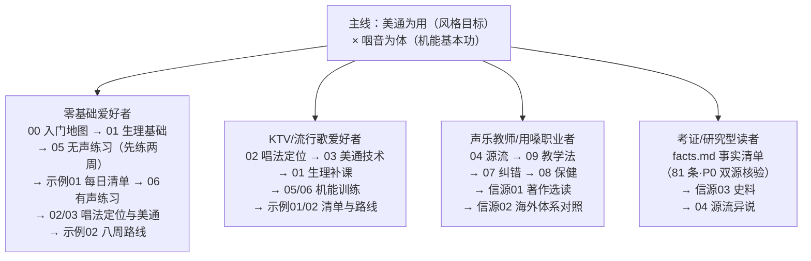

# 美通唱法与咽音体系教学教程

本知识包（bundle）是面向零基础歌唱爱好者、流行/美声方向初学者与声乐教师的**教学型**中文教程，基于 Web 公开信源调研整理（信源逐条登记于 [事实清单](facts.md)）。教程主线为"美通为用、咽音为体"（见下文体用分述）：

- **咽音为体（基本功主线）**：林俊卿《"咽音"练声的八个步骤》体系——源出意大利老派美声（Voce faringea），以四个无声练习打底、四个有声练习进阶，训练呼吸、喉位稳定、咽部共鸣与换声过渡；

- **美通为用（风格目标）**：美声功底 × 通俗表达的融合唱法——用通畅、共鸣、混声的机能基础，唱流行歌曲的语气、咬字与个性化表达。

> ⚠️ **安全提示**：本教程为知识整理，不替代面授教师。练习中出现疼痛、嘶哑、失声等症状应停止练习并就医（耳鼻喉科/艺术嗓音医学门诊）；咽音对嗓音疾病的康复案例均出自专业机构指导下的治疗实验，自学不可当作治疗手段。详见 [概念08·嗓音保健](concepts/08-voice-health.md)。

## 📚 快速导航

### [概念文档](concepts/index.md) — 10 篇核心概念

| 序号 | 文档                                                       | 内容                                     |
| -- | -------------------------------------------------------- | -------------------------------------- |
| 00 | [入门地图：为什么"美通为用、咽音为体"](concepts/00-why-vocal-pedagogy.md) | 读者画像、术语地图、本束用法与学习顺序                    |
| 01 | [歌唱的生理基础](concepts/01-singing-physiology.md)             | 呼吸器官、声带闭合、共鸣腔、发音管与歌手共振峰                |
| 02 | [三种唱法与"美通"的定位](concepts/02-three-styles-and-meitong.md)  | 1986 青歌赛三分法、融合唱法谱系、金铁霖"中国声乐"框架         |
| 03 | [美通唱法技术原理](concepts/03-meitong-technique.md)             | 混声与换声区、U 通道与支点、咬字语气、美声功底通俗表达           |
| 04 | [咽音体系源流](concepts/04-yanyin-lineage.md)                  | 意大利 Voce faringea、卡鲁索经验谈、林俊卿生平、上海声乐研究所 |
| 05 | [咽音八步骤（上）：四个无声练习](concepts/05-eight-steps-silent.md)     | 张大口、震摇下巴甩舌、舌成沟、狗喘气——要领·达标·错误·剂量        |
| 06 | [咽音八步骤（下）：四个有声练习](concepts/06-eight-steps-voiced.md)     | 张大口咽音、哼咽音、张小口咽音、音阶母音、oo 母音、打开喉咙        |
| 07 | [常见发声毛病与纠正](concepts/07-common-faults.md)                | 挤卡捏、喉位高、气息浅、换声断层、白声——症状→机理→练习映射        |
| 08 | [嗓音保健与治疗边界](concepts/08-voice-health.md)                 | 用嗓卫生、声带小结、气泡音按摩、就医红线、自学安全规则            |
| 09 | [教学法与练声安排](concepts/09-teaching-methods.md)              | 潘乃宪辨证施治、金铁霖启发式感觉教学、每日练声结构、自学与面授        |

### [实践示例](examples/index.md) — 2 篇实操指南

| 序号 | 文档                                                       | 内容                     |
| -- | -------------------------------------------------------- | ---------------------- |
| 01 | [每日 20–30 分钟练声清单](examples/01-daily-practice-routine.md) | 八步骤剂量表、晨起/睡前安排、自检标准与红线 |
| 02 | [八周自学路线图](examples/02-eight-week-roadmap.md)             | 周目标、练习重点、美通曲目选择、阶段自检   |

### [信源参考](references/index.md) — 3 篇信源登记

| 序号 | 文档                                                   | 内容                            |
| -- | ---------------------------------------------------- | ----------------------------- |
| 01 | [核心著作与教材信源](references/01-core-books.md)             | 林俊卿四种、潘乃宪五种、金铁霖教材、沈湘《歌唱学》分级表  |
| 02 | [嗓音科学与海外体系信源](references/02-voice-science.md)        | 歌手共振峰、声带生理、SLS、Estill、嗓音医学机构  |
| 03 | [机构人物与赛事史料信源](references/03-institutions-history.md) | 上海/北京声乐研究所、师承谱系、青歌赛制度史、媒体纪念报道 |

### 工作文档

- [事实清单](facts.md) — 81 条零推测客观事实登记（人物、机构、著作、步骤、科学数据，信源 URL 逐条内嵌，含 P0 双源核验表）

- [架构洞察](insights.md) — 声乐教学知识地图的核心洞察（体用分层、脚手架本质、术语门派辨析、自学边界）

## 🚀 快速开始

如果你之前从未接触过声乐：

1. 先读[入门地图](concepts/00-why-vocal-pedagogy.md)，确认目标与安全边界
2. 读[歌唱的生理基础](concepts/01-singing-physiology.md)，建立呼吸—声带—共鸣的基本图景
3. 读[咽音八步骤（上）](concepts/05-eight-steps-silent.md)，无声练习可以当天开练（不伤嗓）
4. 打开[每日练声清单](examples/01-daily-practice-routine.md)，从 15 分钟剂量起步
5. 有声练习（[概念06](concepts/06-eight-steps-voiced.md)）建议对照镜子、录音自评，有条件时找老师面授纠偏
6. 想直接学唱流行歌：读[美通技术原理](concepts/03-meitong-technique.md) + [八周路线图](examples/02-eight-week-roadmap.md)

## 📖 推荐学习路径



**图 1｜四种读者画像的分支路径**：中心为本束主线"美通为用、咽音为体"，四条分支按身份给出建议阅读顺序（数字为概念文档编号），与下方代码块的完整路径一一对应。

```
零基础爱好者（第一次接触声乐）：
  概念00（地图）→ 概念01（生理）→ 概念05（无声练习，先练两周）→
  示例01（每日清单）→ 概念06（有声练习）→ 概念02/03（唱法定位与美通）→
  示例02（八周路线）→ 概念07/08（纠错与保健随用随查）

KTV/流行歌爱好者（想唱得省力好听）：
  概念02（唱法定位）→ 概念03（美通技术）→ 概念01（生理补课）→
  概念05/06（机能训练）→ 示例01/02

声乐教师/用嗓职业者（教学参考与保健）：
  概念04（源流）→ 概念09（教学法）→ 概念07（纠错）→ 概念08（保健）→
  references/01（著作选读）→ references/02（科学与海外体系对照）

考证/研究型读者：
  facts.md（P0 双源核验表）→ references/03（史料）→ 概念04（源流异说）
```

```{toctree}
:hidden:
:maxdepth: 7

concepts/index
examples/index
references/index
facts
insights
```

