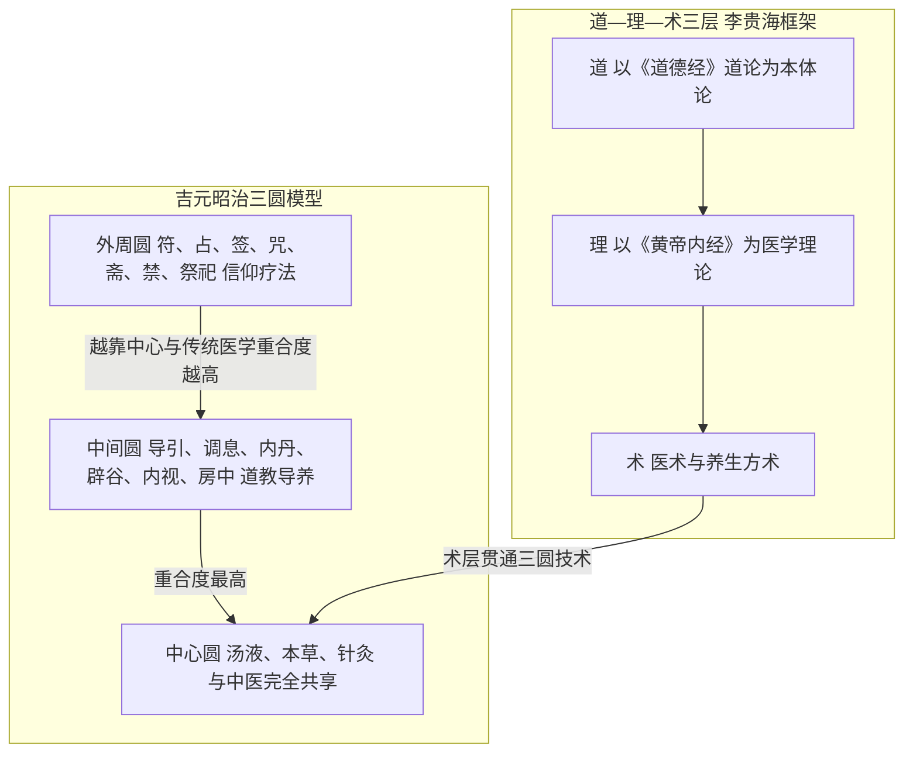

# 道医是什么——界定、模型与词源

## 三种学术界定

现代学界对"道医"并无单一定义，影响最大的有三家：

1. **盖建民：道教医学是一种"宗教医学"。** 盖建民《道教医学》（宗教文化出版社2001，ISBN 7-80123-318-2）是我国第一部系统研究道教医学的学术专著，由其1998年四川大学博士论文（导师卿希泰）修订而成（AX-001、AX-002、AX-013）。他与何振中合著的《道教医学精义》（2014，ISBN 9787802547988）进一步概括道教医学"融生理治疗、心理治疗、精神信仰治疗于一炉"，临床处置次序为"先医药，后符咒"（AX-004、AX-005）。
2. **胡孚琛："道教医药学"。** 胡孚琛、吕锡琛《道学通论》（1999；修订版2009，ISBN 9787509708149）方术篇第二章题为"医药、服食和养生"，提出"道教医药学"概念，要点为：以气为本、身神存神、唐代以后内丹取代外丹、重视肾脏（AX-006、AX-007）。
3. **丁贻庄：较早的学科定义。** 丁贻庄1985年发表道医定义文章，该定义后收入《中国大百科全书·宗教卷》（1988年版），是较早的道医学术定义（AX-012）。

此外，林富士将道士医术分为四类：医者之术、养生之术、巫者之术、道教自创仪式疗法（AX-010）；郑志明《道教生死学》（中央编译2008，ISBN 9787802117150）从生死观角度处理相关议题（AX-011）。

## 吉元昭治三圆模型

日本学者吉元昭治《道教与不老长寿医学》（杨宇译，成都出版社1992）用三个同心圆描述道医的技术构成（AX-014）：

| 圈层 | 内容 | 与传统医学的关系 |
|------|------|----------------|
| **中心圆** | 汤液、本草、针灸 | 与中医完全共享 |
| **中间圆** | 导引、调息、内丹、辟谷、内视、房中 | 道教导养技术，与中医养生学交叉 |
| **外周圆** | 符、占、签、咒、斋、禁、祭祀 | 道教信仰疗法，宗教仪式层 |

这个模型的关键启示是：**越靠近中心，与传统医学的重合度越高；越靠近外周，宗教信仰色彩越浓。** 流行文化中"道医＝画符念咒"的印象，其实只对应外周圆。

## "道医"词源考辨

李贵海《道医学初探》（《世界宗教文化》2019年第5期）的词源考辨结论值得注意（AX-015、AX-016）：

- 古文献中**未见"道医"提法**，相近说法是"道士医师"，出处见《太上灵宝五符序》与《云笈七签》卷82；
- "中医"一词则首见《汉书·艺文志》（AX-017）；
- 该文提出道医的**三层结构**：道（《道德经》）、理（《黄帝内经》）、术（医术与养生方术）。

也就是说，"道医"是一个现代学术概念，用来回溯描述一个历史现象——道门中人长期兼行医药、道教典籍长期收纳医方、医学理论与道家哲学共用一套宇宙论语言。

## 道—理—术三层结构

按李贵海的框架（AX-016），可以把道医读作三层：

- **道**：以《道德经》"道"论为本体论基础——道法自然、返璞归真、柔弱不争；
- **理**：以《黄帝内经》为医学理论——阴阳五行、藏象经络、气运气化；
- **术**：医术与养生方术——本草、针灸、汤液与导引、调息、内丹、服食并存。

三层不是三个派别，而是同一传统的不同抽象层级：葛洪谈"金丹"而著《肘后》救急方，孙思邈在《千金要方》中列"大医精诚"的医德规范又收录道养内容，都是三层贯通的实例（详见 [03 道门医家](03-daoist-physicians.md)）。

三圆模型与道—理—术三层的对应关系如下图：

## 道医与中医是什么关系

- **不是并列关系**：历史上不存在一个与"中医"并行的独立"道医"医疗体系；中心圆技术（汤液、本草、针灸）本就是传统医学的主体。
- **是汇流关系**：盖建民的历史分期第三期即"明清汇入传统医学"（AX-003）——道门医学成果最终汇入中国传统医学的大河。
- **读史的正确姿势**：把"道医"当作观察医学与宗教互动的视角，而不是另一套医学的标签。读《素问》是读中医元典，也是读道家思想在医学中的展开；读《云笈七签》是读道藏，也是读养生方术的汇编。

> ⚠️ 本束为文化与文献研究，不构成医疗或练功指导。

## 相关概念

- [01 医道同源史](01-history-yidao-tongyuan.md)
- [03 道门医家](03-daoist-physicians.md)
- [08 辨伪方法与信源分级](08-authenticity-and-sources.md)