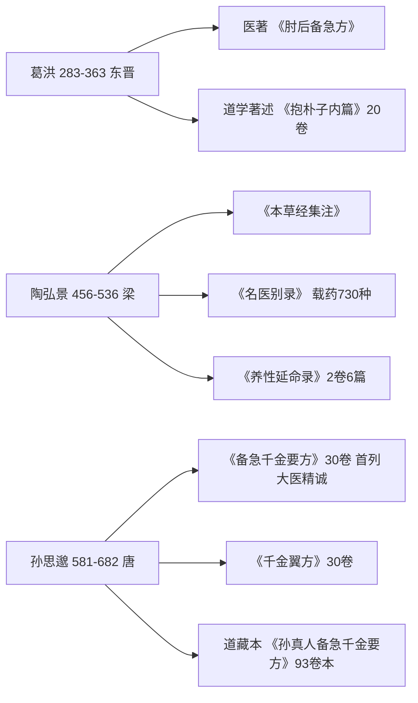

# 道门医家——葛洪、陶弘景、孙思邈

"十道九医"最硬的证据是三个名字：葛洪、陶弘景、孙思邈。他们既是道教史的关键人物，也是医学史无法绕过的作者（AX-022、CAN-001~003）。

*AI 生成意境图，非历史图像，仅作阅读氛围辅助*

## 葛洪（283-363，东晋）

**医著：《肘后备急方》**。简便验廉的急救方书，卷三治寒热诸疟方载："青蒿一握，以水二升渍，绞取汁，尽服之。"该条是屠呦呦研究青蒿素时的文献线索（SRC-010）。在线：维基文库（19页，含葛洪序与陶弘景补阙序）、识典 CADAL01023778 / NA08783（重订肘后百一方）（CAN-018）。

**道学著述：《抱朴子内篇》20卷**。其中《杂应》篇明言"古之初为道者，莫不兼修医术"（DAO-001），是"道医同源"最直接的自我表述。内篇兼论金丹、服食、养生，是外丹学的核心文献。在线：识典 DZ1185（涵芬楼道藏本20卷，精校+译文）、ctext 主库、维基文库（73个子页面，内篇20、外篇50）、国学导航（DAO-002、SRC-005）。纸本：王明《抱朴子内篇校释》（中华书局"道教典籍选刊"1980，后收入新编诸子集成）（DAO-024）。

读法提示：**先读《肘后》，再读《抱朴子》**——先看作为临床医家的葛洪，再看作为丹道理论家的葛洪，就能理解"先医药、后修炼"的次序不是后人建构，而是葛洪本人的写作次序。

## 陶弘景（456-536，梁）

- **《本草经集注》**：整理《神农本草经》并增补汉魏以来用药经验，是本草学承上启下之作；原书早佚，敦煌有残卷（参见 [06 出土方技](06-excavated-fangji.md)）。
- **《名医别录》**：陶弘景辑，载药730种（CAN-002）。
- **《养性延命录》2卷6篇**：陶弘景辑录先秦至六朝养生文献，六篇为教戒、食戒、杂戒忌禳灾祈善、服气疗病、导引按摩、御女损益；收入《云笈七签》卷32（DAO-005）。在线：ctext res=73338。这是研究六朝养生术的枢纽文献，与《诸病源候论》导引法同源互见（CAN-012）。

陶弘景身跨道、医两界：既是茅山宗的实际开创者，又是本草学体系化的关键人物。

## 孙思邈（581-682，唐）

- **《备急千金要方》30卷**，约成书于652年；**《千金翼方》30卷**为续编（CAN-003）。
- 《千金要方》首列**《大医精诚》**，是中医医德规范的经典文本（原文见 [examples/01](../examples/01-classic-passages.md)）；又有《食治》卷专论食疗。
- **道藏本与传世本卷次差异（重要）**：《千金要方》传世主流为30卷本（识典 SK1426 四库本；维基文库36个子页面）；而正统道藏所收为**《孙真人备急千金要方》93卷本**（识典 DZ1163，涵芬楼正统道藏本，精校+译文）（CAN-019）。道藏本卷次分合不同，引用时务必注明所用本。
- 《千金翼方》在线：识典 CADAL11203144（光绪四年景元大德梅溪书院本30卷）、维基文库31个子页面、diancang（CAN-020）。
- 纸本：李景荣《千金要方校释》《千金翼方校释》（人卫1998）（CAN-022）。

孙思邈被后世尊为"药王"，道教中奉为"孙真人"；《千金要方》收入道藏（AX-021；道藏本识典 DZ1163 著录为93卷，钟肇鹏统计作95卷，卷数分合口径不同），本身就是医道一体的象征。

三位道门医家与其医著、道学著述的对应关系如下图：

## 三家共读建议

| 人物 | 先读 | 再读 | 关键问题 |
|------|------|------|---------|
| 葛洪 | 《肘后备急方》（选读） | 《抱朴子内篇·杂应/至理》 | 医家与丹道如何同一人 |
| 陶弘景 | 《养性延命录》（云笈七签卷32） | 《本草经集注》辑本 | 养生术如何被系统辑录 |
| 孙思邈 | 《千金要方·大医精诚/食治》 | 《千金翼方》养性卷 | 医德、食疗与道养的合流 |

> ⚠️ 本束为文化与文献研究，古籍方药、灸法、服食内容均不构成现代医疗建议。

## 相关概念

- [02 中医元典的道家根源](02-classics-daolist-roots.md)
- [04 道藏医书与养生文献](04-daozang-medical.md)
- [05 内丹与身神传统](05-neidan-medical.md)