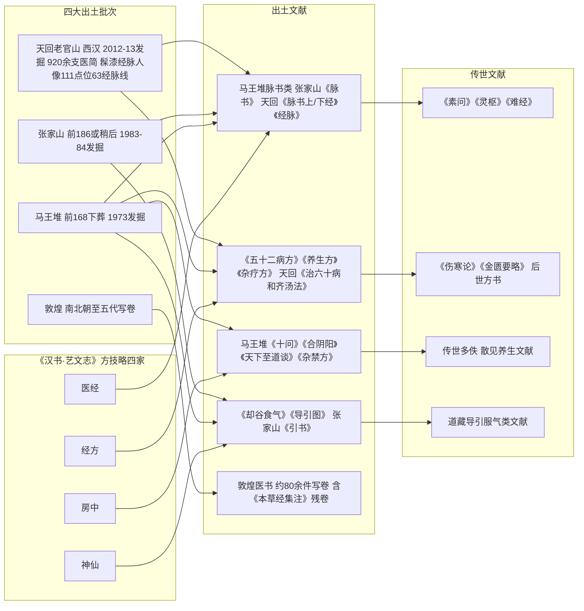

# 出土方技文献——马王堆、张家山、天回、敦煌

出土文献是核验传世本的标尺，也是重写早期医学史的直接证据。《汉书·艺文志·方技略》分方技为四家——**医经、经方、房中、神仙**（EXC-013），著录方技36家868卷：医经7家216卷、经方11家274卷、神仙10家205卷（房中家卷数未查到，标待考）（EXC-014）。这些书绝大部分亡佚，而二十世纪以来的出土文献正好填补了其中神仙、房中、医经三类的实物空白。

*AI 生成意境图，非历史图像，仅作阅读氛围辅助*

## 马王堆汉墓医书（前168年下葬）

马王堆三号汉墓1973年发掘，下葬年代为汉文帝十二年（前168）（EXC-001）。出土医书14种（《长沙马王堆汉墓简帛集成》细分15种）（EXC-002）：

- **帛书10种**：足臂十一脉灸经、阴阳十一脉灸经（甲、乙本）、脉法、阴阳脉死候、五十二病方、却谷食气、导引图、养生方、杂疗方、胎产书；
- **竹木简4种**：十问、合阴阳、天下至道谈（竹简）、杂禁方（木简）。

权威整理本三种：《马王堆汉墓帛书（肆）》（文物出版社1985）、马继兴《马王堆古医书考释》（湖南科技1992）、裘锡圭主编《长沙马王堆汉墓简帛集成》全7册（中华书局2014，ISBN 9787101101683；2024年修订本）（EXC-003）。

## 张家山汉简《脉书》《引书》（前186年或稍后下葬）

张家山247号汉墓1983年底至1984年初发掘，下葬年代为吕后二年（前186）或稍后（EXC-004）。

- **《脉书》**：65/66简、2028字，为《灵枢·经脉》祖本系统——经脉学说的出土实证；
- **《引书》**：112/113简、3235字，导引专著，首句为"春生夏长秋收冬藏，此彭祖之道也"（EXC-005）——导引术在西汉初已体系化。

整理本：《张家山汉墓竹简〔二四七号墓〕》（文物出版社2001，ISBN 978-7-5010-1257-2；修订本2006）（EXC-006）。

## 天回老官山医简（西汉，扁鹊仓公一系）

成都天回镇老官山M3汉墓2012年7月至2013年8月发掘，出土**920余支医简**及髹漆经脉人像（人像有111个点位、63条经脉线，是现存最早的医学教具实物）（EXC-007）。医简定名8种：脉书上经、脉书下经、逆顺五色脉臧验精神、犮理、刺数、治六十病和齐汤法（旧称六十病方）、经脉、疗马书（EXC-008）。

学术源流出扁鹊（简文作"敝昔"）、仓公一系；柳长华等《四川成都天回汉墓医简的命名与学术源流考》，载《文物》2017年第12期第58-69页，DOI:10.13619/j.cnki.cn11-1532/k.2017.12.007（EXC-009）。整理本：《天回医简》（文物出版社2022，ISBN 978-7-5010-7835-6）（EXC-010）。

## 敦煌医书（南北朝至五代写卷）

敦煌医书约80余件写卷（英藏编号 S.、法藏编号 P.），年代为南北朝至五代（EXC-011）。整理本：马继兴《敦煌古医籍考释》（江西科技1988）、《敦煌医药文献辑校》（江苏古籍1998）；沈澍农《敦煌吐鲁番医药文献新辑校》（高等教育2016）；王淑民《英藏敦煌医学文献图影与注疏》（人卫2012，ISBN 978-7-117-15643-1）；彩色图版见国际敦煌项目 IDP（idp.bl.uk，SRC-008）（EXC-012）。陶弘景《本草经集注》即有敦煌残卷存世（见 [03 道门医家](03-daoist-physicians.md)）。

## 《汉志》四家与文献对应

| 汉志四家 | 出土对应 | 传世对应 |
|---------|---------|---------|
| 医经 | 马王堆脉书类、张家山《脉书》、天回《脉书上/下经》《经脉》 | 《素问》《灵枢》《难经》 |
| 经方 | 《五十二病方》《养生方》《杂疗方》、天回《治六十病和齐汤法》 | 《伤寒论》《金匮要略》、后世方书 |
| 房中 | 《十问》《合阴阳》《天下至道谈》《杂禁方》 | （传世多佚，散见养生文献） |
| 神仙 | 《却谷食气》《导引图》、张家山《引书》 | 道藏导引服气类文献 |

（EXC-015）

《汉志》方技略四家与出土、传世文献的对应，以及四大出土批次的关系如下图：

## 为什么出土文献对"道医"主题重要

1. **经脉学说早于《灵枢》定型**：马王堆灸经与张家山《脉书》显示，十一脉体系在《灵枢》十二脉之前（EXC-005）；
2. **导引、房中、食气本是官学**：《汉志》著录证明神仙、房中与医经、经方同列"方技"，医学与养仙术在汉代本为一家之学（EXC-013/015）；
3. **证伪与证真都更有据**：出土本为辨伪提供了年代标尺（如《辅行诀》争议中敦煌卷子的传本链问题，见 [08 辨伪与信源](08-authenticity-and-sources.md)）。

> ⚠️ 出土文献中的方药、导引、房中等内容均属历史研究材料，不构成现代医疗或养生实践指导。

## 相关概念

- [01 医道同源史](01-history-yidao-tongyuan.md)
- [04 道藏医书与养生文献](04-daozang-medical.md)
- [08 辨伪方法与信源分级](08-authenticity-and-sources.md)