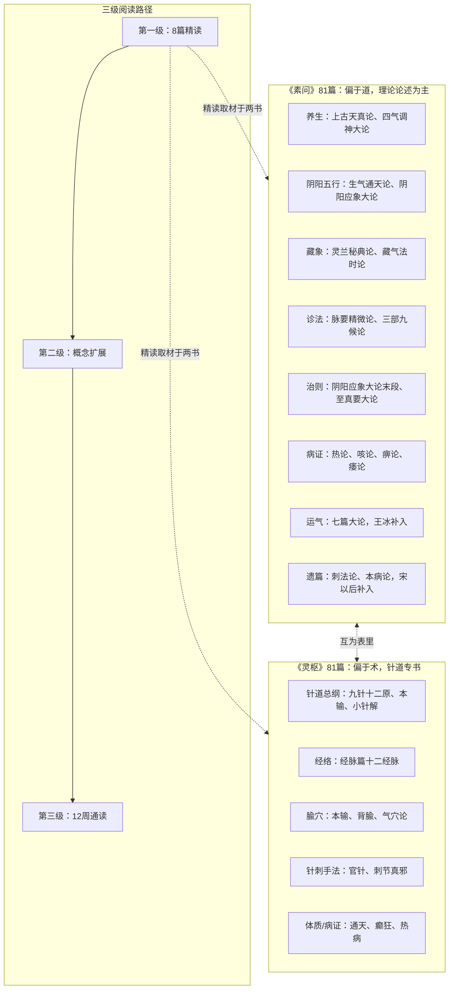

# 全书结构与阅读路径

## 一、两书的分工

| 书 | 篇数 | 重心 | 文体特征 |
|----|------|------|----------|
| 《素问》 | 81 篇（24 卷本） | 医学理论：阴阳五行、藏象、病机、诊法、治则、运气、养生 | 理论论述为主，问答体 |
| 《灵枢》（古称《针经》） | 81 篇（24 卷本） | 经络、腧穴、针刺、九针、十二经脉 | 操作性内容多，针道专书 |

"素问"偏重"道"的阐发，"灵枢"偏重"术"的传授，两者互为表里。

## 二、《素问》的内容板块

按通行的教材分类（参王洪图《内经选读》），81 篇大致分布：

| 板块 | 代表篇 | 本 bundle |
|------|--------|-----------|
| 养生 | 1 上古天真论、2 四气调神大论 | examples/01、02 精读 |
| 阴阳五行 | 3 生气通天论、4 金匮真言论、5 阴阳应象大论 | examples/03、04 精读 |
| 藏象 | 8 灵兰秘典论、9 六节藏象论、22 藏气法时论 | examples/05 精读 |
| 诊法 | 17 脉要精微论、18 平人气象论、20 三部九候论 | concepts/07 |
| 治则 | 见阴阳应象大论末段、74 至真要大论 | examples/04、06 精读 |
| 病证 | 各论病诸篇（热论、咳论、痹论、痿论等） | 通读阶段选读 |
| 运气（七篇大论） | 66–71、74 | concepts/10，examples/06 精读 |
| 遗篇 | 72 刺法论、73 本病论 | 宋以后补入，最后读或不读 |

### 七篇大论与遗篇

- **七篇大论**：第 66 天元纪大论、67 五运行大论、68 六微旨大论、69 气交变大论、70 五常政大论、71 六元正纪大论、74 至真要大论，篇目均带"大论"，由王冰补入，专论五运六气、病机与治则。其中《至真要大论》含病机十九条与系统治法，思想性最强
- **遗篇**：第 72《刺法论》、第 73《本病论》为宋以后补入，内容风格与全书不类，初读跳过

## 三、《灵枢》的内容板块

| 板块 | 代表篇 | 本 bundle |
|------|--------|-----------|
| 针道总纲 | 1 九针十二原、2 本输、3 小针解 | examples/07 精读 |
| 经络 | 10 经脉（十二经脉循行与病候） | examples/08 精读 |
| 腧穴 | 本输、背腧、气穴论等 | 通读选读 |
| 针刺手法 | 九针十二原、官针、刺节真邪等 | 文献阅读 |
| 体质/病证 | 通天、癫狂、热病等 | 通读选读 |

## 四、推荐阅读路径（三级）

### 第一级：8 篇精读（本 bundle examples/01–08）

| 顺序 | 篇 | 为什么先读它 |
|------|----|--------------|
| 1 | 素问·上古天真论 | 最亲切的入口：养生与生命周期，文字优美 |
| 2 | 素问·四气调神大论 | 四时节律与"治未病" |
| 3 | 素问·生气通天论 | 阳气论与阴阳总纲（"阴平阳秘"） |
| 4 | 素问·阴阳应象大论 | 全书理论框架的浓缩 |
| 5 | 素问·藏气法时论 | 藏象与五味膳食，操作性概念集中 |
| 6 | 素问·至真要大论 | 病机十九条与治法群（配合 concepts/10） |
| 7 | 灵枢·九针十二原 | 针道总纲，九针与五输穴 |
| 8 | 灵枢·经脉 | 十二经脉循行模板，经络体系主干 |

### 第二级：概念扩展（concepts/03–10）

每篇精读后读对应概念文档，把原文中的命题接到理论框架上。

### 第三级：12 周通读（examples/09）

以梅花本或人卫白文本为底本，按"养生→阴阳→藏象→诊法→病证→运气→灵枢选篇"顺序通读全部名篇，遗篇与运气大论可作专题后置。

下图将《素问》《灵枢》的板块分工与三级阅读路径并置，以便一览全书结构与入门次第。

## 五、历代节选本的启示

不必有"必须读完 162 篇"的负担——历史上医家入门本就靠节选：

- 元·滑寿《读素问钞》：首创分类摘抄，12 类
- 明·李中梓《内经知要》：8 类（道生、阴阳、色诊、脉诊、藏象、经络、治则、病能），流传最广的入门古注
- 明·张介宾《类经》：12 大类 390 目，最完整的类分著作，供专题深读
- 清·沈又彭《医经读》：仅分平、病、诊、治 4 集

本 bundle 的"名篇精读 + 概念框架"路径，正是这一传统的延续。