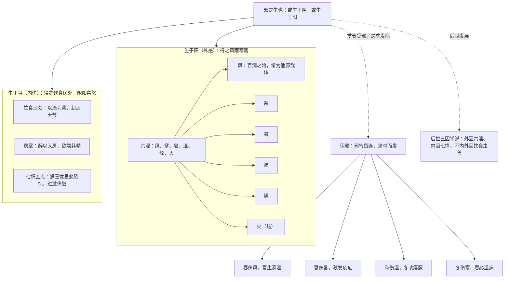

# 病因学说

> 《内经》没有"病因学"专篇，病因思想散见于《生气通天论》《阴阳应象大论》《调经论》《上古天真论》等篇；下文引文据 ctext 四部丛刊本。

## 一、最早的病因二分法

《素问·调经论》给出中国医学史上第一个病因分类框架：

> 夫邪之生也，或生於陰，或生於陽。其生於陽者，得之風雨寒暑；其生於陰者，得之飲食居處，陰陽喜怒。

- **生于阳（外感）**：风雨寒暑——来自外部自然环境的邪气
- **生于阴（内伤）**：饮食居处、阴阳喜怒——饮食起居失节与情志失调

这是后世"三因学说"（宋·陈无择《三因极一病证方论》：外因六淫、内因七情、不内外因饮食虫兽）的直接源头。

下图以《调经论》"生于阴/生于阳"二分法为纲，统摄六淫、伏邪、七情房室与后世三因学说，示病因分类之大略。

## 二、六淫：风为百病之始

外部致病因素称"邪"，按气候分六种：风、寒、暑、湿、燥、火（热），合称六淫（淫 = 过度、失节）。

《生气通天论》强调风的先导地位：

> 故風者，百病之始也。清靜則肉腠閉拒，雖有大風苛毒，弗之能害，此因時之序也。

"风为百病之始"有两层意思：①风邪常为其他外邪的载体（风寒、风热、风湿）；②风性善行而数变，病证游移多变多责于风。后一句则指出防御的关键：起居清静、腠理致密，外邪便不能侵犯——抵抗力在内因。

## 三、伏邪：今病受自往季

《生气通天论》提出季节受邪、延后发病的观察：

> 春傷於風，邪氣留連，乃為洞泄；夏傷於暑，秋為痎瘧；秋傷於濕，上逆而咳，發為痿厥；冬傷於寒，春必溫病。

- 春伤风→夏生洞泄；夏伤暑→秋发疟；秋伤湿→冬咳痿厥；冬伤寒→春发温病
- 这一"伏邪"模式（病邪潜伏、逾时而发）深刻影响后世温病学说（伏气温病）

《阴阳应象大论》有同构表述："冬傷於寒，春必溫病；春傷於風，夏生飧泄；夏傷於暑，秋必痎瘧；秋傷於濕，冬生咳嗽。"

## 四、情志内伤：七情与五志

情志过激直接损伤脏腑：

- 《阴阳应象大论》五志相伤："怒傷肝，悲勝怒……喜傷心，恐勝喜……思傷脾，怒勝思……憂傷肺，喜勝憂……恐傷腎，思勝恐"
- 同篇："暴怒傷陰，暴喜傷陽。厥氣上行，滿脈去形"
- 《灵枢·口问》论悲哀泪泣、《举痛论》"百病生於氣"段列九气："怒則氣上，喜則氣緩，悲則氣消，恐則氣下，寒則氣收，炅則氣泄，驚則氣亂，勞則氣耗，思則氣結"（情志之外，寒、炅、劳亦令气失调）

情志不是"心理点缀"，而是与六淫并列的正式病因；且情志之间有相胜制约关系（悲胜怒、恐胜喜等），这是五行框架在情志层面的运用。

## 五、生活方式之伤

《上古天真论》把早衰归因于生活方式：

> 今時之人不然也，以酒為漿，以妄為常，醉以入房，以欲竭其精，以耗散其真，不知持滿，不時御神，務快其心，逆於生樂，起居無節，故半百而衰也。

四类内伤在此齐备：饮酒过度（饮食）、以妄为常/起居无节（居处）、醉以入房/欲竭其精（房事）、务快其心/不时御神（情志）。与《调经论》"饮食居处，阴阳喜怒"完全对应。

## 六、病因学说的读法

1. 《内经》的病因观是**关系观**：邪之外侵与人之内虚互为条件（"邪之所凑，其气必虚"，见《素问·评热病论》），不是单一病原观
2. 分类的目的是指导"避其毒气"与调摄方向，不是给疾病贴标签
3. 后世三因学说、伏气温病、七情致病论，全部在此发源——读《内经》病因诸段，是在读一部病因学的"生成史"

---

**阅读边界**：本篇所述"六淫""七情""伏邪"等均为《内经》自身的病因分类模型，用于研读古人的思维结构，不是现代病原学结论，也不构成养生或诊疗建议；不得据本 bundle 内容自我诊断、自我调治，健康问题请咨询具备资质的执业医师。