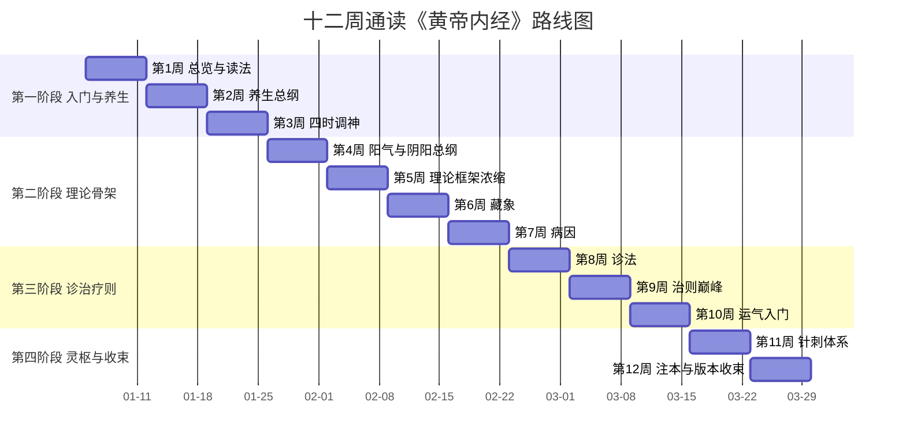

# 十二周通读《黄帝内经》计划

> 本计划面向零基础读者，以本知识包八篇精读为骨架，配合权威白文与一部古注、一部现代教材。
> 每周建议投入 3~4 小时：读原文白文 1 小时 + 精读篇 1 小时 + 古注/教材对照 1 小时。
> ⚠️ 全程为文献与思想阅读，不涉及任何自我诊疗。

## 阅读材料配置

| 角色 | 推荐 | 说明 |
|---|---|---|
| 白文原文 | ctext《素问》《灵枢》四部丛刊本（[信源指南](../references/electronic-sources.md)） | 繁体原貌，逐字核对用 |
| 简体读本 | 人卫《黄帝内经素问》《灵枢经》梅花本或《中医必读丛书》白文本（[版本指南](../references/editions.md)） | 日常通读 |
| 古注 | 张介宾《类经》或李中梓《内经知要》（[注本指南](../concepts/11-commentary-guide.md)） | 《知要》薄、《类经》全 |
| 现代教材 | 王洪图《内经选读》（[现代研究](../references/modern-studies.md)） | 院校通行教材 |
| 工具书 | 郭霭春《黄帝内经词典》 | 字词训诂备查 |

## 十二周路线

### 第一阶段：入门与养生（第 1~3 周）

| 周次 | 主题 | 读什么 | 检验问题 |
|---|---|---|---|
| 第 1 周 | 总览与读法 | 本包 [index.md](../index.md) + [00 为什么读《内经》](../concepts/00-why-read-neijing.md) + [02 结构与阅读路径](../concepts/02-structure-and-reading-path.md) + 《上古天真论》白文 | 说出《素问》《灵枢》各多少篇、王冰做了什么 |
| 第 2 周 | 养生总纲 | [精读 1 上古天真论](01-shanggu-tianzhen.md) + 古注《知要·道生》 | 女七男八的节律如何排列？"恬惔虚无"底本如何用字？ |
| 第 3 周 | 四时调神 | [精读 2 四气调神大论](02-siqi-tiaoshen.md) + [09 养生学说](../concepts/09-yangsheng.md) | 四季段落的同构结构是什么？"治未病"原句怎么说？ |

### 第二阶段：理论骨架（第 4~7 周）

| 周次 | 主题 | 读什么 | 检验问题 |
|---|---|---|---|
| 第 4 周 | 阳气与阴阳总纲 | [精读 3 生气通天论](03-shengqi-tongtian.md) + [03 阴阳五行总纲](../concepts/03-yinyang-wuxing.md) | "阴平阳秘"四句怎么说？煎厥与薄厥分别因何而起？ |
| 第 5 周 | 理论框架浓缩 | [精读 4 阴阳应象大论](04-yinyang-yingxiang.md) | 五方段每一列包含多少个对应项？壮火少火如何区分？ |
| 第 6 周 | 藏象 | [精读 5 藏气法时论](05-zangqi-fashi.md) + [04 藏象学说](../concepts/04-zangxiang.md) | 五脏苦欲的句法结构？"五谷为养"四句的主次关系？ |
| 第 7 周 | 病因 | [06 病因学说](../concepts/06-disease-causes.md) + 复读生气通天论伏邪段、阴阳应象大论伏邪段 | "生于阴/生于阳"的病因二分？两版伏邪文本有何异同？ |

### 第三阶段：诊治疗则（第 8~10 周）

| 周次 | 主题 | 读什么 | 检验问题 |
|---|---|---|---|
| 第 8 周 | 诊法 | [07 诊法学说](../concepts/07-diagnostics.md) + 《脉要精微论》《举痛论》白文选段（ctext） | "诊法常以平旦"的理由句如何说？九气是哪九气？ |
| 第 9 周 | 治则巅峰 | [精读 6 至真要大论](06-zhizhen-yao.md) + [08 治则治法](../concepts/08-treatment-principles.md) | 病机十九条如何计数？为什么无"燥"？正治反治如何区分？ |
| 第 10 周 | 运气入门 | [10 五运六气](../concepts/10-five-movements-six-qi.md) | 天干化运、地支化气的基本对应？七篇大论为何特殊？ |

### 第四阶段：《灵枢》与收束（第 11~12 周）

| 周次 | 主题 | 读什么 | 检验问题 |
|---|---|---|---|
| 第 11 周 | 针刺体系 | [精读 7 九针十二原](07-jiuzhen-shier-yuan.md) + [精读 8 经脉](08-jingmai.md) + [05 经络与针刺](../concepts/05-meridians-and-nine-needles.md) | 九针名称与长度？"守神/守形"之辨？是动与所生病如何分？ |
| 第 12 周 | 注本与版本收束 | [01 成书与版本](../concepts/01-authorship-and-editions.md) + [11 注本指南](../concepts/11-commentary-guide.md) + [references 全部](../references/index.md) | 王冰、林亿、史崧各贡献了什么？选定下一阶注本 |

下图以甘特图并置四阶段、十二周的次第与每周主题，周次划分与主题均出上表。

## 读完之后

- 想读全本：按《素问》1~81 篇顺序，以《类经》对照（《类经》是拆散重组的索引，可作导航）
- 想读专题：养生（《素问》上古天真、四气调神、生气通天）、诊法（《脉要精微》《平人气象》）、针刺（《灵枢》九针十二原、经脉、本输）
- 想读学术史：龙伯坚《黄帝内经概论》、任应秋《黄帝内经研究十讲》（见 [现代研究](../references/modern-studies.md)）

> 再次提示：本计划全部内容为古典文献阅读。任何健康问题请咨询执业医师。