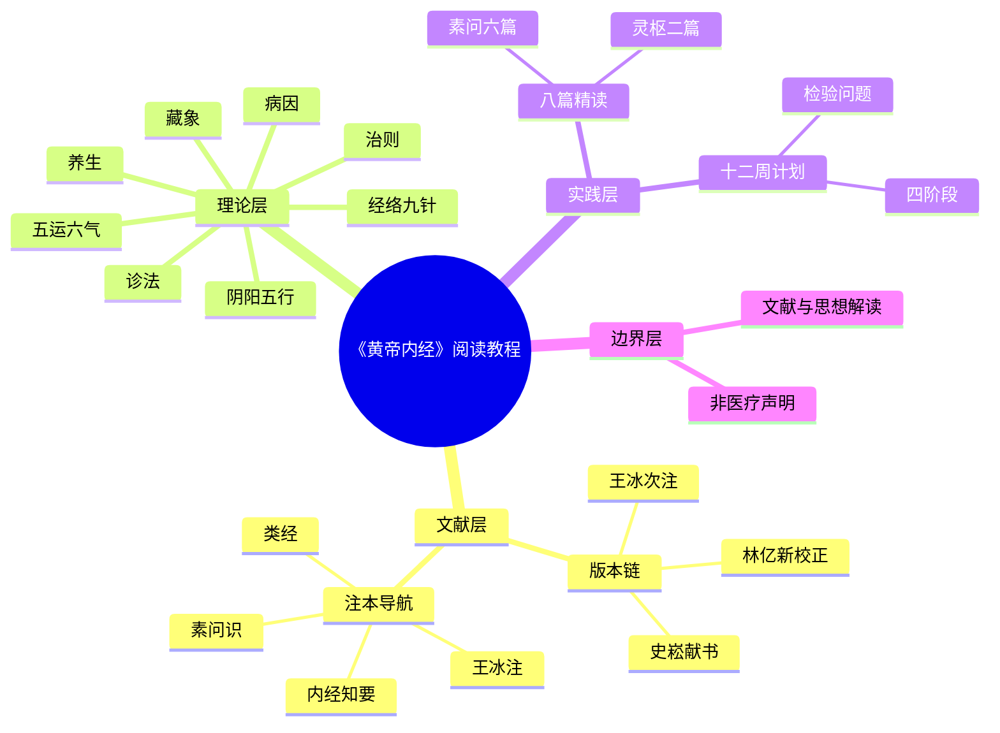

# 架构洞察（Architecture Insights）

> 基于事实清单（facts.md，137 条）与八篇原文逐字核对得出，每条洞察遵循四元组结构（陈述／证据／反常识／行动）

---

## 洞察1：《内经》的正确入口是"名篇精读 + 概念框架 + 注本导航"，而非 162 篇顺序通读

| 四元组 | 内容 |
|--------|------|
| **陈述** | 《素问》《灵枢》各 81 篇、合计 162 篇，且各篇主题、文体、难度差异极大；零基础读者从第 1 篇顺序通读的完成率极低。可行路径是：以 8 篇思想性与体系性最强的名篇建立"原文体感"，以 12 个概念文档建立理论框架，再借注本导航扩展到全书。 |
| **证据** | F-002（各 81 篇）、F-070~F-077（八篇定位）、F-010（历代注本近 400 部，传统读法本就依赖注家节选）、F-037（滑寿《读素问钞》首创分类选读）、F-040（李中梓《内经知要》8 类节选本流传最广） |
| **反常识** | 一般人以为"读经典就该从头读到尾才算读过"，但历代医家入门恰恰不这么做——滑寿、李中梓、沈又彭的节选分类本（F-037/F-040/F-044）才是历史上实际流通的入门形态；顺序通读是现代排印本制造的错觉。 |
| **行动** | bundle 采用"概念 12 篇搭框架 → 八篇精读建体感 → 通读计划管节奏"的三层结构；examples/09 给出 12 周通读计划，明确哪些篇精读、哪些篇浏览、哪些篇（遗篇/运气）可后读。 |

## 洞察2："最权威的原文"不是某一个真本，而是一条可核验的底本链 + 异文双录

| 四元组 | 内容 |
|--------|------|
| **陈述** | 《内经》不存在"黄帝时代的单一原本"：传世文本经由王冰次注（762）、林亿新校正（1057 后）定型，《灵枢》经由史崧 1155 年献本定型。所谓"权威真实"= 底本身份可核验（刻本/影印本/电子文本所据底本明确）+ 异文照录不擅改。 |
| **证据** | F-001/F-004（《汉志》十八卷著录与皇甫谧说）、F-019~F-025（王冰 12 年整理、补七篇、9→24 卷；林亿正 6000 余字、增 2000 余条）、F-028/F-029（史崧本为灵枢祖本）、F-061（ctext 底本为四部丛刊景印本）、F-111（至真要"热因热用/热因寒用"异文）、F-042（吴崑擅改经文为历代所讥） |
| **反常识** | 用户想要"最真实的原文"，直觉是找一个"标准版"照抄；但真正的文献学规范恰恰相反——必须说明每段文字来自哪个底本，并保留异文。ctext 的繁体四部丛刊本、人卫梅花本、gushiwen 简体本文字时有出入，单取一本而不注底本，反而制造"伪确定感"。 |
| **行动** | 八篇精读引文全部标注底本（S1/S2 四部丛刊繁体本为主，S3/S4/S5 简体网页为辅）；异文处双录并注（如 F-111、五穀為養/為食）；references/editions.md 给出底本链，electronic-sources.md 给出电子文本信源分级，并明确标记 zysj 旧域名已被垃圾页占用（F-068）。 |

## 洞察3：古注不是原文之外的"参考资料"，王冰注与经文已合为一体千余年

| 四元组 | 内容 |
|--------|------|
| **陈述** | 今天读到的《素问》篇目分卷、七篇大论的存留、大量经文的断句与解释，都经过王冰之手；林亿《新校正》又以校语形式混入注中。读"白文"时跳过注，实际跳过的是文本成型史的关键一层。 |
| **证据** | F-020（王冰补入第七卷即运气七篇）、F-021（9 卷扩 24 卷、次注全书）、F-023/F-024（林亿正谬误 6000 余字、增注义 2000 余条，名《重广补注》）、F-013（全元起注仅存于林亿引文中）、F-052（梅花本素问 592 页含古注，白文本仅 229 页） |
| **反常识** | 读者常以为"白文 = 纯粹原文，注 = 后人附加的主观解释"，于是只买白文本。但七篇大论是否为《素问》原有、篇次如何排定，本身就是王冰工作的结果；脱离王冰注读运气诸篇，连读什么都成问题。白文与注的边界在《素问》这里从来不是清晰的。 |
| **行动** | concepts/11-commentary-guide 给出"白文 → 王冰注/《类经》 → 现代语译"三层读法；references/commentaries.md 为每类问题推荐对应注家（校勘读林亿、类分读《类经》、简明读《内经知要》、考据读《素问识》）；concepts/10 讲运气七篇时明确标注其来源问题。 |

## 洞察4：病机十九条是"病机归类的方法示范"，不是可对号入座的诊断口诀

| 四元组 | 内容 |
|--------|------|
| **陈述** | 病机十九条以"诸 X 皆属 Y"句式示范如何把症状群归入五脏/六气/上下，其精神在结语"谨守病机，各司其属，有者求之，无者求之，盛者责之，虚者责之"的方法，而非 19 条本身作为完备诊断表。 |
| **证据** | F-106（十九条全文）、F-107（结语方法）、F-049（张介宾释"机者，要也，变也，病变所由出也"）、F-047（高世栻对心/火归属的改读）、F-111 同类异文意识、F-127/F-128（胜复治法同样以"平为期"而非固定套方） |
| **反常识** | 现代普及内容常把十九条做成"症状→脏腑"对照表让读者自查，这既误读了文本（十九条中 6 条属火、无一条属燥，金元刘完素才补"诸涩枯涸，干劲皴揭，皆属于燥"；心/火归属版本有异），也越过了诊疗边界。《内经》本身强调"善诊者，察色按脉，先别阴阳"（F-101），诊断是专业行为。 |
| **行动** | examples/06 讲至真要大论时，十九条按"方法范式"讲解：先示范归类逻辑，再列版本异文与历代争议（刘完素火热论），最后落到"有者求之无者求之"的思维方式；全 bundle 加非医疗建议声明，明确禁止据条文自我诊疗。 |

## 洞察5：《内经》同时是医学经典与思想文本，教程必须分层并标注边界

| 四元组 | 内容 |
|--------|------|
| **陈述** | 八篇精读中，《上古天真论》《四气调神大论》近于养生哲学，《阴阳应象大论》是宇宙论框架，《九针十二原》《经脉》是针灸操作理论，《至真要大论》是病机治则。文化阅读层与临床实践层必须分开处理。 |
| **证据** | F-070/F-071（养生论篇目）、F-073（阴阳五行总纲）、F-076/F-077（针经内容）、F-075（病机治则）、F-114（"余欲勿使被毒药，无用砭石，欲以微针通其经脉"的诊疗语境）、F-126（盛泻虚补、热疾寒留的刺法原则） |
| **反常识** | 一般读者把《内经》当作"古代养生大全"，倾向把诊疗条文也拿来自我施行；但《内经》自己反复强调"治未病"是医者之事（F-086）、针道需"上守神"的专业训练（F-115）。把思想文本当操作手册，既是文本误读，也是安全风险。 |
| **行动** | 全 bundle 置顶非医疗建议声明；concepts 分层标注（养生/哲学层可直接阅读，诊疗层仅作文献与医理理解）；examples 每篇设"本篇可以怎么用/不可以怎么用"栏；09-yangsheng 概念讲四时养生时区分"作息节律参考"与"医疗手段"。 |

---

## 知识地图

```
《黄帝内经》阅读教程（neijing-reading）
│
├── concepts/ 概念框架（12 篇，先读）
│   ├── 00-why-read-neijing.md        → 为什么读、怎么读、非医疗声明
│   ├── 01-authorship-and-editions.md → 成书、著录、版本流传链（王冰/林亿/史崧）
│   ├── 02-structure-and-reading-path.md → 162 篇结构、七篇大论、阅读路径
│   ├── 03-yinyang-wuxing.md          → 阴阳五行总纲（应象大论）
│   ├── 04-zangxiang.md               → 藏象：五脏应四时五味（藏气法时）
│   ├── 05-meridians-and-nine-needles.md → 经脉、九针、五输穴、十二原
│   ├── 06-disease-causes.md          → 病因：邪正、阳气、五味所伤
│   ├── 07-diagnostics.md             → 诊法：察色按脉、先别阴阳
│   ├── 08-treatment-principles.md    → 治则：病机十九条、正反治、求属
│   ├── 09-yangsheng.md               → 养生：天真、四气、治未病
│   ├── 10-five-movements-six-qi.md   → 五运六气与七篇大论导读
│   └── 11-commentary-guide.md        → 注本导航：三层读法与注家选择
│
├── examples/ 名篇精读（8 篇原文 + 1 计划）
│   ├── 01-shanggu-tianzhen.md        → 素问·上古天真论（养生/天癸/真人）
│   ├── 02-siqi-tiaoshen.md           → 素问·四气调神大论（四时/治未病）
│   ├── 03-shengqi-tongtian.md        → 素问·生气通天论（阳气/阴平阳秘）
│   ├── 04-yinyang-yingxiang.md       → 素问·阴阳应象大论（阴阳五行总纲）
│   ├── 05-zangqi-fashi.md            → 素问·藏气法时论（五脏苦欲/膳食）
│   ├── 06-zhizhen-yao.md             → 素问·至真要大论（病机十九条/治则）
│   ├── 07-jiuzhen-shier-yuan.md      → 灵枢·九针十二原（九针/五输/十二原）
│   ├── 08-jingmai.md                 → 灵枢·经脉（十二经脉/是动所生病）
│   └── 09-reading-plan.md            → 12 周通读计划
│
└── references/ 信源登记
    ├── editions.md                   → 历代刻本与现代整理本（底本链）
    ├── commentaries.md               → 历代注本与类分著作
    ├── modern-studies.md             → 现代教材、语译、工具书
    └── electronic-sources.md         → 电子文本信源分级与 URL
```

下图以思维导图总览全包四层结构——文献层、理论层、实践层、边界层，与上方树状图互为表里。



## 跨包关联

- 与 [think/laozi/boshu-reading](../../../guoxue/laozi/boshu-reading/index.md) 同属"中国古典文本阅读教程"类型，共享"原文逐字核对 + 注本导航 + 通读计划"的 bundle 结构方法论
- 《黄帝内经》学术思想与道家关系密切（"恬惔虚无""真人至人"），阅读时可与《老子》对照