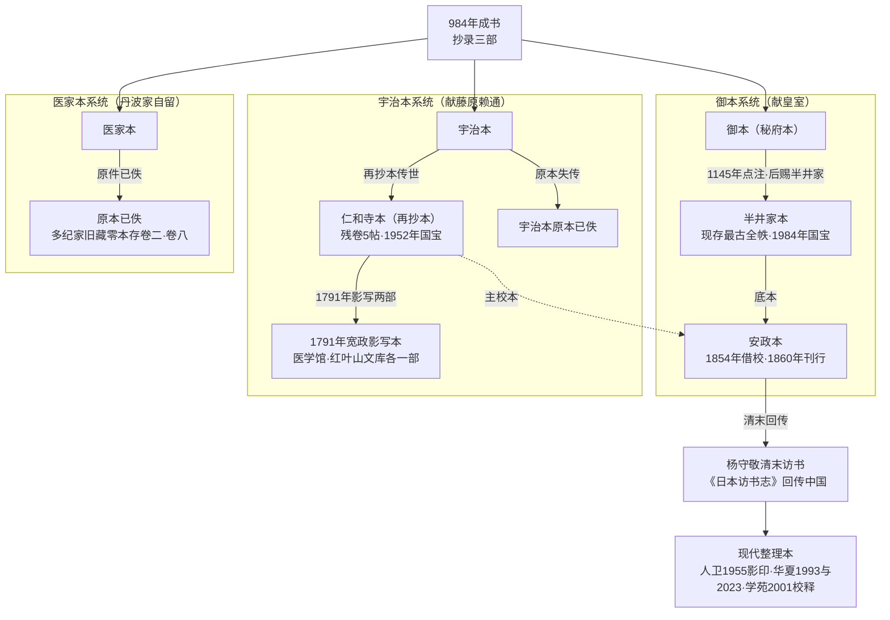

# 版本流传与回传中国

*AI 生成意境图，非历史图像，仅作阅读氛围辅助*

《医心方》的文本史本身就是一部传奇：它在日本以抄本形式秘传近千年，从未刊刻；直到江户幕末才被摹刻成书（安政本）；又因明治维新后汉学衰落、中国学者东渡访书，这部保存中国佚书的书反过来"回传"中土。理解这条版本链，是判断今天手里那个整理本可靠程度的前提。

三抄本源头及其千年流变、清末回传路径如下图所示（虚线表示校勘关系，非传承关系）：

## 一、三抄本源头

据日本学者杉立义一研究，《医心方》撰成后抄录三部：

| 抄本 | 去向 | 后世称名 | 命运 |
|------|------|----------|------|
| 最善一部 | 献天皇（皇室秘府） | **御本**（秘府本） | 后赐半井家，即半井家本，存 |
| 一部 | 呈关白藤原赖通（一说藤原道通） | **宇治本**（因藤原家在宇治建别墅） | 原本失传，再抄本即仁和寺本 |
| 一部 | 留丹波家自用 | **医家本** | 原件已佚，存零本三卷 |

李浩《〈医心方〉版本源流系统浅识》据此将版本划分为御本—半井家本、宇治本、医家本三个系统，并指出历次整理活动多以半井家本为底本、宇治本为主校本、医家本为旁校本。

> **存疑提示**：宇治本受献者，中国中医药网、书格作藤原赖通，李贞德论文作藤原道通（992—1074），两说并列。

## 二、半井家本（御本系统）：现存最古全帙

半井家本是现存所有抄本中**年代最古且全三十卷齐备**的抄本：

- 二十七卷为平安时代抄写，一卷为镰仓时代抄写，二卷及一册为江户时代补抄本；
- 平安时代抄本中二十五卷书于楮纸，由十人左右分担抄写；
- 二十五卷文中有天养二年（1145）据"宇治入道大相国藤原忠实"本写下的训点、校异，以及据医家本等写下的校异——可见平安时代学者已用宇治本、医家本校订御本；
- 卷二十五、卷二十九为平安时代后期书写的别本，纸背有长承二年（1133）具注历及保安、大治年间文书约五十通。

**下赐半井家**：御本长期秘藏宫廷，后由正亲町天皇赐予典药头半井氏。下赐年代与受赐者诸说并存：东京国立博物馆 e 国宝称室町时代赐半井光成；中国中医药网称永禄三年（1560）赐半井瑞策，"秘藏 470 多年"；广州中医药大学医史馆称天正年间（1573—1586）赐半井瑞策；安政本序文仅记"正亲町帝时赐典药头半井氏"，未记具体年份。半井家规定该本不得出家门，除安政元年（1854）一度借与幕府外，直到近年不曾公开。

**国宝指定**：半井家本于 **1984 年 6 月 6 日**指定为日本国宝（指定编号 00272），现藏东京国立博物馆，所有者为独立行政法人国立文化财机构。

## 三、仁和寺本（宇治本系统）：最接近原本形态的残卷

宇治本原书已佚；据该本抄成的再抄本后藏京都仁和寺，称"仁和寺本"（japanheritage 解说称传为自丹波家留存的控本书写——与"宇治本再抄本"说并存）。

- 仁和寺原有 30 卷中 20 册（《本朝书籍目录》载镰仓时代有训点本），江户时代末期以降多有散失，现存卷第一、第五、第七、第九、第十残卷共 5 帖（各帖均有缺损）；
- **1952 年（昭和二十七年）指定为国宝**——早于半井家本的 1984 年指定；
- 仁和寺本因后世写注较少，被认为**较接近康赖编纂时原本形态**，是安政本的主要校本；
- 僚卷散存：卷第二十七残本（约四十叶余）藏东京前田育德会尊经阁文库；卷第十九第五十九叶一纸残简经杉立义一、小曾户洋研究确认为仁和寺本断简；
- 宽政二年（1790），仁和寺本残卷自京都送至江户；宽政三年（1791）多纪元悳（多纪元恵）等制成影写本两部，分纳幕府红叶山文库与医学馆，即"影仁和寺本"。安政本序文追述此事，称该本"残脱居半"。

## 四、医家本与写本总数

医家本原件已佚；多纪家旧藏零本中存其三卷（卷二、卷八等），半井家本札记、背记中可见相关记载。

据杉立义一自昭和五十六年（1981）起十次报告"《医心方》の伝写について"，其会长讲演统计现存写本 **52 点**，分为八群（半井家本系、仁和寺本系、延庆本系、卷第二·四系、多纪家旧藏卷第二十二系等）；广州中医药大学医史馆表述为"今存《医心方》抄本达 53 种之多，多为据宇治本流传下来的版本"。两数并存。杉立清单所列收藏机构包括宫内厅书陵部、内阁文库、杏雨书屋、尊经阁文库、静嘉堂文库、大东急纪念文库、北京大学图书馆、中国医学科学院图书馆等——可见写本早已散处中日两地。

> **存疑提示**：有中文资料提及"安元本"，本次调研未检索到可核查的公开信源证实该写本；宫内厅书陵部所藏在杉立论文中记为安政元年影写本（"书陵部本 安政元年 三十卷三十轴"）。

## 五、安政本校刊始末

安政本是《医心方》的第一个刊本，也是此后一切通行本的祖本：

1. **借本**：安政元年（1854，嘉永七年十一月改元），幕府命将半井家本借与江户医学馆校勘影写（杨守敬表述为"安政元年官府命医学摹刊以行"）。
2. **序文**：安政元年十二月朔，侍医多纪元坚、多纪元昕署名作序，叙述借得半井家全帙、奉命"遵依原本摸刻，以布之海内"。
3. **校勘**：以半井家本为底本，以仁和寺本（多纪家影写系统）为主校本，并参校半井家所藏延庆旧钞册子本、仁和王府所藏十六卷、旧藏零本四卷。札记（校勘笔记）以小岛尚真、高岛久贯、涩江全善、森立之、佐藤苌等"最与有力"。
4. **续成**：校刊未半，多纪元坚、多纪元昕相继去世；其子多纪元琰、多纪元佶承袭先职续成校雠。
5. **刊行**：版木于安政六年（1859）完成，万延元年（1860）刊行；半井原本于同年四月返还半井家。

杨守敬评安政本："其影写手渡边■（岸允）亦一时之绝技，而刊刻之精，校订之密，当为日本摸刻古书第一。"国立国会图书馆数字藏品收录安政本（PID 991030）。

> **口径提示**：部分中文信源统称安政本为"安政年间（1854—1859）刊"；严格说版木完成于 1859 年，刊行于 1860 年。

## 六、杨守敬与清末回传

安政本刊行二十余年后，这部书踏上了回传中国之路：

- **杨守敬**（1839—1915），湖北宜都人，清末民初历史地理学家、金石学家、版本目录学家、书法家、藏书家。明治维新后日本政府废除旧汉学和传统医学，大量珍本古籍被抛售，杨守敬收集了三万余卷，编著《古逸丛书》并在日本出版，后将大量书籍带回国；其访日经历写成《日本访书志》，收录善本 235 种，为我国第一部域外汉籍目录。
- **《日本访书志》卷十**著录"《医心方》三十卷（摸刊古卷子本）"，即安政本。杨氏记其书"体例仿王焘《外台秘要》"，所引方书"有但见于《隋志》者；有不见于隋、唐、宋《志》，但见于其国《见在书目》者；亦有独见于此书所引，不见于着录家者"——这是中国学者对《医心方》辑佚价值的最早系统认识。他还指出卷二十七所引嵇康《养生论》"多溢出于今本之外"，并记旁注引陆法言《切韵》、郭知玄等《切韵》、武玄之《韵诠》等逸书。
- **回传规模**：真柳诚统计，还流中国的日本刊写本医书 296 种；明治以降传入中国的日本旧藏医书估计 4000 部以上；明治时代和刻医书版木亦输出中国重印。国立国会图书馆所藏杨守敬观海堂藏书中，大陆亡佚书 16 种 22 部，含辑佚书 2 种 4 部。
- **辑佚接力**：1908 年叶德辉从《医心方》卷二十八辑出《素女经》等房中书刊入《双梅景闇丛书》（详见[亡佚引书与辑佚价值](02-lost-books.md)）；1955 年人民卫生出版社影印安政本，《医心方》正式成为中国学界通行读物（详见[如何选读整理本](05-choosing-editions.md)）。

一部书离开中国（以引文形式），在日本被保存了一千年，又以刊本与辑佚本的形式回到中国——这条环流路线，正是《医心方》文化史价值的最生动注脚。

## 延伸阅读

- 上一篇：[亡佚引书与辑佚价值](02-lost-books.md)
- 下一篇：[研究史与解读立场](04-research-lineage.md)
- 选本指南：[如何选读整理本](05-choosing-editions.md)
