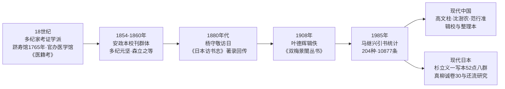

# 研究史与解读立场

*AI 生成意境图，非历史图像，仅作阅读氛围辅助*

《医心方》的研究史可以粗略分为三段：**江户时代多纪家的考证学派**奠定了文本校勘的基础；**清末民初中国学者**（杨守敬、叶德辉）发现其辑佚价值；**20 世纪后半叶至今**，中日两国学者分别从文献学、医学史、文化交流史角度深化研究。了解这条谱系，读者才能知道今天每个结论背后站着谁、依据什么。

《医心方》研究史上的关键年代节点与代表学者，按时间顺序梳理如下：

## 一、多纪家考证学派与跻寿馆

《医心方》的第一批专业读者，是丹波康赖自己的后裔——改姓"多纪"的江户考证学派。

- **跻寿馆**：18 世纪中期，丹波康赖 29 世孙丹波元孝改姓"多纪"；明和二年（1765），多纪元孝创办汉医学教育机构跻寿馆，后由幕府改制为官办医学馆，馆长由多纪家世袭。
- **学术产出**：18 世纪末至 19 世纪上半叶，多纪元德、元简、元胤、元坚祖孙三代用汉文编撰出版医著，包括元简《素问识》《灵枢识》《伤寒论辑义》、元胤《医籍考》《难经疏证》、元坚《素问绍识》《伤寒论述义》《杂病广要》等。以多纪元德等为核心，形成了与后世派、古方派并立的日本汉方医学第三大学派——**折衷派**。
- **与《医心方》的关系**：多纪家是安政本校刊的主持者（多纪元坚、元昕发起，元琰、元佶续成），也是仁和寺本影写本的制作者（宽政三年多纪元恵影写）。可以说，今天通行的《医心方》文本形态，就是多纪家考证学风的产物。

### 森立之与校刊群体

安政本跋文称校勘札记以小岛尚真、高岛久贯、涩江全善、**森立之**、佐藤苌等"最与有力"。其中森立之（1807—1885；生卒年未见本包信源登记，【待核验】）值得单独一提：

- 他是江户医学馆校刊《医心方》职名中人员，并参与《外台秘要方》影钞工程（嘉永己酉官命医学影钞宋本《外台秘要》，"以五人分书之，越三年乃成"）；
- 与涩江全善等合撰《经籍访古志》——日本现存汉籍善本书志（安政三年海保渔村作序）；
- 撰有《医心方引用书目》稿本，是《医心方》引书索引的先驱；
- 他本人藏有大量珍本，大多卖给了杨守敬——杨守敬初次求购珍本《黄帝内经太素》时还曾遭拒。森立之既是《医心方》的校勘者，也是中日书籍交流的当事人。

## 二、中国学者的发现：从杨守敬到叶德辉

- **杨守敬**（1870 年代末—1880 年代访日）在《日本访书志》卷十著录安政本《医心方》，指出其所引方书"有但见于《隋志》者……亦有独见于此书所引，不见于着录家者"，并发现卷二十七所引嵇康《养生论》"多溢出于今本之外"、旁注引《切韵》《韵诠》等逸书。这是中国学者对《医心方》辑佚价值的首次系统揭示。
- **叶德辉**（1908）从卷二十八辑出《素女经》等房中书刊入《双梅景闇丛书》，把辑佚价值转化为实际成果（详见[亡佚引书与辑佚价值](02-lost-books.md)）。

## 三、现代中国辑佚学家的利用

20 世纪后半叶以来，《医心方》成为中国医籍辑佚与整理的重要资源，几位代表性学者：

### 马继兴（1925— ）

中国中医科学院荣誉首席研究员，出版《敦煌古医籍考释》《中医文献学》《马王堆古医书考释》《神农本草经辑注》等，事业涵盖辑复、考证、点校古医籍。他 1985 年发表于《日本医史学杂志》（31:3）的统计——《医心方》引用古医学文献 **204 种、10877 条**（将"又方""今案"分别单独计数）——至今仍是引用最广的口径。注意：若按冈西为人或小曾户洋的算法（不另计"又方"或不录"今案"），条数不及五千。

### 高文柱（高文铸）

天津中医学院出身，古医籍整理大家。与《医心方》相关的贡献包括：

- 辑校《小品方》（1983）、《集验方》辑校本（1986）——均以《医心方》为重要辑佚来源；
- 华夏出版社 1993 年校点本《医心方》的校者、2023 年校注本的校注者；
- 《跬步集：古医籍整理序例与研究》（中华书局 2009）收入《医心方》（校注）序例、《医心方》（半井家本）书写符号及校改标记研究、《医心方》编撰方法概述、《医心方》引用文献考略、《医心方》文献史料价值研究等文；
- 另撰《〈医心方〉房中养生文献述略》，判定卷二十八为古代房中文献的集成和类编，并考《玉房指要》《洞玄子》成书于唐代的可能性极大。

### 沈澍农

南京中医药大学教授，"首次揭示了日本类方书《医心方》的符号标记的识读规律，并纠正了不少前人的错误见解"；主编《医心方校释》（学苑出版社 2001）。《医心方》写本中大量使用日本式书写符号与省略记号，不识读者寸步难行——沈澍农的工作解决的是"读得懂"的问题。

### 范行准（1906—1998）

耗十余年之力，从历代中医文献中辑出《范东阳方》等古代方书凡百余卷，取名《全汉三国六朝唐宋医方》；2019 年中医古籍出版社出版《全汉三国六朝唐宋方书辑稿》（范行准辑佚、梁峻整理，共 11 册），含《范东阳方》《经心录》《集验方》等——《医心方》引文是其中重要来源。

### 其他

- 严世芸等《三国两晋南北朝医学总集》辑入深师方（籍《千金要方》《外台秘要》《医心方》等）；
- 尤海燕、曾凤《〈医心方〉引录〈千金要方〉方剂文献考证》（北京中医药大学学报 2015）确认《医心方》引书"不改原文直接引用，均标明出处"、一直以写本流传从未经后人整理；
- 吴承艳统计《医心方》记载无名方 4000 余首（南京中医药大学学报 2024）；
- 李浩《〈医心方〉版本源流系统浅识》（浙江中医药大学学报 2015）确立御本—半井家本、宇治本、医家本三系统。

## 四、日本现代研究：从杉立义一到真柳诚

- **杉立义一**：自昭和五十六年（1981）起十次报告"《医心方》の伝写について"，会长讲演统计现存写本 52 点分八群，并绘制传写系统图；与小曾户洋共同确认仁和寺本断简。
- **小曾户洋**：《『医心方』引用文献名索引》（日本医史学杂志连载）是检索《医心方》引文的现代工具；他概括《医心方》价值为"①中国中世以前的医药文献的佚文大量残存，且其出典明记；②且彼等皆保持宋改以前之旧态"，并称其为"六朝·隋唐医学之宝庫"。
- **多田伊织**（京都大学人文科学研究所）：撰《『医心方』所引『僧深方』輯佚》及从《古今录验方》看六朝《僧深方》等文。
- **真柳诚**（茨城大学／北里研究所）：《『医心方』巻30の基礎的研究》（薬史学雑誌 1986）指出卷 30 内容近半引自《新修本草》，并列举《神农本草经》《本草经集注》《新修本草》《食疗本草》《小品方》《素女经》《玉房秘诀》等唐以前医药书以《医心方》为"重辑、校订之格好资料"；《中国に還流した日本所伝の中国古医籍》（2003）统计 562 年吴人知聪携"内外典·药书·明堂图等百六十四卷"为日本医籍传来最早记录之一，16 世纪以前渡来中国医书至少 647 种，17 世纪至幕末至少 804 种，还流中国的日本刊写本医书 296 种。

## 五、中日医学交流史视角

近年研究把《医心方》放进"汉籍医书东传—和刻—回流"的大循环中考察：回嘉莹、刘雅芳《汉籍医书在日本的和刻出版及回流》（医学与哲学 2025）指出，清末大量日存医籍及和刻本回流中国，江户后期兴起的考证派医学成果一同传入；"中国现在的医书通行本中有一部分是受益于日版回流，或依据和刻本汉籍刊印"。广州中医药大学医史馆"香播万邦——中医药海外传播"系列则把《医心方》定位为"日本方书的府库""东洋医学的至宝"。

对普通读者的启示：读《医心方》时，你读的不仅是一部医书，还是一千年来中日书籍环流的一个节点——它的每一条佚文都带着"东传—保存—回传"三层历史。

## 延伸阅读

- 上一篇：[版本流传与回传中国](03-editions-transmission.md)
- 下一篇：[如何选读整理本](05-choosing-editions.md)
- 辑佚成果详解：[亡佚引书与辑佚价值](02-lost-books.md)
