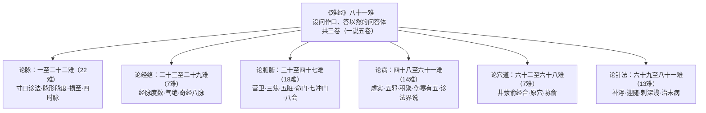

# 八十一难的结构与题名全录

## 体例与分卷

《难经》全书共八十一难，采用**设问作"曰"、答以"然"**的问答体裁：每一难以"……何谓也？""……奈何？"之类问题起首，以"然："引出答案。这种体例使全书天然成为一部"问题驱动"的理论读本。分卷方面，全书共 3 卷（一说 5 卷），分 81 难。

## 六部分法

国学导航将正文分为六部；此六部分法在国学导航、古诗文网、中医宝典三处一致，为通行的阅读分区：

| 分部 | 难次 | 主题域 |
|------|------|--------|
| 论脉 | 一至二十二难 | 寸口诊法、脉形、脉度、损至、四时脉 |
| 论经络 | 二十三至二十九难 | 经脉度数、气绝、奇经八脉 |
| 论脏腑 | 三十至四十七难 | 营卫、三焦、五脏、命门、七冲门、八会 |
| 论病 | 四十八至六十一难 | 虚实、五邪、积聚、伤寒、诊法界说 |
| 论穴道 | 六十二至六十八难 | 井荥俞经合、原穴、募俞 |
| 论针法 | 六十九至八十一难 | 补泻、迎随、刺深浅、治未病 |

*下图为八十一难的六部分区：*

## 题名问题说明

各难原文**无独立题名**，通行以"一难"至"八十一难"编号称之；古诗文网目录页载有 81 难各自标题。下表"主题"列系按各难设问内容归纳的存目题名，供检索定位之用，不是原文固有标题。

## 八十一难题名/主题全录（存目）

### 论脉（一至二十二难）

| 难 | 主题（按设问归纳） |
|---|---|
| 一 | 独取寸口 |
| 二 | 脉有尺寸 |
| 三 | 太过不及、覆溢关格 |
| 四 | 脉有阴阳之法 |
| 五 | 脉有轻重（菽重） |
| 六 | 阴盛阳虚、阳盛阴虚 |
| 七 | 六经王脉 |
| 八 | 寸口脉平而死（生气之原） |
| 九 | 别知脏腑之病（数迟） |
| 十 | 一脉十变（五邪刚柔） |
| 十一 | 不满五十动而一止 |
| 十二 | 内外之绝（实实虚虚之戒） |
| 十三 | 色脉相参 |
| 十四 | 脉有损至 |
| 十五 | 四时之脉（弦钩毛石） |
| 十六 | 三部九候与五脏脉证 |
| 十七 | 切脉知死生存亡 |
| 十八 | 脉有三部、部有四经 |
| 十九 | 男女脉逆顺 |
| 二十 | 脉有伏匿 |
| 二十一 | 形病脉不病 |
| 二十二 | 是动、所生病 |

### 论经络（二十三至二十九难）

| 难 | 主题（按设问归纳） |
|---|---|
| 二十三 | 经脉长短度数 |
| 二十四 | 三阴三阳气绝之候 |
| 二十五 | 经有十二（心主三焦有名无形） |
| 二十六 | 络有十五 |
| 二十七 | 奇经八脉总名 |
| 二十八 | 奇经八脉起止循行 |
| 二十九 | 奇经八脉病候 |

### 论脏腑（三十至四十七难）

| 难 | 主题（按设问归纳） |
|---|---|
| 三十 | 荣卫相随 |
| 三十一 | 三焦部位与治 |
| 三十二 | 心肺独在膈上 |
| 三十三 | 肝肺浮沉之理 |
| 三十四 | 五脏声色臭味液与七神 |
| 三十五 | 五脏之腑与五色肠 |
| 三十六 | 肾有两、命门 |
| 三十七 | 五脏气通九窍、关格 |
| 三十八 | 腑有六（三焦有名无形） |
| 三十九 | 腑五脏六（肾两脏） |
| 四十 | 鼻知香臭、耳闻声之理 |
| 四十一 | 肝有两叶 |
| 四十二 | 肠胃长短与五脏度量 |
| 四十三 | 不食饮七日而死 |
| 四十四 | 七冲门 |
| 四十五 | 八会 |
| 四十六 | 老人不寐 |
| 四十七 | 面独耐寒 |

### 论病（四十八至六十一难）

| 难 | 主题（按设问归纳） |
|---|---|
| 四十八 | 三虚三实 |
| 四十九 | 正经自病与五邪 |
| 五十 | 五邪之别（虚贼微正） |
| 五十一 | 病欲寒温、见人与否 |
| 五十二 | 脏腑发病根本 |
| 五十三 | 七传、间脏 |
| 五十四 | 脏病难治、腑病易治 |
| 五十五 | 积聚之别 |
| 五十六 | 五脏之积 |
| 五十七 | 五泄 |
| 五十八 | 伤寒有五 |
| 五十九 | 狂癫之别 |
| 六十 | 厥痛、真痛 |
| 六十一 | 望闻问切（神圣工巧） |

### 论穴道（六十二至六十八难）

| 难 | 主题（按设问归纳） |
|---|---|
| 六十二 | 脏井荥有五、腑独有六（原） |
| 六十三 | 井为始 |
| 六十四 | 阴阳井荥俞经合五行 |
| 六十五 | 所出为井、所入为合 |
| 六十六 | 十二经之原 |
| 六十七 | 募在阴、俞在阳 |
| 六十八 | 井荥俞经合所主病 |

### 论针法（六十九至八十一难）

| 难 | 主题（按设问归纳） |
|---|---|
| 六十九 | 补母泻子 |
| 七十 | 春夏刺浅、秋冬刺深（致阴阳） |
| 七十一 | 刺荣无伤卫 |
| 七十二 | 迎随调气 |
| 七十三 | 刺井以荥泻 |
| 七十四 | 四时刺法 |
| 七十五 | 泻南方、补北方 |
| 七十六 | 补泻取置气（从卫取、从荣置） |
| 七十七 | 上工治未病 |
| 七十八 | 针有补泻（信左信右） |
| 七十九 | 迎而夺之、随而济之 |
| 八十 | 有见如入、有见如出 |
| 八十一 | 无实实虚虚 |

## 阅读地图

- 六部之中，**论脉 22 难篇幅居首**，是全书重心——首难"独取寸口"的逐句精读见 [第一难精读](../examples/first-nan-cunkou.md)；
- 论脏腑部容纳命门（三十六难）、三焦（三十八难）、七冲门（四十四难）、八会（四十五难）等概念，解读见 [03 核心概念解读](03-core-concepts.md)；
- 论针法部的补母泻子（六十九难）、泻南补北（七十五难）等治则与《内经》的对照见 [02 与内经的关系](02-relation-to-neijing.md) 与 [对照阅读法](../examples/nanjing-neijing-parallel.md)。

> ⚠️ 本知识包内容为古籍文献学习资料，非医疗建议；任何健康问题请咨询执业医师。文中方药剂量仅为文献记录。
