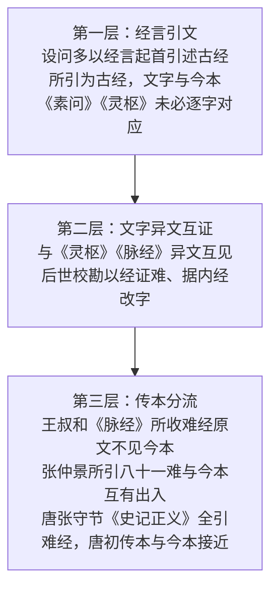

# 《难经》与《黄帝内经》的关系

## 定位：设难释义

通行的理解是：《难经》针对《内经》中深奥的中医学理论，归纳为 81 个问题进行释疑解难。这一定位解释了全书体例——问句挑出疑难，答句"然"以下展开阐释。但"释疑解难"不等于"忠实转述"：《难经》与《内经》之间是**引述、阐释与分流并存**的动态关系，需要分三层看。

*三层关系如下图所示：*

## 第一层："经言"引文分析

书中设问多以"经言"起首，引述古经文字后设为问答。典型例证：

- **十二难**："经言五脏脉已绝于内……"——讨论内外之绝与针法禁忌；
- **十四难**："经言脉不满五十动而一止，一脏无气者……"——引出损至之辨；
- **七十一难**："经言刺荣无伤卫，刺卫无伤荣……"——讨论针刺深浅手法。

需要注意的是，"经言"所引的是"古经"，其文字与今本《素问》《灵枢》未必逐字对应——今本《内经》本身也经历了漫长定型过程。把"经言"直接等同于今本《内经》原文，是读《难经》最常见的误区之一。

## 第二层：文字异文互证

维基文库底本附校勘记 19 条，对校引据之书包括《难经本义》《难经疏证》《古本难经阐注》《脉经》《灵枢》。其中与《灵枢》直接互证的条目，是"难经—内经"文本关系最硬的证据：

| 难 | 《难经》文字 | 《灵枢》文字 | 关系 |
|---|---|---|---|
| 三十七难 | "当上关于九窍也" | 《脉度》篇作"常内阅于上七窍也" | 异文互见 |
| 二十四难 | "三阴" | 《经脉》篇作"五阴" | 用字两读 |
| 二十四难 | "肉满" | 《经脉》篇作"人中满" | 文字歧异 |
| 六十六难 | 心之原"大陵"（底本原作"太"） | 据《九针十二原》改 | 据内经改字 |
| 二十七难 | "不虞"（原作"然"） | 据《脉经》改 | 据脉经改字 |

这类条目说明：二者共享一批理论文本，但传本各自流变；后世校勘家常以《灵枢》《脉经》订《难经》之字（如六十六难"大陵"之改），这是"以经证难"传统的实例。

## 第三层：传本分流

三条证据显示《难经》文本在汉唐间并不稳定：

1. **王叔和《脉经》收录的《难经》原文均不见于今本《难经》**——晋代所据是另一传本；
2. **张仲景所引《八十一难》与今本互有出入**——东汉末的《难经》与今本已有距离；
3. **唐张守节《史记正义》全引《难经》文以释《扁鹊仓公列传》之义**，并全载第四十二难与第一难、三十七难全文——唐初传本与今本接近，但仍需逐字核对。

## 学说层：并见而不废

《难经》内部对新旧诊法是并收的：一难以"十二经皆有动脉，独取寸口"设问，主张寸口诊脉；而十六难、十八难均言"脉有三部九候"，与独取寸口之说并见于本书。这说明《难经》并非"以寸口废遍诊"，而是把两种诊法体系叠放在同一文本中——读的时候必须分辨各难的立论层次。

## 对照阅读法

以上三层关系可以操作化为三步对照阅读法（识"经言"、核今本、登记异文关系），完整演示见 [对照阅读法](../examples/nanjing-neijing-parallel.md)。结构背景见 [01 八十一难全录](01-structure-81.md)，核心理论解读见 [03 核心概念解读](03-core-concepts.md)。

> ⚠️ 本知识包内容为古籍文献学习资料，非医疗建议；任何健康问题请咨询执业医师。文中方药剂量仅为文献记录。
