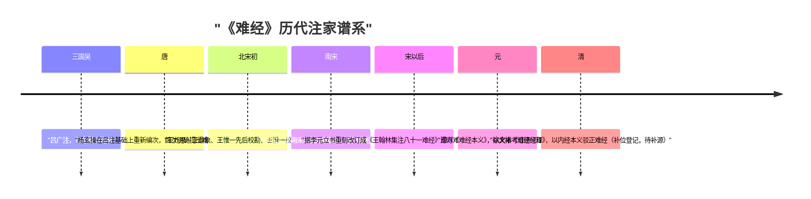

# 《难经》历代注家谱系与立场

历代注释、发挥《难经》者约 50 家，形成"单注 → 官校 → 集注 → 疏义"的诠释传统。本篇登记谱系中可考的节点人物与立场，注本选择建议见 [注本分级表](../references/commentary-grades.md)。

## 注家谱系表

| 注家 | 时代 | 贡献与立场 | 依据 |
|------|------|-----------|------|
| 吕广 | 三国吴 | **可考最早注家**。宋赵希弁《读书后志》著录"黄帝八十一难经一卷，秦越人撰，吴吕广注，唐杨玄操演" | 《中国医籍考》引 |
| 杨玄操 | 唐 | 在吕广注本基础上**重新编次**，并首次明确提出《难经》为秦越人所作（"黄帝八十一难者，斯乃勃海秦越人之所作也"）；其《难经注》一书已亡佚，序收入唐开元年间张守节《史记正义》 | 中医宝典词条、《中国医籍考》 |
| 王九思、王鼎象、王惟一 | 北宋初 | 先后校勘《难经》；翰林院医官**王惟一校勘本在吕注本和杨注本基础上完成，曾刊印颁行** | 中医宝典词条 |
| 李元立 | 南宋 | 汇集南宋以前 9 家校注著作编撰**《难经十家补注》** | 中医宝典词条 |
| （无名氏） | 宋以后 | 据李元立书重刻改订，编成**《王翰林集注八十一难经》**（简称《难经集注》），为后世通行本 | 中医宝典词条 |
| 滑寿 | 元 | **《难经本义》**为重要注本。维基文库底本校勘记引其说："至于收病也，当作至脉之病也"（十四难校语）——可见其以文本考订济义理阐发 | 维基文库校勘记[4] |
| 徐大椿 | 清 | 《难经经释》以《内经》本义驳正《难经》**（补位登记：该书未纳入本次事实采集范围，无登记信源，谱系待补）** | 本束按语 |

*注家谱系时间线如下图：*

## 版本流传要点

- **早期版本**：现存较早的版本有明经厂刻医要集览本、日本武村市兵卫刻宋·王九思《黄帝八十一难》集注本等；
- **《难经集注》系统**：传世通行本传入日本保存至今；国内上海涵芬楼影印本（1924）、中华书局《四部备要》排印本、人民卫生出版社影印本（1956）均据日人林衡氏辑《佚存丛书》本；
- **对校用书**：维基文库底本校勘记的对校引据书包括《难经本义》《难经疏证》《古本难经阐注》《脉经》《灵枢》——后二书属"以经证难"，前三书属注家内部互证。

## 立场小结

1. **"演注"传统**：吕广开注、杨玄操演并编次，唐代注本即以"吕杨注"并称（今有《八十一难经吕杨注》辑校与研究）；
2. **官校定型**：北宋三王校勘、刊印颁行，是《难经》文本官定化的关键节点；
3. **集注存异**：《难经集注》汇九家之说于一编，注家异说不加裁断并列存录——这一体例正是本知识包"冲突并列登记"原则的传统先例；
4. **清代的批判性转向**：徐大椿一系以《内经》还治《难经》，于难经立说与内经不合处直加驳正（立场登记如上，具体条目待补源）。

> ⚠️ 本知识包内容为古籍文献学习资料，非医疗建议；任何健康问题请咨询执业医师。文中方药剂量仅为文献记录。
