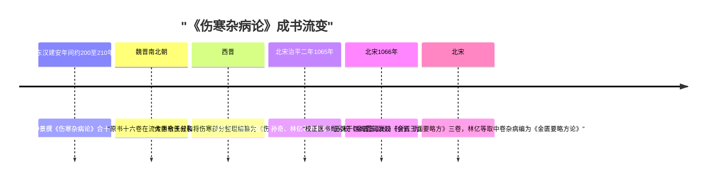

# 成书流变——从十六卷原书到伤寒论/金匮要略二书

> ⚠️ 本知识包内容为古籍文献学习资料，非医疗建议；任何健康问题请咨询执业医师。文中方药剂量仅为文献记录，不构成用药指导。

## 一条时间线

| 时期 | 事件 | 依据 |
|------|------|------|
| 东汉建安年间（约公元 200—210 年） | 张仲景撰《伤寒杂病论》合十六卷 | SH-003、SH-007 |
| 魏晋南北朝 | 原书十六卷在流传中散佚分裂 | SH-008 |
| 西晋 | 太医令王叔和将其伤寒部分整理编纂为《伤寒论》十卷；王叔和另撰《脉经》十卷 | SH-008 |
| 北宋治平二年（1065 年） | 校正医书局高保衡、孙奇、林亿等奉敕校订《伤寒论》，镂版刊行，通行本卷首载进表 | SH-009 |
| 北宋（1066 年刊行） | 校正医书局另校《金匮玉函经》，为《伤寒论》同源异构传本 | SH-010 |
| 北宋 | 翰林学士王洙于馆阁蠹简中发现《金匮玉函要略方》三卷；林亿等取其中卷杂病部分，去重复、加校订，编为《金匮要略方论》 | SH-011 |

*《伤寒杂病论》的成书与流变时间线：*

## 每一环发生了什么

**原书散佚**。张仲景自述"合十六卷"的原书（SH-003），在魏晋南北朝的战乱流传中散佚分裂（SH-008）。今天没有任何十六卷原书的实物或完整抄本传世，这是讨论一切"仲景原文"问题的起点。

**王叔和整理**。西晋太医令王叔和"将其伤寒部分整理编纂为《伤寒论》十卷"（SH-008）。换言之，今本《伤寒论》的框架（含分篇结构）首先是王叔和之手的结果。后世"错简重订派"与"维护旧论派"的争论（见[概念 06](06-commentators.md)），争的正是这层整理的忠实程度。王叔和另撰《脉经》十卷，其中亦收有仲景条文，可作对勘材料。

**北宋校正医书局校订**。治平年间，高保衡、孙奇、林亿等奉敕校订《伤寒论》，治平二年（1065 年）镂版刊行，通行本卷首载校正医书局进表（SH-009）。今日所读宋本系统文字，即经此番校订定型。次年（1066 年）校正医书局另校《金匮玉函经》刊行，是《伤寒论》的"同源异构传本"——同一祖本的不同结构形态（SH-010）。

**《金匮要略》独立成书**。北宋翰林学士王洙在馆阁蠹简中发现《金匮玉函要略方》三卷：上卷辨伤寒、中卷论杂病、下卷载方剂。林亿等取其中卷杂病部分，去重复、加校订，编为《金匮要略方论》——原书十六卷之杂病部分自此独立成书（SH-011）。这条材料同时说明：《金匮要略》的成书晚于《伤寒论》定型近千年，且所据只是馆阁残卷的中卷。

## 流变事实对阅读的三点约束

1. **"原文"是分层累积的**。今本任何一条文字，至少经过仲景原撰（佚）→王叔和整理→宋臣校订三层之手。称"《伤寒论》第 N 条作某"是准确的；称"张仲景说某"则越过了整理与校订两层（INS-001）。
2. **伤寒与金匮是兄弟不是父子**。二书同出十六卷原书而分流时间、分流路径不同（伤寒部分经王叔和一线、杂病部分经馆阁残卷一线），内容互有交叉（如《金匮玉函要略方》上卷亦辨伤寒）。读金匮不应视其为伤寒论的"附录"。
3. **宋代是定型节点**。1065/1066 年两次校刊，使宋本系统成为此后近千年《伤寒论》传本的祖本（见[概念 02：版本系统考](02-version-systems.md)）。今日"398 条"研读体系的文字基准，最终锚定在赵开美摹刻的宋本系统上（SH-013、SH-017）。

## 与他书的关系

- 《金匮玉函经》：同源异构传本（SH-010），条文可与宋本对勘，[信源文档](../references/sources-editions.md)的异文登记中多处引用《脉经》《千金翼方》《外台秘要》等同类的早期传本对勘材料（SH-033~035）。
- 《辅行诀脏腑用药法要》：敦煌卷子，载"昔南阳张机，依此诸方，撰为《伤寒论》一部"，为方剂源出《汤液经法》说的直接文献依据（SH-030），详见[概念 06：历代注家与经方传统](06-commentators.md)。
