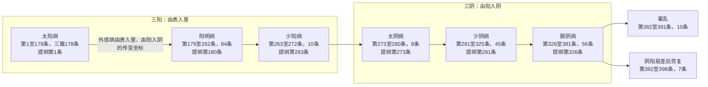

# 六经辨证框架与 398 条编号体系

> ⚠️ 本知识包内容为古籍文献学习资料，非医疗建议；任何健康问题请咨询执业医师。文中方药剂量仅为文献记录，不构成用药指导。

## 六经辨证：全书的纲领框架

《伤寒论》以"六经辨证"为纲领框架，即太阳病、阳明病、少阳病、太阴病、少阴病、厥阴病，各设"辨××病脉证并治"专篇（SH-021）。六经（三阳三阴）既是病位与病性的分类纲领，也是外感病由表入里、由阳入阴传变层次的坐标。每经以一条提纲条文界定本病基本特征：

| 六经 | 提纲条 | 条文原文（底本：宋本系统，C、W、J 三源核对） |
|------|--------|-----------------------------------------------|
| 太阳 | 第 1 条 | 太阳之为病，脉浮，头项强痛而恶寒。 |
| 阳明 | 第 180 条 | 阳明之为病，胃家实是也。 |
| 少阳 | 第 263 条 | 少阳之为病，口苦，咽干，目眩也。（异文：成注本此条作"少阳病"，无"为"字） |
| 太阴 | 第 273 条 | 太阴之为病，腹满而吐，食不下，自利益甚，时腹自痛。若下之，必胸下结硬。 |
| 少阴 | 第 281 条 | 少阴之为病，脉微细，但欲寐也。 |
| 厥阴 | 第 326 条 | 厥阴之为病，消渴，气上撞心，心中疼热，饥而不欲食，食则吐蛔，下之利不止。 |

提纲条文编号（第 1/180/263/273/281/326 条）据 SH-022 登记。

*六经传变坐标与分篇条数分布（图中条文编号为现代校注者所加，宋本、成注本原书无编号）：*

## 一个必须先讲清的事实：398 条编号是现代人所加

通行宋本《伤寒论》正文计 398 条、方 113 首（113 方统计中禹余粮丸有名无药，故亦有 112 方之统计口径）（SH-018）。但"第 1 条至第 398 条"之**条文编号系统为现代校注本（如刘渡舟《伤寒论校注》、郭霭春《伤寒论校注语译》等）为研读便利所加，宋本、成注本原书无条文编号**（SH-019）。

这意味着：仲景原书与王叔和整理本、宋臣校订本中，条文以"辨××病脉证并治"篇目统摄、连续书写，并无"第 N 条"的切分；今天说"《伤寒论》第 12 条"，实际是在用现代校注者的编号体系指称一段宋本系统文字。本知识包沿用 398 条编号（便于定位与检索），但读者应知其为现代研读工具而非古籍原貌（INS-001）。

## 二十二篇结构与编号分布

《伤寒论》通行宋本系统二十二篇中，"辨太阳病脉证并治"分上、中、下三篇，"辨霍乱""辨阴阳易差后劳复"独立成篇；"辨脉法""平脉法""伤寒例""辨痉湿暍脉证"四篇不计入 398 条编号体系（SH-023）。现代通行条文分篇编号体系如下（SH-036）：

| 篇章 | 条文号范围 | 条数 |
|---|---|---|
| 辨太阳病脉证并治（上） | 1—30 | 30 |
| 辨太阳病脉证并治（中） | 31—127 | 97 |
| 辨太阳病脉证并治（下） | 128—178 | 51 |
| 辨阳明病脉证并治 | 179—262 | 84 |
| 辨少阳病脉证并治 | 263—272 | 10 |
| 辨太阴病脉证并治 | 273—280 | 8 |
| 辨少阴病脉证并治 | 281—325 | 45 |
| 辨厥阴病脉证并治 | 326—381 | 56 |
| 辨霍乱病脉证并治 | 382—391 | 10 |
| 辨阴阳易差后劳复病脉证并治 | 392—398 | 7 |
| **合计** | 1—398 | **398** |

各篇核心主题（方证分布）的完整存目见 [398 条索引与金匮 25 篇存目](../references/catalog-398.md)。

## 六经怎么用：从纲到方证

六经框架的实际展开方式是"经—证—方"三级：每经提纲定界（如上表六条），其下以脉证组合细分证型，证型落到方剂（"××汤主之"）。例如太阳经之下，第 2 条"名为中风"与第 3 条"名为伤寒"分出表虚表实两大方向，分别导向桂枝汤类（第 12、13 条）与麻黄汤类（第 35 条）——这条"经→证→方"的导航路线，本包整理为[六经辨证阅读路线图](../examples/six-channels-reading-map.md)。

需要说明的是：六经的实质（经络说、脏腑说、气化说、证候群说等）历代注家解说不一，本包不裁决，注家谱系见[概念 06：历代注家与经方传统](06-commentators.md)。
