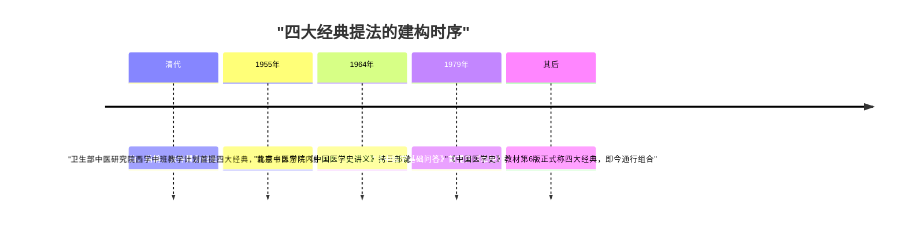
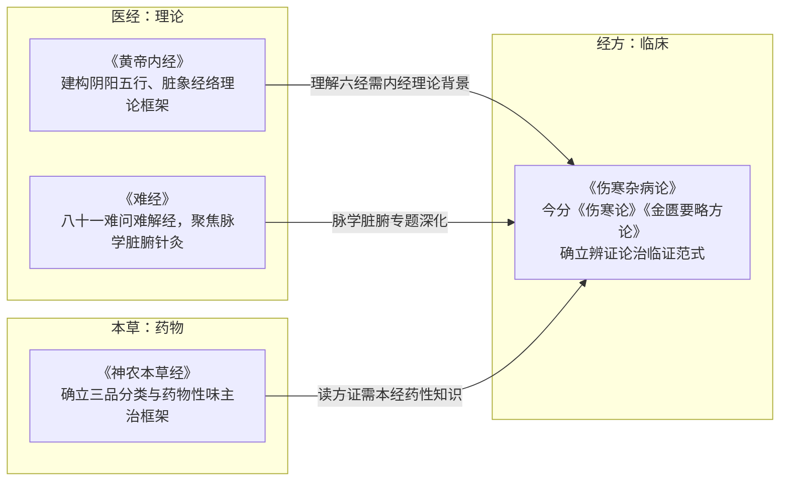

# 四大经典导读与关系

## 先说结论：这是一个"现代建构的经典群"

"四大经典"并非自古相传的提法。该词正式提出于 **1955 年**——卫生部制订的中国中医研究院第一届西学中班教学计划提出学习中医必须系统学习"四大经典"，且**首提书目为《内经》《神农本草经》《伤寒论》《金匮要略》**，与今通行组合不同（OV-002）。其雏形或可追至清代黄元御《四圣心源》——"四圣"指黄帝、岐伯、扁鹊、张仲景，该书为《内经》《难经》《伤寒论》《金匮要略》之释义，被视作对"四大经典"最早的提法（OV-006）。

含《难经》的"四部"说最早见于 **1979 年**《中医学基础问答》；历版《中国医学史》教材中，1964 年北京中医学院《中国医学史讲义》持"三部"说（《黄帝内经》《神农本草经》《伤寒杂病论》），第 2、3、4 版沿用三部说，第 5 版增入《难经》，**第 6 版才正式称"四大经典"**（OV-005）。

因此，本束不把"四大经典"当作天然知识边界，而作为**现代建构的阅读组合**呈现（INS-003）。

*下图为"四大经典"提法的建构时序：*

## 组合争议并列登记（不裁决）

| 组合方案 | 出处与年代 | 登记事实 |
|---|---|---|
| 《内经》《神农本草经》《伤寒论》《金匮要略》 | 1955 年卫生部西学中班教学计划（首提） | OV-002 |
| 《黄帝内经》《难经》《伤寒杂病论》《神农本草经》（今通行说） | 1979 年《中医学基础问答》首提四部；《中国医学史》教材第 6 版正式称"四大经典" | OV-001、OV-005 |
| 《黄帝内经》《伤寒论》《金匮要略》《温病条辨》 | 部分中医教材采用；北京中医学院（现北京中医药大学）曾提出 | OV-003 |
| 《内经》《伤寒论》《金匮要略》+ "温病"（温病学，非专指一书） | 近年执业医师考试与各类晋升考试多用 | OV-004 |
| 三部说：《黄帝内经》《神农本草经》《伤寒杂病论》 | 1964 年《中国医学史讲义》，第 2—4 版沿用 | OV-005 |
| "四圣"雏形：黄帝、岐伯、扁鹊、张仲景 | 清代黄元御《四圣心源》 | OV-006 |

值得注意的是考试语境中的一个细节：中医学者张大宁曾重申"**温病是一种病，并非一本书，经典首先应是一本本书**"（OV-004）——考试体系中的"温病"指温病学这一学科。本表诸说并列，读者按自身目标（教材体系/考试大纲/临床研修/文献研究）对齐相应书单，分级依据见[概念 04：书目分级](04-graded-bibliography.md)。

## 四经分述

| 经 | 托名/撰者 | 性质与体例 | 成书年代诸说 | 现存最早版本 |
|---|---|---|---|---|
| 《黄帝内经》 | 托名黄帝 | 《素问》九卷 + 《灵枢》九卷共十八卷；汉志列入"医经" | 战国时代、战国至西汉等不同考论（ctext.org 标注"战国—西汉"） | 元后至元五年（1339 年）胡氏古林书堂刻本，今藏国家图书馆 |
| 《难经》 | 原名《黄帝八十一难经》，题秦越人撰 | 设问回答、解释疑难，共八十一难 | 战国时代、东汉以前、秦汉之际等不同考论 | —（待难经束登记） |
| 《伤寒杂病论》 | 东汉张仲景所撰 | 后世分为《伤寒论》与《金匮要略方论》二书；临床医学奠基性名著 | 东汉 | —（待伤寒束登记） |
| 《神农本草经》 | 书名托为神农 | 我国现存最早药学专著 | 原书早佚，成书年代诸说见本草束 | 现行本为后世辑复本 |

（登记事实：内经 OV-007/008，难经 OV-009，伤寒杂病论 OV-010，本草经 OV-011。）

四经分述要点：

- **《黄帝内经》**：成书年代有战国时代、战国至西汉等不同考论；汉代刘向等校书时将其著录于《七略》，《汉书·艺文志》将其列入"医经"。现存最早且最完好的版本为元后至元五年（1339 年）胡氏古林书堂刻本，该书于 2011 年 5 月入选《世界记忆名录》（OV-007/008）。
- **《难经》**：题秦越人撰，成书年代有战国时代、东汉以前、秦汉之际等不同考论；以设问回答、解释疑难的体例编纂，全书共八十一难（OV-009）。
- **《伤寒杂病论》**：东汉张仲景所撰，后世分为《伤寒论》与《金匮要略方论》二书，为我国临床医学奠基性名著（OV-010）。今本文字历经整理定型，详见[概念 03：托名与成书判断](03-pseudepigrapha-dating.md)五问法。
- **《神农本草经》**：我国现存最早的药学专著，书名托为神农，原书早佚，现行本为后世从历代本草书中集辑的辑复本（OV-011）——读到的任何一本《本经》都是"某辑本"，辑本间差异详见[概念 02：版本学常识](02-philology-basics.md)。

## 四经之间的关系：医经—经方—本草

四经不是四本并列的"教科书"，而分属三个知识功能：

1. **医经（理论）**——《黄帝内经》与《难经》。《内经》建构阴阳五行、脏象经络的理论框架；《难经》以八十一难问难解经，聚焦脉学、脏腑、针灸腧穴等专题深化。
2. **经方（临床）**——《伤寒杂病论》（今分《伤寒论》《金匮要略》）。在《内经》理论背景下确立辨证论治的临证范式，被后世尊为"方书之祖"一系源头。
3. **本草（药物）**——《神农本草经》。确立三品分类与药物性味主治的基本框架，为经方提供药物学基础。

三者构成"理论—临证—药物"的闭环：读《伤寒》的方证需《本经》的药性知识，理解《伤寒》的六经需《内经》的理论背景。这也是[通读计划](../examples/four-classics-reading-plan.md)安排阅读顺序的依据之一。

*下图为四经在医经、经方、本草三个知识功能间的关系：*

## 阅读提示

- 不要把"四大经典"的边界当知识边界：温病学派、金元各家同样是中医理论的重要发展（见[概念 00：谱系分层](00-genealogy-layering.md)）。
- 四经均存在托名、层累、辑复问题——开卷前先过[概念 03：五问法](03-pseudepigrapha-dating.md)。
- 引用原文先辨版本系统（见[概念 02：版本学常识](02-philology-basics.md)），电子文本尤其需要双源核对（见[双源核对演示](../examples/dual-source-verification-demo.md)）。
