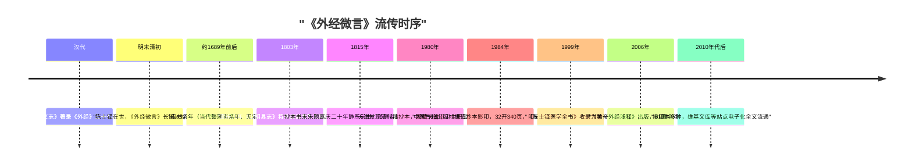

# 发现与流传：从清代抄本到 1984 影印

## 流传状态：长期抄本独行

《外经微言》在 1984 年以前未见刊刻行世的记录，长期以抄本流传；查阅多种图书目录均无记载，目前可见的最早方志著录是嘉庆八年（1803）《山阴县志》，将《外经微言》列入陈士铎著作清单。

## 1980 年：天津发现清抄本

- 1980 年整理古医籍过程中，一部清代精抄本被发现，经专家鉴定为清代精抄本，现藏**天津市卫生职工医学院图书馆**。
- 抄本形态：**前无序、后无跋，封皮残缺，印章模糊难辨**。
- 卷首题署："**岐伯天师传，山阴陈士铎号远公又号朱华子述**"。
- 书末有朱色题字"**嘉庆二十年静乐堂书**"（1815），笔体与正文稍异，整理者记"疑或后人所加"。

## 1984 年：影印出版

1984 年 4 月，**中医古籍出版社**据该清抄本影印出版：

| 项 | 数据 |
|---|---|
| 底本 | 天津藏清代精抄本，原抄本书法体影印 |
| 版次 | 一版一印（1984-04） |
| 开本/页数 | 32 开，340 页 |
| 印数 | **5500 册** |
| 发行 | 标注"**限国内发行**" |
| 定价 | 1.70 元 |

影印本完整保留抄本手写风貌，是今天核对电子文本异同时的纸本裁定依据。

## 现代排印与数字化

- 1999 年：柳长华主编《陈士铎医学全书》（中国中医药出版社，ISBN 7-80156-004-3）收《外经微言》为第一部。
- 2006 年：《黄帝外经浅释》（第二军医大学出版社，ISBN 7-81060-665-7）出版，81 篇全注全译，题解/原文/注解/浅释四层，是目前最便入门的现代注本。
- 2010 年代后：中国医药科技出版社（2016）、山西科学技术出版社（2012，《陈士铎医学全书》另版）等排印本陆续出版；云南人民出版社有白话整理本（ISBN 9787222143029）。
- 数字化：维基文库（简体转录全文）、古书网（繁体，标注清抄本 1698 底本）、古诗文网、寻岐黄、cloudtcm 等站点提供全文电子文本。

## 流传时间线

*《外经微言》的流传时序：*



```
汉           《汉书·艺文志》著录《外经》三十七卷（后亡佚）
明末清初      陈士铎（1627？—1707？）在世，《外经微言》以抄本传世
1689 前后     成书（当代整理者系年，无定论）
1803         嘉庆八年《山阴县志》著录陈士铎著作含《外经微言》
1815         抄本书末朱题"嘉庆二十年静乐堂书"（疑后人加）
1980         天津发现清代精抄本（藏天津市卫生职工医学院图书馆）
1984         中医古籍出版社影印，印 5500 册，限国内发行
1999         《陈士铎医学全书》收录（中国中医药出版社）
2006         《黄帝外经浅释》全注全译本出版
2010s—       排印本多种；维基文库等电子化全文流通
```

> 注：自媒体有"1980 年梅自强于天津获见抄本"的叙述（WJ-BIB-26），学术出处待核，本知识包不采为事实。