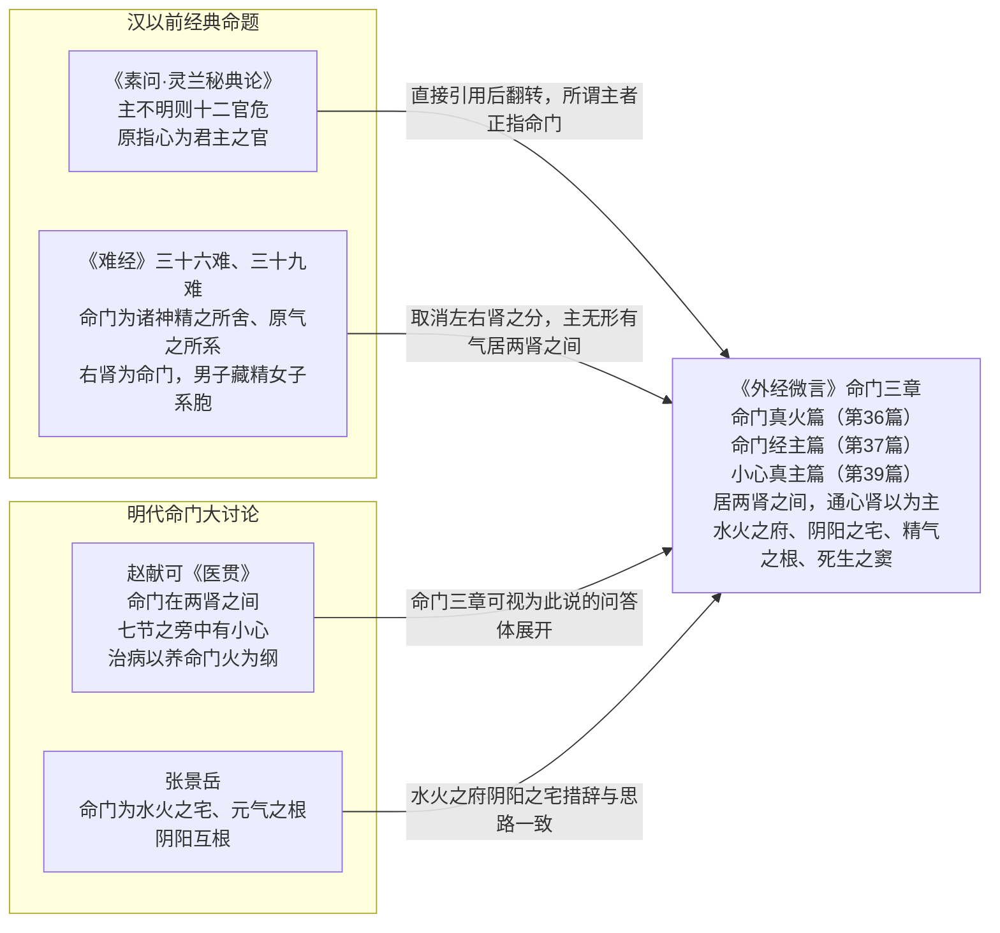

# 命门水火：十二经之主与小心真主

> 命门学说是《外经微言》理论建构的核心。全书以连续三篇——卷四末《命門真火篇》（第 36 篇）、卷五首《命門經主篇》（第 37 篇）、《小心真主篇》（第 39 篇）——集中讨论，世称"命门三章"。有现代研究统计本书"命门"一词出现 94 处、10 篇专门论述（该统计待纸本复核，WJ-RES-18），并有命门学说专题研究专著以本书为核心文本（WJ-BIB-20）。

## 三章核心命题（原文照录）

**命門真火篇**（WJ-RES-04）：

> 命門，火也。無形有氣，居兩腎之間，能生水而亦藏于水也。

> 命門為十二經之主。

> 主不明則十二官危。所謂主者，正指命門也。七節之旁有小心。小心者，亦指命門也。

> 修仙之道無非溫養命門耳。

**命門經主篇**（WJ-RES-05）：

> 主在腎之中，不在心之內。然而離心非主，離腎亦非主也。命門殆通心腎以為主乎？

> 是十二經為主之官，而命門為十二官之主。

**小心真主篇**（WJ-RES-06）：

> 命門者，水火之源。

> 命門為水火之府也，陰陽之宅也，精氣之根也，死生之竇也。

> 七節之旁中有小心，小心即命門也。

> 小心在心之下，腎之中。

三章原文逐段、异文校记、字词注解与白话解读见 [命门三章精读](../examples/mingmen-three-chapters.md)。

## 命门在哪里：三种表述的统一

三章对命门位置给出三种看似不同的表述，细读则层层递进：

| 表述 | 出处 | 含义 |
|------|------|------|
| 居**两肾之间** | 命門真火篇 | 命门在两肾之中、无形有气，非形质脏器——"能生水而亦藏于水" |
| **七节之旁中有小心** | 命門真火篇、小心真主篇 | 沿脊柱下数第七椎旁的"小心"即命门，借《素问》语定位 |
| **心之下、肾之中**，通心肾以为主 | 命門經主篇、小心真主篇 | 命门非心非肾、亦心亦肾——"離心非主，離腎亦非主"，是交通心肾的中枢 |

三说合观：命门不是一个解剖器官，而是两肾之间、心肾相交处的**功能中枢**——火（阳）与水（阴）在此互根，十二经之气由此出入。

## 命门的四重身份

小心真主篇的四句定义可视为全书命门说的总纲（WJ-RES-06）：

1. **水火之府**：命门兼具水火——火是命门真火（元阳），水是命门真水（元阴），火能生水、水亦藏火。
2. **阴阳之宅**：一身阴阳的根宅，阴阳互根在此具象化为心肾相交。
3. **精气之根**：先天精气所系，养生、生育、寿夭诸篇最终都归到此处（参卷一回天生育、命根养生）。
4. **死生之窦**：命门盛衰即生机盛衰——"命門為十二經之主"，主明则十二官安，主不明则十二官危。

## 学术承应谱系

本书命门说不是孤明先发，而是对前代命题的集成与再创作（WJ-RES-09、WJ-RES-10）：

| 来源 | 原有命题 | 本书的发展 |
|------|---------|-----------|
| 《素问·灵兰秘典论》 | "主不明则十二官危"——原指**心**为君主之官 | 直接引用后翻转："所謂主者，正指命門也"——把"主"从心移到命门 |
| 《难经·三十六难》 | "命门者，诸神精之所舍，原气之所系也"，右肾为命门 | 取消左右肾之分，主"居两肾之间""无形有气" |
| 《难经·三十九难》 | 命门"男子以藏精，女子以系胞，其气与肾通" | 扩展为"通心肾以为主"，命门统摄心肾两脏 |
| 赵献可《医贯》（明） | 命门在两肾之间，为人身之主宰，"七节之旁中有小心"，治病以养命门火为纲 | 命题高度重合——本书命门三章可视为此说的问答体展开 |
| 张景岳（明） | 命门为"水火之宅"、元气之根，阴阳互根 | "水火之府、陰陽之宅、精氣之根"措辞与思路一致 |

*命门说的学术承应谱系：*

这一承应关系是判断本书思想年代的重要坐标（见 [03 真伪考辨](03-authenticity-debate.md)）：它回应的是宋明命门大讨论，而非单纯复述《内经》。

## 治则落点：温养命门

"修仙之道無非溫養命門耳"一句，把命门理论收束为两个字——**温养**（WJ-RES-04）：

- **温**：命门是火，但此火不可折（见火清火则灭真火）、也不可拔（蛮补相火则燎原）；
- **养**：命门火藏于水中，"能生水而亦藏于水"——养火必须养水，水中补火、火中补水，正是卷一"颠倒顺逆"思维在论治中的落实（见 [05 颠倒顺逆](05-diandao-shunni.md)）。

落到日常调摄，卷九善养篇给出可操作版本："人以胃氣為本""陽根于陰，陰根于陽""閉目塞兌，內觀心腎""用攻于补之中，用补于攻之内"（WJ-RES-07/08），见 [善养篇精读](../examples/shanyang.md)。

## 校勘备注

命门三章各电子本存在共同传抄疑误 8 条（如"为当"疑为"伯高"之讹、"窃窈冥冥"当作"窈窈冥冥"等），维基文库与古诗文网文本同源度极高，双源一致不能排除共同传抄之误（WJ-TEX-25/28/29）。**8 条均标注"存疑，待纸本裁定"**，详见精读文档校记与 [原典信源说明](../references/sources-yuandian.md)。

## 关联阅读

- [命门三章精读](../examples/mingmen-three-chapters.md)：原文逐段+异文校记+白话解读
- [07 五行脏腑与运气伤寒](07-wuxing-zangfu.md)：命门说在脾胃、膀胱、三焦诸篇中的应用
- [善养篇精读](../examples/shanyang.md)：命门思想在日常调摄中的分寸