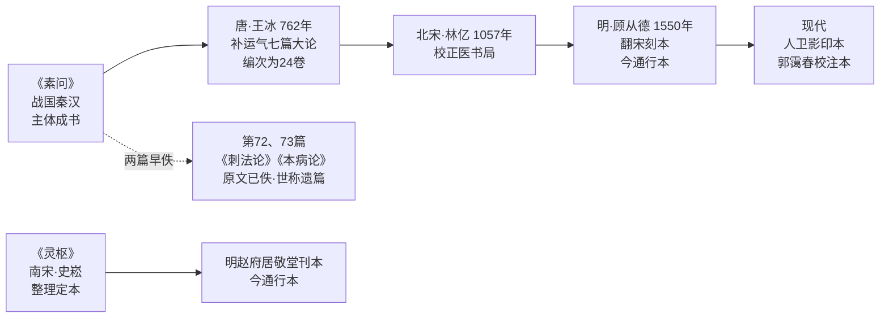

## 《黄帝内经》：为什么它是养生源头

后世谈养生，绕不开《黄帝内经》。它之所以被称为源头，不是因为最古老（事实上它的成书年代聚讼纷纭），而是因为它一举立下了两个至今仍在使用的命题：怎么养——"法于阴阳"；为什么养——"治未病"。此后两千多年，从嵇康到孙思邈再到高濂，养生著作大都在这两个命题之内做展开。

## 两大命题

第一个命题出自《素问》开卷第一篇《上古天真论》："法于阴阳，和于术数，食饮有节，起居有常，不妄作劳。"这几十个字几乎就是一部养生总纲：顺应自然节律、掌握调理方法、饮食有节制、作息有规律、不过度消耗。它把养生从"求仙问药"拉回到"管好日常"。

第二个命题出自《四气调神大论》："不治已病治未病。"养生在《内经》体系里不是医疗的附属品，而是医疗的前置环节——病未发而先防。《四气调神大论》还按春、夏、秋、冬四季给出起居与情志的具体安排，是"按季节生活"最早的系统表述。

## 全书构成与成书

《黄帝内经》由《素问》与《灵枢》两部分组成，各 81 篇、合计 162 篇；今通行本《素问》24 卷、《灵枢》12 卷。"黄帝内经"这个名字首见于《汉书·艺文志·方技略》，著录为"《黄帝内经》十八卷"；有学者据刘向、刘歆父子校理方技之书（公元前 26 年）推定其成书下限。书既托名"黄帝"，自然不是一时一人之作，而是一部汇编；其成书年代有战国说、西汉说、东汉说等分歧，主流观点认为主体成于战国至秦汉。2011 年，《黄帝内经》列入联合国教科文组织《世界记忆名录》。

## 版本常识：补七篇、遗篇与通行本

读《内经》需要知道几件版本史上的事，否则容易疑惑某些篇目"风格不像一手"：

- **王冰补七篇**：《素问》第七卷很早就佚失了。唐代王冰于公元 762 年注成《素问》，补入运气七篇大论，并重新编次为 24 卷——今天看到的卷次框架即出自王冰之手。
- **遗篇**：《素问》第 72、73 篇《刺法论》《本病论》原文已佚，后世所传内容世称"遗篇"，可信度与正文不同。
- **今通行《素问》**：其底本经北宋校正医书局林亿等人于 1057 年校正，今通行者为明嘉靖二十九年（1550）顾从德翻宋刻本。
- **《灵枢》**：由南宋史崧整理成今天的定本，通行本为明赵府居敬堂刊本，现存最早刻本为元胡氏古林书堂刻本。

也就是说，我们今天读到的《素问》是一部"战国秦汉之文 + 唐人补编 + 宋人校正"的层累文本——这不妨碍阅读，但有助于理解它的面貌。

《素问》与《灵枢》的版本层累流传如下图所示：

## 入门读法

81 篇不必从第一篇硬读到最后一篇。建议从养生色彩最浓的篇目入手：

1. 《上古天真论》——论人生长壮老的节律与养生总纲；
2. 《四气调神大论》——四季养生的原始出处；
3. 《生气通天论》等讨论阳气与日常起居、饮食关系的篇章。

读通这几篇，再回头补其他篇目，事半功倍。

版本方面，人民卫生出版社先后于 1956、2015 年出版《素问》《灵枢》影印本，1963 年出版校勘排印本，是多年来的通行读本；若想深入研究文字异同，可入手郭霭春主编《黄帝内经素问校注》（人民卫生出版社 1996 年版，中国中医药出版社 2023 年第 2 版），该书广收 50 余种善本作校本。

## 延伸阅读

- 本 bundle 事实清单：[facts.md](../facts.md)
- 承接《内经》命题的下一篇：[嵇康《养生论》](02-ji-kang-yangsheng-lun.md)
- 医家对"治未病"的实践化：[《千金要方》养性篇](03-beiji-qianjin-yao-fang-yangxing.md)
- 明代生活化的《内经》传统：[《遵生八笺》](04-zunsheng-ba-jian.md)
- 老年专题的落地：[《老老恒言》与《寿亲养老新书》](05-laolao-hengyan-and-shouqin.md)