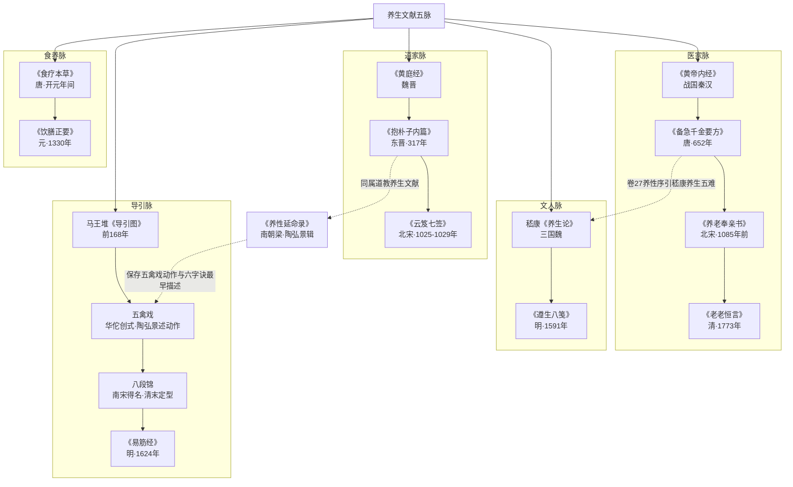

## 养生五脉谱系

养生文献没有一部"总集"统摄全部：它分散在医家、道家、文人、食养、导引五大传统之中，各脉的撰写主体、目标读者与知识形态都不相同。初学者若不先立地图，容易"只见树木不见森林"，或误以为功法类（如八段锦）就能代表养生文献全貌。本篇按五脉给出知识地图，全部著作与年代均以[事实清单](../facts.md)登记为准。

## 总览

| 脉络 | 代表著作脉络 | 知识形态 |
|------|-------------|---------|
| 医家脉 | 《黄帝内经》→《千金要方》→《养老奉亲书》→《老老恒言》 | 理论奠基→临床整合→老年专科→日常起居 |
| 道家脉 | 《黄庭经》→《抱朴子内篇》→《云笈七签》 | 存思服气→金丹行气→类书集成 |
| 文人脉 | 嵇康《养生论》→高濂《遵生八笺》 | 玄学专论→文人生活百科 |
| 食养脉 | 《食疗本草》→《饮膳正要》 | 本草食疗→宫廷营养 |
| 导引脉 | 《导引图》→五禽戏→六字诀→八段锦→易筋经 | 图谱→戏诀→功法定型 |

五脉谱系如下图所示，虚线标示脉络之间的交汇：

### 一、医家脉：理论奠基到日常起居

医家脉是养生文献的主干。《黄帝内经》由《素问》《灵枢》组成，各 81 篇共 162 篇，托名黄帝，主体成于战国至秦汉，确立了"食饮有节，起居有常"与"治未病"的理论框架。唐代孙思邈《备急千金要方》（652 年成书，30 卷）将养性内容集中于卷 27，分养性序、道林养性、按摩法、调气法等八类；其《千金翼方》卷 12-15 专论养生长寿与养老食疗。北宋陈直《养老奉亲书》（成书不晚于 1085 年）是现存最早的老年养生专著，主张"先食治、后命药"。清代曹庭栋《老老恒言》（1773 年自刻，5 卷）则把养生落实为安寝、盥洗、散步、粥谱等日常细节。

### 二、道家脉：存思、金丹与类书集成

道家脉以修真技术为核心。魏晋间相传为魏华存所传的《黄庭经》分内景、外景两部分，《内景经》三十六章系统阐述存思身神与三丹田之说。东晋葛洪《抱朴子内篇》（约 317 年，二十卷）汇集金丹服食、行气胎息、导引诸法，提出"形者，神之宅""形神相卫"命题。北宋张君房先编成《大宋天宫宝藏》4565 卷（1019 年），再撮其精要辑成《云笈七签》122 卷，收入《正统道藏》，素有"小道藏"之称。梁代陶弘景《养性延命录》（二卷六篇，引书 30 余种）虽是道教辑撰之书，同时横跨导引脉——详见下文。

### 三、文人脉：从玄学专论到生活百科

文人脉的两端相隔一千三百年：一头是三国魏嵇康（223-262）约两千字的《养生论》，提出"形恃神以立，神须形以存"的形神相须论与清虚静泰、少私寡欲的主张，收入《昭明文选》卷五十三；另一头是明万历名士高濂的《遵生八笺》（1591 年刊，正文十九卷分八笺），把养生扩展为清修妙论、四时调摄、起居安乐、延年却病、饮馔服食、燕闲清赏、灵秘丹药、尘外遐举八大门类，是典型的生活化百科。

### 四、食养脉：从本草食疗到宫廷营养

食养脉专讲"吃"。唐代孟诜撰、张鼎增补的《食疗本草》（约开元年间成书，227 条，一说载食物约 260 种）是本草食疗代表；原书早佚，全貌依赖 1907 年敦煌莫高窟发现的残卷（S.0076）与《证类本草》等书佚文辑复。元代宫廷饮膳太医忽思慧所撰《饮膳正要》（1330 年，3 卷）收聚珍异馔、汤煎、食疗诸病与米谷兽禽鱼果菜 230 余种，被多源表述为"我国现存第一部完整的饮食卫生与营养学专书"。医家脉中的《千金要方》卷 26 食治、《老老恒言》卷 5 粥谱可视为食养思想在医书与起居书中的延伸。

### 五、导引脉：从汉墓图谱到功法定型

导引脉是身体技术的谱系：马王堆三号汉墓（封于前 168 年）出土帛画《导引图》，为现存最早的导引图谱实物，共 44 幅彩绘图式；五禽戏最早见《三国志·华佗传》（虎、鹿、熊、猿、鸟），但具体动作描述晚至南朝陶弘景《养性延命录·导引按摩篇》才出现；同书服气疗病篇的吹、呼、嘻、呵、嘘、呬六种呼气法是现知"六字诀"理论的最早出处。"八段锦"之名现存最早见于南宋洪迈《夷坚志》（1117 年），清末《新出保身图说》才首次以"八段锦"为名绘图并定型歌诀；《易筋经》现存文献可确证者始于明代（天启四年 1624 年天台紫凝道人宗衡跋），托名达摩与李靖序、牛皋序均经辨伪，2021 年列入国家级非物质文化遗产。

### 五脉交汇处

五脉并非泾渭分明：《千金要方》卷 27 养性序引嵇康"养生五难"，是医家对文人脉的吸收；《养性延命录》既是道教文献又保存了五禽戏与六字诀的早期描述，横跨道家脉与导引脉。读原典时留意这些交汇点，比记住五脉划分本身更重要。

## 下一步

有了这张地图，可按[选篇精读阅读计划](../examples/02-reading-plan.md)从短小核心篇目进入原典；选书时参考[如何选读版本与注本](07-choosing-editions.md)。